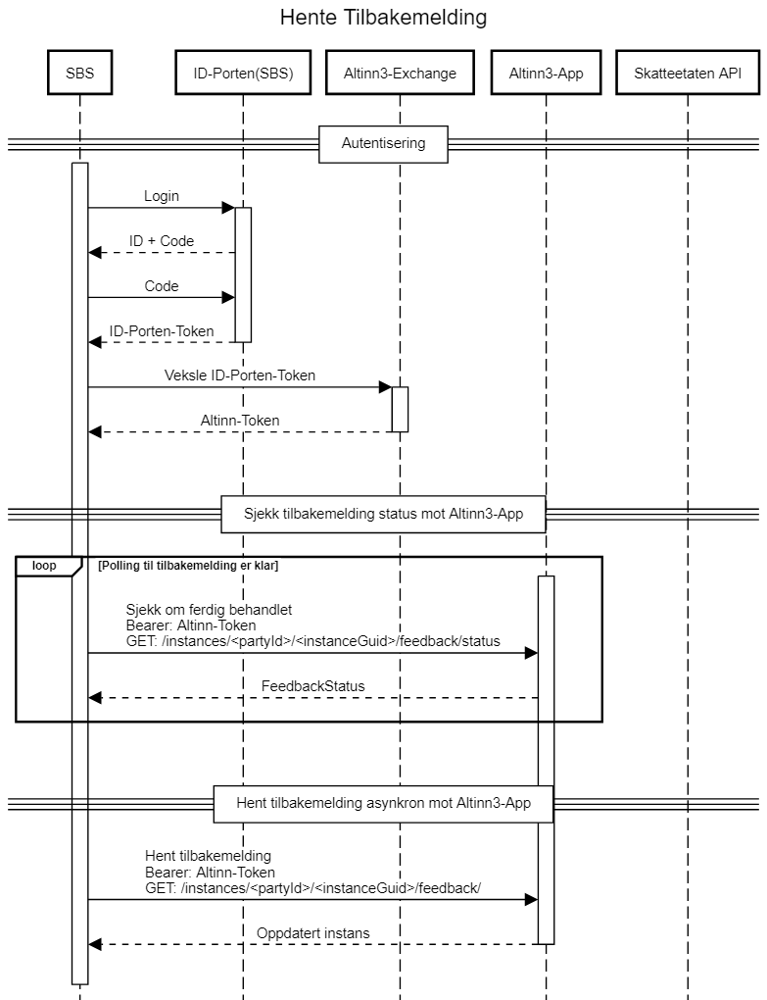

# MVA Melding Validerings og Innsendings API

MVA Meldinger som skal sendes til Skatteetaten fra et sluttbrukersystem (SBS) burde bruke disse APIene:

1. Skatteetatens MVA-Melding validerings API
1. Skatteetatens Altinn3 MVA-Melding-Innsending's API

som beskrives under.

# Prosess innsending og validering

Innsending av Mva Melding gjøres mot Skatteetatens Altinn3 Instans API for Innsending. Detaljert beskrivelse av Altinn3's Instans-API finnes her
<a href="https://docs.altinn.studio/teknologi/altinnstudio/altinn-api/app-api/instances/" target="_blank">Altinn Studio Instans API</a>. Inngående kjennskap til dette API'et er ikke nødvendig da denne dokumentasjonen dekker behovet for Mva Melding Innsending.

Det anbefales å benytte <a href="https://skd.apps.tt02.altinn.no/skd/mva-melding-innsending-etm2/swagger/index.html" target="_blank">swagger dokumentasjonen</a> sammen med denne API-beskrivelsen.

I tillegg finnes det kjørende eksempel på innsending som bruker Jupyter Notebook og python under <a href="https://skatteetaten.github.io/mva-meldingen/documentation/test/" target="_blank">Test</a>

Prosessen gjennomføres med en sekvens av kall mot Instans-API´et og beskrives i detalj under sekvensdiagrammet og er som følger:

1. Autentisering
   - Veksle ID-porten token til Altinn-token
2. Validering mot Skatteetaten
3. Utfylling mot Altinn3-App
   - Opprett instans mot Altinn3-App
   - Last opp MvaMeldingInnsending mot Altinn3-App
   - Last opp mva-melding mot Altinn3-App
   - Last opp vedlegg mot Altinn3-App
4. Fullfør utfylling mot Altinn3-App
5. Fullfør innsending mot Altinn3-App
6. Hent tilbakemelding mot Altinn3-App

Instans API'et til Mva Melding Innsending er tilgjengelig på denne URLen:

```
instansApiUrl = "https://skd.apps.tt02.altinn.no/skd/mva-melding-innsending-etm2/instances"
```

I følgende sekvensdiagram vil applikasjonsUrl'en være skjult, så hvis det er skrevet `POST: /intances/` så er det implisitt `POST: instansApiUrl`


## Autentisering

### Veksle ID-porten token til Altinn-token

For å veksle ID-porten-tokenet må man gjøre følgende kall:

```JSON
GET `https://platform.tt02.altinn.no/authentication/api/v1/exchange/id-porten`
HEADERS:
    "Authorization": "Bearer " + "{IDPortenToken}"
       "content-type": "application/json"
```

og i responsen vil content være et rykende ferskt altinnToken som brukes som Bearer token i de resterende kallene. Tokenet har i dag en varighet på 8 timer. Senere i 2021 vil Altinn3 tilby refresh-tokens slik at en login vil kunne vare i opptil 3 mnd.

## Valider skattemelding

Tjenesten validerer innholdet i en skattemelding og returnerer en respons med eventuelle feil, avvik og advarsler. Tjenesten vil foreta følgende:

1. Kontroll av meldingsformatet.
2. Kontroll av innholdet og sammensetningen av elementene i mva-meldingen.

Skatteetaten forutsetter at valideringstjenesten blir kalt i forkant av innsending av mva-meldingen.
Dette sikrer at mva-meldingen har korrekt format og innhold og øker sannsynligheten for at mva-meldingen
vil bli godkjent ved innsending.

**URL** : `POST https://<env>/api/mva-melding/valider`

Hvor `<env>` er Miljøspesifikk adresse f.eks. `mp-test.sits.no`

**Body** :

- Iht. XSD: <a href="https://github.com/Skatteetaten/mva-meldingen/tree/master/docs/documentation/informasjonsmodell/xsd/no.skatteetaten.fastsetting.avgift.mva.skattemeldingformerverdiavgift.v1.0.xsd" target="_blank">Skattemeldingformerverdiavgift.v1.0</a>

**Eksempel** : Innsending av XML på ugyldig format

POST <a href="https://mp-test.sits.no/api/mva-melding/skattemeldingformerverdiavgift/valider" target="_blank">https://mp-test.sits.no/api/mva-melding/skattemeldingformerverdiavgift/valider </a>

Header: `Content-Type: application/xml`

Med innhold (http body)som ikke passerer XML-validering basert på <a href="https://github.com/Skatteetaten/mva-meldingen/tree/master/docs/documentation/informasjonsmodell/xsd/no.skatteetaten.fastsetting.avgift.mva.skattemeldingformerverdiavgift.v1.0.xsd" target="_blank">XSD</a>:

```xml
<?xml version='1.0' encoding='UTF-8'?>
<mvaMeldingDto xmlns="no:skatteetaten:fastsetting:avgift:mva:skattemeldingformerverdiavgift:v1.0">

</mvaMeldingDto>
```

### Response

status: 200
Innhold (body)

```xml
<valideringsresultat>
    <status>UGYLDIG_SKATTEMELDING</status>
    <valideringsfeil>
        <stiTilFeil>//innsending</stiTilFeil>
        <valideringsDetaljer>
            <feilmelding>Mva meldingen må være på gyldig format og passere XML skjema valideringen</feilmelding>
            <alvorlighetsgrad>UGYLDIG_SKATTEMELDING</alvorlighetsgrad>
            <avvikKode>MvaMeldingsinnhold_Xml_SkjemaValideringsfeil</avvikKode>
            <informasjon>cvc-complex-type.2.4.b: The content of element 'mvaMeldingDto' is not complete. One of
                '{"no:skatteetaten:fastsetting:avgift:mva:skattemeldingformerverdiavgift:v1.0":innsending}' is expected.
            </informasjon>
        </valideringsDetaljer>
    </valideringsfeil>
</valideringsresultat>

```

## Opprett Instans

En instans er et objekt i altinn som følger prosessen og datamodellen definert av en applikasjon. Skatteetaten har en Mva-Melding-Innsendings applikasjon som har en prosess med foreløpig tre steg for innsending. Stegene er utfyllings-, bekreftelses- og tilbakemeldings-steg.

En instans har i tillegg til å være et objekt, et data-objekt definert av en datamodell i appen.

Når en instans er opprettet vil den være mulig å oppdatere data-objektet til instansen og legge til andre data-objekter i appens datamodell. Dette gjøres i neste steg.

For å opprette en instans utfører man en POST mot instansApiUrl med et `instanceOwner`-objekt hvor det fylles inn organisasjonsnummeret for organisasjonen det skal sendes mva melding for:

```JSON
POST {applikasjonsUrl}/instances/
HEADERS:
    "Authorization": "Bearer " + "{altinnToken}"
    "content-type": "application/json"
CONTENT/BODY:
    {
        "instanceOwner": {
            "organisationNumber": "{organisasjonsnummer}"
            }
    }
```

Dette kallet vil opprette instansen og returnere

### Response

```JSON
Response HTTPCode: 201 (OK)
Content:
{
    "id": "{partyId}/{instanceGuid}",
    "instanceOwner": {
        "partyId": "{partyId}",
        "organisationNumber": "{organisasjonsnummer}"
    },
    "appId": "skd/{ApplikasjonsNavn}",
    "org": "skd",
    "selfLinks": {
        "apps": "{instansUrl}", // appens instansUrl
        "platform": "{platformUrl}" // altinn3 plattformens url for instansen
    },
    "data": [
        {
            "id": "{dataGuid}", // {dataGuid} kan benyttes i neste steg
            "instanceGuid": "{instanceGuid}",
            "dataType": "no.skatteetaten.fastsetting.avgift.mva.mvameldinginnsending.v1.0",
            "contentType": "application/xml",
            "blobStoragePath": "skd/{ApplikasjonsNavn}/{instanceGuid}/data/{dataGuid}",
            "selfLinks": {
                "apps": "{instanceDataAppUrl}", // {instanceDataAppUrl} kan benyttes i neste steg
                "platform": "{instanceDataPlatformUrl}"
            },
            "size": 273,
            "locked": false,
            "refs": [],
            "isRead": true,
            "created": "2021-03-01T08:15:25.1139057Z",
            "createdBy": "86257",
            "lastChanged": "2021-03-01T08:15:25.1139057Z",
            "lastChangedBy": "86257"
        }
    ]
    // resten av objektet er snippet bort
}

```

Resten av kallene i sekvensen for innsendingen benytter `instansUrl`. Denne kan bli funnet fra responsen ved opprettelsen av instansen. Se i eksempel responsen over. <br>
`instansUrl` kan enten bruke `selflinks.apps` eller ved å utlede fra `instansApiUrl/{partyId}/{instanceGuid}`, hvor `{partyId}` og `{instanceGuid}` kan bli funnet i `id` feltet for den returnerte instansen.

Eksempel på instansUrl: `https://skd.apps.tt02.altinn.no/skd/mva-melding-innsending-etm2/instances/3949387/abba061g-3abb-4bab-bab8-c9abbaf1ed50/data/28abba46-dea8-4ab7-ba90-433abba906df`

### Feilmeldinger

_Respons 400 - Bad Request:_ <br>
Eksempel verdi

```JSON
{
  "type": "string",
  "title": "string",
  "status": 0,
  "detail": "string",
  "instance": "string"
}
```

_Respons 403 - Forbidden:_ <br>
Eksempel verdi

```JSON
{"type":"https://tools.ietf.org/html/rfc7231#section-6.5.3","title":"Forbidden","status":403,"traceId":"00-44eab35cb9ca2049b24de316f380a774-a724e045b09dfc44-00"}
```

Denne feilmeldingen kan en få hvis en prøver å lage en instanse hvor innlogget bruker ikke har rettigheter til organisasjonen definert i request header.
Dette vil da også gjelde hvis innlogget bruker ikke har tilstrekkelig roller for å opprette en instans.

_Respons 404 - Not Found:_ <br>
Eksempel verdi

```JSON
"Cannot lookup party: Failed to lookup party by organisationNumber: 123456789. The exception was: 404 - Not Found - "
```

Denne feilmeldingen kan en få hvis en setter organisasjonsnummeret i request headeren til noe ugyldig.

## Last Opp MvaMeldingInnsending

MvaMeldingInnsending er en datatype for metadata for innsendingen. Objektet man skal fylle ut blir skapt under instansieringen og vil kunne finnes i instans-objektets `data`-liste og har `"dataType": "no.skatteetaten.fastsetting.avgift.mva.mvameldinginnsending.v0.1"`. Siden dette objektet allerede finnes når man skal laste opp MvaMeldingInnsending, benyttes PUT for å oppdatere data-elementet.

Modellen for MvaMeldingInnsending finnes her: <a href="https://github.com/Skatteetaten/mva-meldingen/blob/master/docs/documentation/informasjonsmodell/xsd/no.skatteetaten.fastsetting.avgift.mvamvameldinginnsending.v1.0.xsd" target="_blank">no.skatteetaten.fastsetting.avgift.mva.mvameldinginnsending.v1.0.xsd</a>

Url til MvaMeldingInnsending har denne oppbygningen:

```
mvaMeldingInnsendingUrl = {instansApiUrl}/{partyId}/{instanceGuid}/data/{dataGuid}
```

hvor `{dataGuid}` er id til data-objektet til instansen.

Det er 2 måter å komme frem til `mvaMeldingInnsendingUrl` og begge benytter instansens data-liste-element som har datatypen `no.skatteetaten.fastsetting.avgift.mva.mvameldinginnsending.v1.0`. Når instansen blir skapt finnes bare ett element i lista.

Fra data-elementet kan man enten:

- flette inn `{dataGuid}` som finnes som verdi i `"id"` i oppbygningen over,
  - eventuelt bruke `{instansApiUrl}/data/{dataGuid}`
- eller bruke `selfLinks.apps` verdien `{instanceDataAppUrl}`, som vist i instans-responsen i forrige steg.
  - `mvaMeldingInnsendingsUrl = {instanceDataAppUrl}`

Man laster opp MvaMeldingInnsending ved å benytte data-apiet til instansen:

```
PUT {mvaMeldingInnsendingsUrl}
HEADERS:
    "Authorization": "Bearer " + "{altinnToken}"
    "content-type": "text/xml"
```

```XML
Content:
<?xml version="1.0" encoding="UTF-8"?>
<mvaMeldingInnsending>
    ...
</mvaMeldingInnsending>
```

Eksempel på xml-fil for mvaMeldingInnsending finnes under <a href="https://github.com/Skatteetaten/mva-meldingen/blob/master/docs/documentation/test/eksempler/melding/" target="_blank">Test</a>.

### Feilmeldinger

_Respons 403 - Forbidden:_ <br>
Hvis innlogget bruker prøver å laste opp fil til instansen, men personen har ikke riktig roller vil en få response kode 403 tilbake.

## Last Opp MvaMelding

Modellen for <a href="../informasjonsmodell/xsd/no.skatteetaten.fastsetting.avgift.mva.skattemeldingformerverdiavgift.v1.0.xsd" target="_blank">no.skatteetaten.fastsetting.avgift.mva.skattemeldingformerverdiavgift.v1.0.xsd</a>

Url for opplasting av Mva Melding har denne oppbygningen:

```
{instansUrl}/data?datatype=mvamelding
```

Mva Melding lastes opp på med følgende request mot instansens data-api:

```JSON
POST {instansUrl}/data?datatype=mvamelding
HEADERS:
    "Authorization": "Bearer " + "{altinnToken}"
    "content-type": "text/xml"
    "Content-Disposition": "attachment; filename=mvaMelding.xml"
```

```XML
Content:
<?xml version="1.0" encoding="UTF-8"?>
<mvaMeldingDto xmlns="no:skatteetaten:fastsetting:avgift:mva:skattemeldingformerverdiavgift:v1.0">
    ...
</mvaMeldingDto>
```

Dette kallet vil laste opp xml-dokumentet til instansen.

### Feilmeldinger

_Respons 403 - Forbidden:_ <br>
Hvis innlogget bruker prøver å laste opp fil til instansen, men personen har ikke riktig roller vil en få response kode 403 tilbake.

## Last Opp Vedlegg

Det er mulig å laste opp fra 0 til 57 vedlegg, med en individuell størrelse på 25MB.

Url for opplasting av Vedlegg har denne oppbygningen:

```
{instansUrl}/data?datatype=vedlegg
```

Det tillates opplasting av følgende content-typer:

- text/xml
- application/pdf
- application/vnd.oasis.opendocument.formula
- application/vnd.openxmlformats-officedocument.wordprocessingml.document
- image/jpeg
- image/jpg
- image/png

Vedlegg lastes opp på med følgende request mot instansens data-api:

```JSON
POST {instansUrl}/data?datatype=vedlegg
HEADERS:
    "Authorization": "Bearer " + "{altinnToken}"
    "content-type": "application/pdf"
    "Content-Disposition": "attachment; filename=merknaderTilMvaMeldingen.pdf"
Content:
{pdf-vedlegg i binærformat}
```

Dette kallet vil laste opp pdf-dokumentet til instansen.

Husk at `content-type` skal være passende for vedlegget som skal lastes opp og at filnavnet i `Content-Disposition`- headeren også bør være passende og unikt. Det er dette filnavnet Skatteetaten vil forholde seg til for vedlegget.

### Feilmeldinger

_Respons 403 - Forbidden:_ <br>
Hvis innlogget bruker prøver å laste opp fil til instansen, men personen har ikke riktig roller vil en få response kode 403 tilbake.

## Fullfør utfylling

Dette steget bruker prosess-apiet til instansen og instansen vil avslutte utfyllingssteget for Mva Melding Innsending og til neste steg i applikasjonens prosess for instansen.

For å fullføre utfyllingen utføres følgende kall mot prosess-apiet til instansen:

```JSON
PUT {instansUrl}/process/next
HEADERS:
    "Authorization": "Bearer " + "{altinnToken}"
    "content-type": "application/json"
```

Innsendingen vil nå være i bekreftelses-steget.

### Feilmeldinger

_Respons 403 - Forbidden:_ <br>
Hvis innlogget bruker prøver å bytte til neste steg i instansprossessen, men personen har ikke riktig roller vil en få response kode 403 tilbake.

_Respons 409 - Conflict:_ <br>
Eksempel verdi

```JSON
{
  "type": "string",
  "title": "string",
  "status": 0,
  "detail": "string",
  "instance": "string"
}
```

```
"Valideringsfeil: Organisasjonsnummeret i instansen er forskjellig fra organisasjonsnummeret i MvaMeldingInnsending (\"konvolutt\")"
```

Hvis organisasjonsnummeret som ble brukt til å lage instansen er forskjellig fra organisasjonsnummeret definert i MvaMeldingInnsending vil en få denne feilmeldingen.

```
"Valideringsfeil: Organisasjonsnummeret i MvaMeldingInnsending (\"konvolutt\") er forskjellig fra organisasjonsnummeret i {filnavn}"
```

Hvis organisasjonsnummeret som er definert i MvaMeldingInnsending er forskjellig fra organisjasnonsnummeret som er definert i mva-meldingen vil en få denne feilmeldingen.

```
"Valideringsfeil: Liste med vedlegg definert i MvaMeldingInnsending (\"konvolutt\") er forskjellig fra listen med vedlegg som er lastet opp i instansen."
```

Hvis listen over vedlegg som er definert i MvaMeldingInnsending er forskjellig fra de som har blitt lastet opp instansen vil en få denne feilmeldingen.

```
"Valideringsfeil: Meldingskategorien i MvaMeldingInnsending (\"konvolutt\") er forsjellig fra Meldingskategorien i {filnavn}"
```

Hvis verdien i meldingskategori feltet for MvaMeldingInnsending er forskjellig fra meldingskategorien i mva-meldigen vil en få denne feilmeldingen.

**Valideringstjenesten**

```
"Valideringsfeil: Ugyldig mva-melding"
```

Appen vil også kalle valideringstjenesten under fullføring av utfyllingen. Hvis mva-meldingen er ugyldig,
vil det returneres feilmelding 409 og valideringsresultatet i xml som content.

Eksempel verdi:

```XML
<valideringsresultat>
    <status>UGYLDIG_SKATTEMELDING</status>
    <valideringsfeil>
        <stiTilFeil>//innsending</stiTilFeil>
        <valideringsDetaljer>
            <feilmelding>Mva meldingen må være på gyldig format og passere XML skjema valideringen</feilmelding>
            <alvorlighetsgrad>UGYLDIG_SKATTEMELDING</alvorlighetsgrad>
            <avvikKode>MvaMeldingsinnhold_Xml_SkjemaValideringsfeil</avvikKode>
            <informasjon>cvc-complex-type.2.4.b: The content of element 'mvaMeldingDto' is not complete. One of
                '{"no:skatteetaten:fastsetting:avgift:mva:skattemeldingformerverdiavgift:v1.0":innsending}' is expected.
            </informasjon>
        </valideringsDetaljer>
    </valideringsfeil>
</valideringsresultat>
```

For en liste over valideringsfeil, kan man finne under [Valideringsregler](/documentation/forretningsregler/).

## Fullfør MvaMeldingInnsending

Dette steget bruker prosess-apiet til instansen og instansen vil avslutte bekreftelsessteget for Mva Melding Innsending og oppdatere instansen til neste steg i applikasjonens prosess.

For å fullføre innsendingen utføres følgende kall mot prosess-apiet til instansen:

```JSON
PUT {instansUrl}/process/next
HEADERS:
    "Authorization": "Bearer " + "{altinnToken}"
    "content-type": "application/json"
```

Innsendingen vil nå være i tilbakemeldings-steget.

### Feilmeldinger

_Respons 403 - Forbidden:_ <br>
Hvis innlogget bruker prøver å bytte til neste steg i instansprossessen, men personen har ikke riktig roller vil en få response kode 403 tilbake.

## Hent tilbakemelding

Dette steget vil hente tilbakemeldingen på instansen som Skatteetaten har lastet opp.
Når instansen har fått tilbakemelding fra Skatteetaten vil den befinne seg i arkivet i altinn-innboksen.
For å få tak i tilbakemeldingene kan man enten polle ved bruk av et asynkron API-endepunkt eller ved å bruke et synkron API-endepunkt.

Alternativ tilnærming for å hente tilbakemelding ved bruk av et asynkron API-endepunkt.


For å få tak i tilbakemeldingen ved bruk av et synkron API-endepunkt utføres det et kall mot instansen:

```JSON
GET {instansUrl}/{partyId}/{instanceGuid}/feedback
HEADERS:
    "Authorization": "Bearer " + "{altinnToken"
    "accept": "application/json"
```

Hvis kallet er vellykket vil en få status kode 200 og et json objekt i retur:

```JSON
{
  "isFeedbackProvided":	boolean
}
```

### Feilmeldinger

_Respons 400 - Bad Request:_ <br>
Eksempel verdi

```JSON
{
  "type": "string",
  "title": "string",
  "status": 0,
  "detail": "string",
  "instance": "string"
}
```

_Respons 403 - Forbidden:_ <br>
Hvis innlogget bruker prøver å hente instansen, men personen har ikke riktig roller vil en få response kode 403 tilbake.

_Respons 404 - Not Found:_ <br>
Eksempel verdi

```JSON
{
  "type": "string",
  "title": "string",
  "status": 0,
  "detail": "string",
  "instance": "string"
}
```
