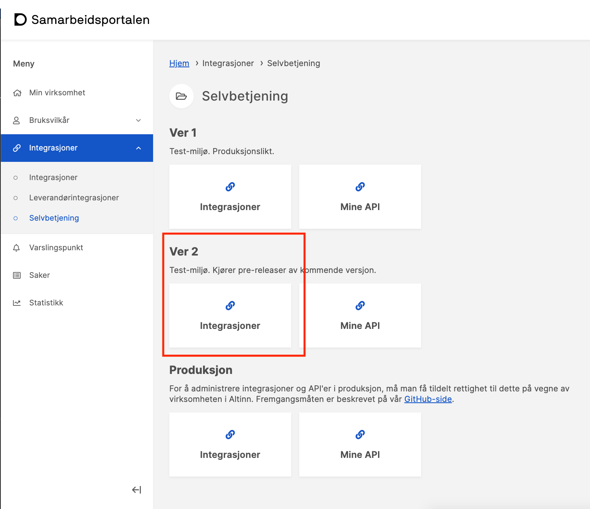
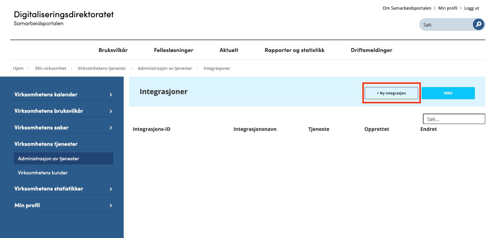
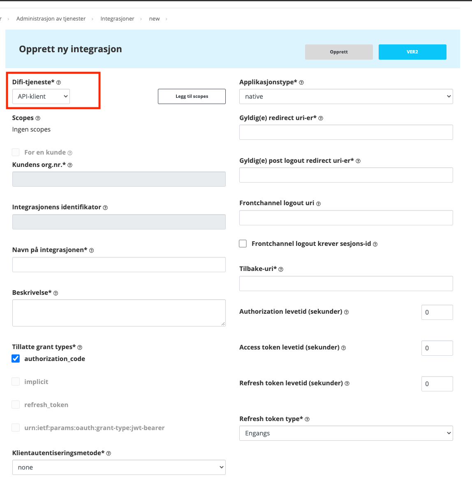
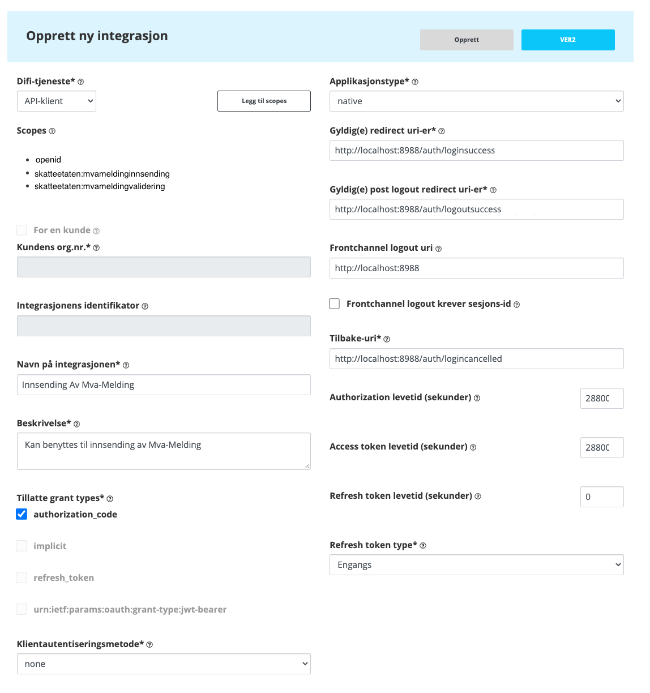

[English](https://skatteetaten.github.io/mva-meldingen/english/idportenauthentication/)

## Introduksjon

### Endringslogg

| Dato       | Hva ble endret?                                                                                  |
| :--------- | :----------------------------------------------------------------------------------------------- |
| 2021.08.26 | Lagt til hvordan man [bestiller Skatteetaten scopes](#scopes).                                   |
| 2021.08.26 | Lagt til seksjon for mange redirect-uri's [Gyldig(e) redirect uri-er](#gyldige-redirect-uri-er). |

For å autentisere med ID-porten må man implementere en Open ID Connect løsning mot ID-Porten. Det kan være utfordrende å implementere og sees på som det minst trivielle å løse med hensyn på innsending av mva-melding.

Det aller viktigste først: Skatteetaten har ressurser som kan hjelpe deg å forstå og finne en god løsning for din applikasjon.

Denne siden inneholder informasjon om hva som må gjøres, og hva som er spesifikt for Skatteetaten i en Open ID Connect-løsning.

Grovt sett er det følgende som må gjøres:

1. Ta i bruk ID-porten
2. Konfigurere en Integrasjon i Samarbeidsportalen
3. Konfigurere applikasjonen til å bruke Integrasjonen fra Samarbeidsportalen

Det er utenfor denne dokumentasjonen å beskrive Open ID Connect og OAuth2, men de detaljene som er spesifikke for Integrasjonen og Skatteetaten blir beskrevet i det følgende.

## Ta i bruk ID-porten

Det anbefales å komme igang med ID-porten så tidlig som mulig da den antakeligvis vil ta kalendertid. For å komme i gang må man gå gjennom en prosessen hos Digitaliseringsdirektoratet (DigDir), og i den prosessen vil få tilgang til å opprette Integrasjoner i Samarbeidsportalen. For å sende inn mva-meldinger må man ha en Integrasjon som er konfigurert riktig for din applikasjon og for API'ene Integrasjonen skal brukes mot.

Hvordan man kommer i gang med ID-porten er beskrevet her: <a href="https://samarbeid.digdir.no/id-porten/id-porten/18" target="_blank">ID-Porten</a>.

En annen fordel med å starte prosessen tidlig er at man kan teste Integrasjonen i test-miljøet som inkluderer både Altinn3 og Skatteetaten. Det må også opprettes egen integrasjon for produksjon.

Skatteetatens Integrasjon med Indentifikator `client_id: 23cc2587-ea4e-4a5f-aa5c-dfce3d6c5f09` kan benyttes til ID-Porten er klar til å tas i bruk. Denne vil bli fjernet etter varsel. Se mer i [avsnittet under](#konfigurere-en-integrasjon-i-samarbeidsportalen)

## Konfigurere en Integrasjon i Samarbeidsportalen

Når tilgangen til Samarbeidsportalen er beskaffet, kan det opprettes en Integrasjon som vil kunne benyttes av sluttbrukersystemet.

Man åpner <a href="https://minside-samarbeid.digdir.no/" target="_blank">https://minside-samarbeid.digdir.no/ </a>

Og velger Integrasjoner under Ver 2 som vist under.

Da blir man tatt videre til Integrasjonene i Ver 2.

Og ved å klikke på Ny integrasjon kan man begynne å konfigurere Integrasjonen mot Skatteetaten.

I denne guiden vil det konfigureres en Digdir-tjeneste at typen API-klient, som vist over.

En gjennomgang av de forskjellige feltene i konfigurasjonen følger

### Digdir-tjeneste

Når man velger en verdi fra dette rullegardinet

- KRR
- ID-porten
- API-klient
- Maskinporten

så vil det kanskje skje noe med:

- Scopes
- Applikasjonstype
- Felter blir låst eller låst opp
- Felter får plutselig verdier som ikke stilles tilbake når man endrer igjen.

Dette er forvirrende, så det anbefales å lage flere, det er helt ufarlig og man kan slette dem man ikke vil ta i bruk.

Som nevnt brukes API-klient. Det vil lage en Open ID Connect klient som ikke har noen forututfylte scopes som ikke det er behov for.

### Scopes

For å bruke validerings og innsendings-api'ene må følgende scopes legges til:

- openid
- skatteetaten:mvameldingvalidering
- skatteetaten:mvameldinginnsending

For å legge dem til bruk knappen "Legg til scopes".

Dersom skatteeten-scopene ikke finnes i søket er det fordi Skatteetaten ikke har gitt din organisasjon tilgang til disse scopene ennå. Din organisasjon kan nå bestille tilgang til scopene ved å følge prosedyren under.

#### Bestilling av scopes

Scopene må bestilles av din organisasjon ved å sende en e-post til [mva-modernisering@skatteetaten.no](mailto:mva-modernisering@skatteetaten.no) og oppgi **organisasjonsnummer** for organisasjonen som administrerer integrasjonen.

Skatteetaten vil gi tilgang til scopene og de kan deretter legges til i integrasjonen. Scopene må også legges til i koden som integrerer med ID-Porten slik at scopene inkluderes i aksess-tokenet til ID-Porten.

Eksempelkoden <a href="https://github.com/Skatteetaten/mva-meldingen/blob/master/docs/mvameldingen/test/Steg/log_in_idporten.py#L105-L164" target="_blank">log_in_idporten.py</a> er oppdatert til å reflektere endringene som behøves i ID-Porten-integrasjonen når scopene er lagt til i integrasjonen i selvbetjeningsportalen.

### Kundens org.nr.

Dette skal være organisasjonsnummeret til organisasjonen din.

### Integrasjonens identifikator

Når integrasjonen blir opprettet dukker det opp en Guid her. Det er dette som er `client_id`

### Navn på integrasjonen & Beskrivelse

Valgfrie tekster. Navnet på integrasjonen vil vises i listen over integrasjonene, så det er fornuftig å gi dem fornuftige navn.

### Tillatte grant types

Her må det velges:

- authorization_code

Her kan det velges:

- refresh_token

I tilfeller hvor det ikke er helt sikkert at tokens eller hemmeligheter er beskyttet fra røvere, anbefales ikke bruken. Refresh-tokens kan derfor ikke brukes i for eksempel en SPA, hvor nettleseren ikke helt sikkert kan beskytte hemmeligheter eller tokens over lang tid. Det anbefales derfor å ikke bruke 'refresh_tokens' i JS/SPA-applikasjoner eller i frittstående applikasjoner som installeres på sluttbrukerens personlige datamaskin. ID-porten har derfor begrensninger på refresh_token-bruk utenfor web-applikasjoner, hvor tokens og hemmeligheter kan beskyttes på tjeneren.

Et refresh_token kan ha veldig lang levetid og brukes til å utstede nye access_tokens.

### Klientautentiseringsmetode

Bestemmer hvilken autentiseringsmetode integrasjonen bruker for å autentisere seg (ikke slutt-brukeren).

Velg none dersom det ikke brukes refresh_token.

### Applikasjonstype

Det er i dette valget at omtalte refresh_token vil kunne bli tilgjengelig dersom web velges.

Applikasjonstypen bestemmer om applikasjonen til integrasjonen er å anse som public eller private, som igjen bestemmer om man kan bruke refresh_tokens.

public:

- native
- browser

private:

- web

Men dette betyr ikke at en web-applikasjon må være privat. Man kan trygt bruke browser for web-applikasjoner som ikke bruker refresh-tokens.

### Gyldig(e) redirect uri-er

Når autentiseringsprosessen starter skal brukeren føres fra applikasjonen til login-siden hos ID-Porten. Og når innloggingen er vellykket blir brukeren redirigert tilbake til applikasjonen.

Dette oppnås ved å inkludere `redirect_uri` i parameterene som brukes for å åpne nettleservinduet hos ID-Porten. `redirect_uri` som sendes som parameter **MÅ** være tilstede i listen over Gyldig(e) redirect uri-er i Integrasjonen.

Applikasjonen er avhengig av å ha et endepunkt som kan håndtere redirigeringen til redirect_uri.

#### Svært mange redirect_uri

Dersom sluttbrukersystemet sin portefølje har veldig mange installasjoner som ikke deler domene kan de heller ikke dele `redirect_uri`. Installasjonene kan være både on-premise eller i skyen. Siden det er et krav at hvert domene må ha sin egen `redirect_uri` kan det bli utfordrende å administrere disse i selvbetjeningsportalen.

Digitaliseringsetaten har nylig publisert informasjon som kan være nyttig i dette tilfellet:
<a href="https://docs.digdir.no/docs/idporten/oidc/oidc_api_admin" target="_blank"> https://docs.digdir.no/docs/idporten/oidc/oidc_api_admin</a>
Systemleverandøren vil være eieren av integrasjonen(e) knyttet til automatiske dynamiske løsninger.

#### Alternativ løsning

Dersom løsningen ovenfor ikke kan brukes i systemporteføljen til systemleverandøren, er det også mulig å la sluttbrukersystemets kunder eie og administrere ID-porten integrasjonene.
Hvis du velger en løsning der hver enkelt kunde administrerer og eier ID-porten-integrasjon, må systemleverandørene supportere kundenes integrasjoner. Skatteetaten supporterer bare henvendelser fra systemleverandører for deres integrasjoner, ikke henvendelser fra systemleverandørers kunder. Skatteetaten vil gi tilgang til de nødvendige scopene for de aktuelle organisasjonsnummerene i tilfeller der denne løsningen velges.
Systemleverandører som ønsker å benytte denne alternative løsningen bør kontakte Skatteetaten med informasjon om hvor mange kunder som er involvert, før de starter med utviklingen av denne løsningen.

### Gyldig(e) post logout redirect uri-er

Liksom Gyldig(e) redirect uri-er, bortsett fra at denne redirigeringen vil intreffe dersom applikasjonen har bedt ID-porten å logge ut brukeren på samme måte som ved innlogging.

### Frontchannel logout uri & Frontchannel logout krever sesjons-id

Dette er knyttet til single logout og utenfor denne guiden.

### Tilbake-uri

Dersom brukeren avbryter innloggingen i ID-Porten vil brukeren tas til denne adressen. Merk at dette bare er 1 uri.

### Levetider

Det er mulig å sette levetiden på

- Autorization
- Access token
- Refresh token

Kombinasjonen av disse vil bestemme hvor lang tid det går mellom hver gang brukeren må autentisere seg hos ID-Porten.

Levetiden vil bli begrenset av maksimal levetid for det tillagte scopet med kortest maksimal levetid. Skatteetatens scope vil ha maksimal levetid på 8 timer.

### Refresh token type

Det kan velges mellom

- Engangs
- Gjenbrukbart
  Ved bruk av Engangs refresh tokens vil ID-Porten utstede et nytt refresh token samtidig med utstedelsen av nytt access token. På denne måten vil man kunne utvide den totale levetiden på access tokens.

Gjenbrukbare refresh-tokens kan ikke benyttes igjen når levetiden utløper og brukeren må gjennomføre en ny autentisering for å få utstedt et nytt refresh token.

## Eksempel på Integrasjon

Under finnes en ferdig utfylt integrasjon. Denne kan benyttes av alle typer applikasjoner som kan lytte til `http://localhost:8988`. Å lytte til `localhost` vil for eksempel passe for systemer som er installert på sluttbrukeres personlige datamaskiner. Den vil også passe strålende under utvikling av applikasjonen som skal benytte en Integrasjon.

Det er verdt å merke seg at selv om det er mulig å ha flere redirect uri-er, så er det for eksempel kun mulig med én Tilbake-uri. Dette vil gjøre det vanskelig å dele Integrasjon mellom domener, applikasjonstyper og utvikling. Lag en ny så fort du ønsker å dele Integrasjonen.

## Konfigurere applikasjonen til å bruke Integrasjonen fra Samarbeidsportalen

ID-porten autentisering kan implementeres i alle typer sluttbrukersystemer

- Desktop Applikasjon
- Web Applikasjon
- SPA

under forutsetning av at applikasjonen kan åpne en URL i en nettleser hvor login gjennomføres og samtidig lytte til requests.

Sluttbrukersystemet må gjøre følgende:

- Starte system browser og gjøre autorisasjonskall mot ID-porten. Les mer om det her: <a href="https://docs.digdir.no/oidc_protocol_authorize.html" target="_blank">https://docs.digdir.no/oidc_protocol_authorize.html</a>, Brukeren blir da sendt til ID-porten for innlogging.
- Sette opp en webserver som kan motta en requests til en av uri'ene Integrasjonens [gyldige redirect uri-er](#gyldige-redirect-uri-er). Etter vellykket pålogging i ID-porten vil browseren redirigeres til denne webserveren. I tilfelle applikasjonen er en SPA, må det settes opp en rute for en av disse uri-ene i stedet for en webserver.
- Gjøre et tokenforespørsel. Les mer om det her: <a href="https://docs.digdir.no/oidc_protocol_token.html" target="_blank">https://docs.digdir.no/oidc_protocol_token.html</a>

Vi benytter følgende testmiljø hos ID-porten:

- /authorize endpoint: https://oidc-ver2.difi.no/idporten-oidc-provider/authorize
- /token endpoint: https://oidc-ver2.difi.no/idporten-oidc-provider/token

For detaljer rundt hvilken HTTP parametere som må sendes med i kallene, se filen [log_in_idporten.py](https://github.com/Skatteetaten/mva-meldingen/blob/master/docs/mvameldingen/test/Steg/log_in_idporten.py)
