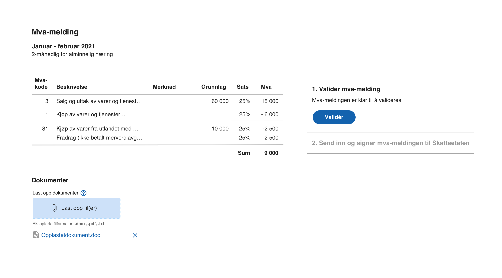
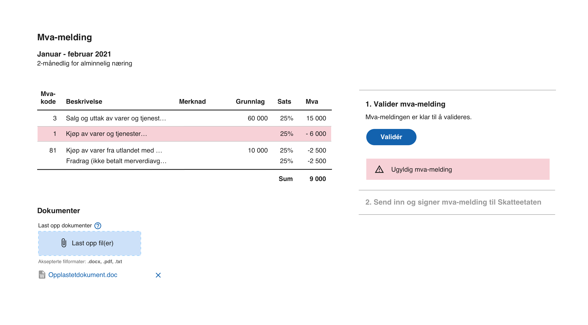
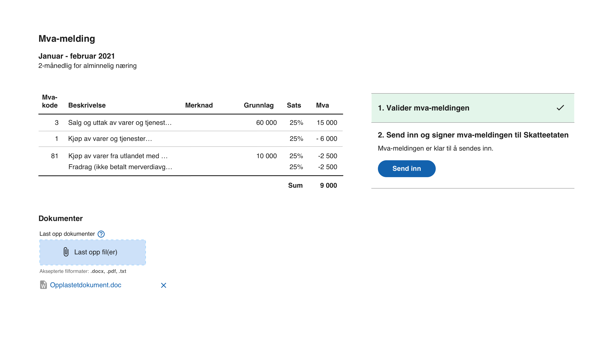
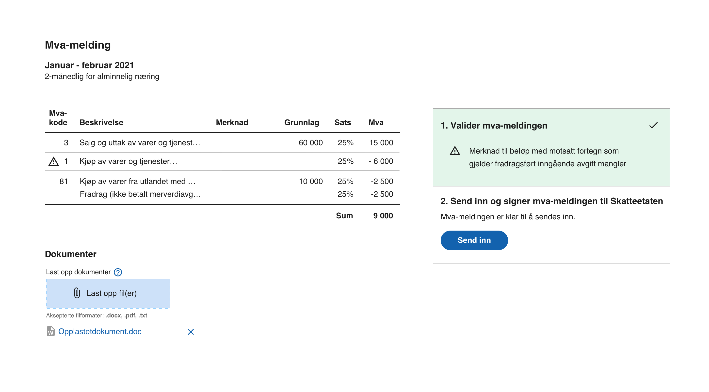
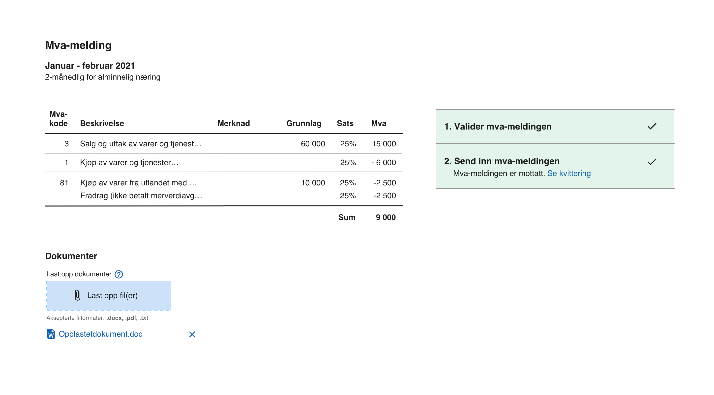

[English](https://skatteetaten.github.io/mva-meldingen/english/implementationguide/)

## Implementasjonsguide

### Endringslogg

| Dato       | Hva ble endret?                                                                                                                                                                                   |
| :--------- | :------------------------------------------------------------------------------------------------------------------------------------------------------------------------------------------------ |
| 2021.05.19 | La til denne endringsloggen og inkluderte at mva-meldingen meldingen blir validert under [fullføring av opplasting](#InnsendingValidering).                                                       |
| 2021.06.17 | Oppdatering av [hente tilbakemelding](#7-hente-tilbakemelding-på-innsendingen-fra-skatteetatens-innsendings-api) og [tilbakemeldingsfiler](#8-laste-ned-og-tolke-skatteetatens-tilbakemeldinger). |

## Forord

Denne guiden er skrevet av en utvikler for å gi leverandører en oversikt over et tenkt prosjekt for å implementere elektronisk innsending av modernisert Mva-Melding til Skattetatens API'er. Guiden vil hjelpe prosjektledere og utviklere med forståelsen av omfanget og hvilke tekniske betraktninger man bør ta stilling til.

## Oversikt

|  #  | Oppgave                                                                                 | Avhengigheter | Kompleksitet |
| :-: | --------------------------------------------------------------------------------------- | :-----------: | :----------: |
|  1  | Uttrekk av grunnlagsdata fra regnskapssystemet til utfylling av modernisert Mva-Melding |       -       |   \* [^1]    |
|  2  | Visning av Mva-Meldingen i regnskapssytemet                                             |       1       |   \* [^1]    |
|  3  | ID-Porten integrasjon                                                                   |       -       |      21      |
|  4  | Validere Mva-Melding mot Skatteetatens validerings-api                                  |       3       |      1       |
|  5  | Tolkning og visning av valideringsresultatet i regnskapssystemet                        |       4       |   \* [^1]    |
|  6  | Sende Mva-Melding til Skatteetatens innsendings-api                                     |       3       |      1       |
|  7  | Hente status på innsendingen hos Skatteetatens innsendings-api                          |       3       |      2       |
|  8  | Laste ned og tolke Skatteetatens tilbakemeldinger                                       |       3       |      2       |

## Oppgavedetaljer

Her finnes detaljer om oppgavene og en forklaring av kompleksiteten.

### 1. Uttrekk av grunnlagsdata fra regnskapssystemet til utfylling av modernisert Mva-Melding

Her handler det om å søke opp posteringer i regnskapet og populere den nye Mva-Meldingen. Oppgaven har ingen avhengigheter til andre oppgaver og det anbefales å starte denne så tidlig som mulig.

Elementer som kan påvirke kompleksiteten:

- Lage objektmodell fra xsd for Mva-Meldingen
- Bruk av Kodeliste for prosentuell sats og gyldighetsperiode
- Bruk av Kodeliste for mva koder i SAF-T standard brukt i mva-melding

### 2. Visning av Mva-Meldingen i regnskapssytemet

Et skjermbilde hvor Mva-Meldingens innhold presenteres for sluttbrukeren før validering og innsending.

Dette skjermbilde kunne tenkes å inneholde funksjonene for å validere og sende inn.

### 3. ID-Porten integrasjon

Bak den høye kompleksiteten har følgende blitt betraktet

- Det må gjennomføres en prosess med ID-Porten
- Autentiseringsprosessen burde være brukervennlig for sluttbrukeren
- Autentiseringsprosessen må være robust
- Token-cache
- Applikasjonstype og kjøremiljø
- OAuth2/OpenID - erfaring

#### ID-Porten prosess

For å ta i bruk validerings og innsendingsapiene må det integreres med ID-Porten. Det må opprettes et kundeforhold dersom dette ikke finnes, og det må gjennomføres flere runder med testing før produksjon kan starte opp.

#### Autentiseringsprosessen

Det antas at det finnes en sluttbruker som allerede er logget inn i regnskapssystemet. Når tiden er inne for å validere eller sende inn Mva-Meldingen ser vi for oss at Mva-Meldingen vises for sluttbrukeren. Autentiseringen vil kunne starte når brukeren velger å validere eller sende inn. Når autentiseringen med ID-porten er gjennomført har systemet et aksess-token som vil kunne brukes når Skatteetatens validerings- eller innsendings-api kalles. For å slippe at brukeren skal autentisere seg med ID-Porten hver gang en mva-melding skal valideres eller sendes inn burde man opprette en cache for Aksess-tokenet for den innloggede brukeren. Aksess-tokenet utstedes med en levetid og vil være gyldig til levetiden utløper. Når levetiden utløper må man ha nytt, og brukeren må enten logge inn på nytt eller dersom kjøremiljøet til regnskapssystemet kan holde en hemmelighet vil man kunne benytte refresh-tokens.

#### Token-cache

For at brukeren ikke skal måtte logge inn hver gang en Mva-Melding skal sendes inn anbefales det å utvikle en cache for innloggede brukeres tokens. Fra tokenet kan man hente utløpstiden som kan brukes for å finne ut om brukeren må logge inn igjen før innsending.

#### Applikasjonstype og kjøremiljø

Både applikasjonstypen og kjøremiljøet vil være med å bestemme om man har mulighet til å benytte refresh-tokens.

ID-Portens innlogging krever at applikasjonen kan lytte til en URL som er konfigurert i ID-Porten klienten når sluttbrukeren har gjennomført autentisering via ID-Porten. Browseren vil redirigere brukeren til nevnte URL så det vil ikke kreve noen endringer i nettverk eller brannmur. Det vil være mindre komplekst å gjøre dette i en web-applikasjon eller SPA i forhold til en skrivebordsapplikasjon.

#### OAuth2/OpenID - erfaring

Dersom erfaringen med OAuth2/OpenID er liten så vil dette kreve innsats å forstå og implementere på en god måte. Alle elementene i ID-Porten integrasjonen henger sammen og det er viktig å bevare brukeropplevelsen under utviklingen.

Les mer om [ID-porten & Autentisering](https://skatteetaten.github.io/mva-meldingen/documentation/idportenautentisering/)

### 4. Validere Mva-Melding mot Skatteetatens validerings-api

Å kalle valideringstjenesten med ID-Porten-token er nærmest trivielt dersom man har en mva-melding og man har et gyldig token fra ID-Porten. Vi anbefaler en prosess hvor valideringstjenesten kalles med mva-meldingen før man starter innsendingen.

Validerings-apiet validerer kun mva-meldingsfilen som er en av flere filer i innsendingen.

### 5. Tolkning og visning av valideringsresultatet i regnskapssystemet

Valideringstjenesten vil returnere et valideringsresultat, og det vil være hensiktsmessig å presentere resultatet for sluttbrukeren, spesielt dersom valideringstjenesten finner mva-meldingen ugyldig. Dette indikeres i valideringsresultatet med status satt til UGYLDIG_SKATTEMELDING. Ugyldige meldinger blir ikke behandlet eller ansett som mottatt av Skatteetaten. Valideringsresultatet vil også gi tilbakemeldinger på element-nivå og vil kunne være interessant å vise i kontekst av mva-meldingen som skal sendes inn.

**Skatteetaten anbefaler å avbryte innsending dersom valideringsresultatet sin status er UGYLDIG_SKATTEMELDING.**

### 6. Sende Mva-Melding til Skatteetatens innsendings-api

En innsending består av følgende filer:

- Mva-Melding
- Mva-Melding-Innsending
- Vedlegg
  Og lastes opp til innsendings-apiet i flere kall. Sekvensen av kall er dokumentert under API, og består av enkle Http-kall.

Brukeren som starter innsendingen må være autorisert for dette for den aktuelle organisasjonen. Sluttbrukeren må ha en av de følgende Altinn-rollene:

- Ansvarlig revisor
- Regnskapsmedarbeider
- Regnskapsfører uten signeringsrett
- Revisormedarbeider

Når alle filene er lastet opp må man gjøre et kall for å fullføre opplasting, og innsendingen vil være klar for fullføring dersom ingen valideringsfeil finnes.

Skatteetaten validerer følgende:

- At organisasjonsnummer er likt i Mva-Meldingsfilen, Mva-Melding-Innsendingsfilen og at det samme organisasjonsnummer som ble brukt for å skape innsendingen (instansens organisasjonsnummer må også være det samme).
- At vedleggene som er lastet opp er i lista over vedlegg i Mva-Melding-Innsendingsfilen og vise versa.
- At Meldingskategorien er lik i Mva-Meldingsfilen og Mva-Melding-Innsendingsfilen
- At Mva-Meldingen er gyldig. Skatteetaten gjør samme kall som i [4. Validere Mva-Melding](#4-validere-mva-melding-mot-skatteetatens-validerings-api), og returnerer valideringsresultatet som innhold i responsen.

Responsen vil ha http-statuskoden 409 hvis valideringen mislykkes. Det er mulig å oppdatere de opplastede filene med egne API-kall. Mer info kan finnes hos Altinn Studio Instans API og <a href="../api#prosess-innsending-og-validering" target="_blank">referanse finnes i API-dokumentasjonen</a>

Når opplastningen er fullført, kan innsendingen fullføres. Brukeren som fullfører innsendingen må være autorisert for dette for den aktuelle organisasjonen. Sluttbrukeren må ha en av de følgende Altinn-rollene:

- Begrenset signeringsrett
- Kontaktperson NUF (gjelder ikke for Skattemelding for merverdiavgiftskompensasjon) 
- Regnskapsfører med signeringsrett

### 7. Hente tilbakemelding på innsendingen fra Skatteetatens innsendings-api

Bak kulissene er dette en asynkron operasjon som involverer flere mikrotjenester. For å legge til rette for en bedre brukeropplevelse og lette implementasjonen av å finne ut om Skatteetaten har mottatt innsending, har vi gjort en utvidelse av rest-apiet som vil blokkere til tilstanden for innleveringen har nådd Skatteetatens definisjon av mottatt. Dette vil spare deg for å implementere en pollende løkke som vil måtte vite og finne ut om Skatteetaten har mottatt innsendingen og gitt tilbakemelding.

I tilfelle det skal polles for å hente tilbakemelding skal status-endepunktet brukes til det returnerer at tilbakemelding er gitt, før instansen hentes, enten med feedback-apiet, eller med instans-apiet.

Flere detaljer om regler og tilbakemelding finnes i <a href="../api#hent-tilbakemelding" target="_blank">API-dokumentasjonen</a>

### 8. Laste ned og tolke Skatteetatens tilbakemeldinger

Skatteetatens tilbakemeldinger består av:

- Status for innlevering (altinn instans substatus)
- Kvittering i PDF-format
- Betalingsinformasjon i xml
- Valideringsresultat i xml

Disse dokumentene er lastet opp til instansen for innsendingen. Lokasjonen hvor de kan lastes ned fra finnes i dataliste-elementet i instansen som returneres fra enten instans-api'et eller tilbakemeldingsutvidelsen av api'et omtalt i punkt 7.

Flere detaljer om tilbakemeldingsfilene finnes i <a href="../api#tilbakemeldingsfiler" target="_blank">API-dokumentasjonen</a>

## UI-forslag

I de følgende skissene foreslår Skatteetaten en brukeropplevelse som vil sikre en enkel arbeidsflyt for sluttbrukeren og hvordan vi anbefaler å kalle valideringstjenestens API.

### Antagelser

I de følgende skissene antar vi at

- Brukeren har et gyldig ID-Porten Access Token
- En mva-melding er generert

### Gjennomføre validering

Vi anbefaler at valideringen blir kalt og er vellykket før du fullfører innsendingen. Hvis det sendes en mva-melding som blir validert og funnet ugyldig av Skatteetaten, anses innsendingen som "Ikke levert", selv om det er teknisk mulig å levere en ugyldig mva-melding.

### Valideringen mislykkes

Hvis valideringen mislykkes, er det ingen grunn for sluttbrukeren å sende den inn, fordi den ikke blir ansett som levert og den vil ikke bli behandlet av Skatteetaten. Vi anbefaler å holde innleveringen deaktivert og vise valideringsfeil og avvik i mva-meldingsvisningen. Valideringsresultatet inkluderer hvilke valideringsregler som feilet og hvilke MVA-koder som forårsaker det.

### Valideringen lykkes uten avvik

Hvis valideringen finner meldingen gyldig, kan innsendingsfunksjonen trygt aktiveres. Skatteetaten vil automatisk behandle og godta gyldige meldinger.

### Valideringen lykkes med avvik

Avvik vil også returneres i valideringsresultatet. Mva-Meldingen vil være gyldig selv om det skulle finnes avvik, og Skatteetaten vil godta meldingen og behandle den automatisk. Innsendingsfunksjonen kan trygt aktiveres.

### Innsending av mva-melding

Når det er klart for å sende inn mva-meldingen, anbefaler vi at når det klikkes på Send-knappen:

1. Gjennomfører alle kallene for innsending, se serien med kall i API-seksjonen
2. Kalle det synkrone (og blokkerende) API-kallet som er diskutert i nr. 7 ovenfor for å vente på tilbakemelding fra Skatteetaten

Begge skal kunne utføres mens det blir presentert en opptatt-indikator. I denne skissen som en spinner i Send-knappen.

### Mva-Melding mottatt

Som nevnt skal Skatteetaten kunne gi tilbakemelding før man får timeout på den synkrone requesten, og vi tror det er verdifullt å vente på tilbakemelding i forbindelse med innleveringen. Da vil brukeren kunne fullføre det nødvendige arbeidet under leveringen av mva-meldingen. Hvis det ikke ventes på tilbakemeldingen, må sluttbrukeren returnere til den senere.

[^1]: Kompleksiteten i denne oppgaven er avhengig av implementasjonen av regnskapssystemet og er opp til leverandøren å evaluere.
