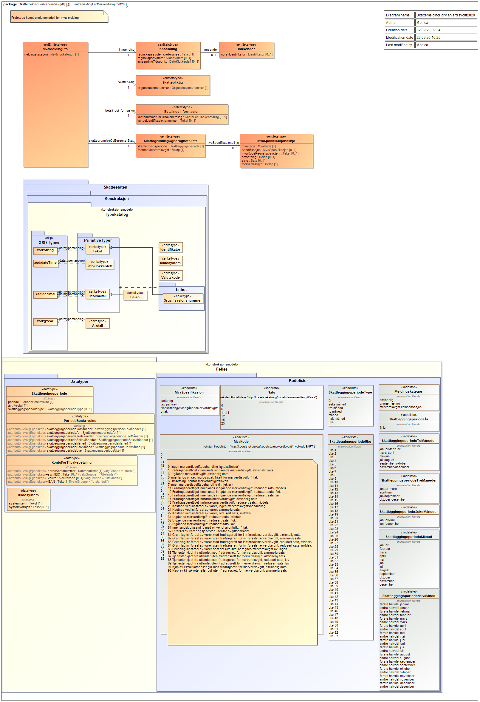

# XSD for mva-meldingen

### Endringslogg

| Dato       | Hva ble endret?                                                                                                                                                                                                                                                                                                                                                                                                                                                                                                                                                     |
| :--------- | :------------------------------------------------------------------------------------------------------------------------------------------------------------------------------------------------------------------------------------------------------------------------------------------------------------------------------------------------------------------------------------------------------------------------------------------------------------------------------------------------------------------------------------------------------------------ |
| 2021.06.21 | Oppdaterte kodeliste [mvaSpesifikasjon](https://github.com/Skatteetaten/mva-meldingen/blob/master/docs/documentation/informasjonsmodell/kodelister/mvaSpesifikasjon.xml), rettet "tap på krav" til "tapPåKrav"                                                                                                                                                                                                                                                                                                                                                      |
| 2021.08.31 | Oppdaterte med beskrivelse av feltene i MvaMeldingInnsending                                                                                                                                                                                                                                                                                                                                                                                                                                                                                                        |
| 2021.09.13 | Ny tabell for beskrivelse av kodelister                                                                                                                                                                                                                                                                                                                                                                                                                                                                                                                             |
| 2021.09.21 | Oppdatert informasjonsmodell for mva-melding. Fjernet SAFT-koder det ikke skal rapporteres på                                                                                                                                                                                                                                                                                                                                                                                                                                                                       |
| 2021.10.12 | Oppdatert kodeliste [merknadTilsvarendeMvaKode](https://github.com/Skatteetaten/mva-meldingen/blob/master/docs/documentation/informasjonsmodell/kodelister/merknadTilsvarendeMvaKode.xml), inkl. fjernet duplikat                                                                                                                                                                                                                                                                                                                                                   |
| 2021.10.15 | Oppdatert kodelister                                                                                                                                                                                                                                                                                                                                                                                                                                                                                                                                                |
| 2021.10.21 | Oppdatert beskrivelse av periode og skattleggingsperiode med informasjon om SkattleggingsperiodeUke og SkattleggingsperiodeHalvmåndelig                                                                                                                                                                                                                                                                                                                                                                                                                             |
| 2021.10.22 | Oppdaterte kodelister, rettet engelske tekster i [merknad](https://github.com/Skatteetaten/mva-meldingen/blob/master/docs/documentation/informasjonsmodell/kodelister/merknad.xml), lagt til nytt element "fradrag" i [merknadTilsvarendeMvaKode](https://github.com/Skatteetaten/mva-meldingen/blob/master/docs/documentation/informasjonsmodell/kodelister/merknadTilsvarendeMvaKode.xml), oversettinger til nynorsk i [mvaKodeSAFT](https://github.com/Skatteetaten/mva-meldingen/blob/master/docs/documentation/informasjonsmodell/kodelister/mvaKodeSAFT.xml). |

## XSD for mva-meldingen versjon 1.0

Mva-meldingen sendes inn i XML-format. Den må være i henhold til strukturen dokumentert i XSD for mva-melding.

Versjon 1.0 av denne XSD'en ligger her:
[no.skatteetaten.fastsetting.avgift.mva.skattemeldingformerverdiavgift.v1.0.xsd](https://github.com/Skatteetaten/mva-meldingen/blob/master/docs/documentation/informasjonsmodell/xsd/no.skatteetaten.fastsetting.avgift.mva.skattemeldingformerverdiavgift.v1.0.xsd)

Grafisk fremstilling av xsd og kodelister for [mva-meldingen](SkattemeldingForMerverdiavgift2020.png):

SAF-T spesifikasjonen inneholder også kodene 0 (Ingen merverdiavgiftsbehandling (anskaffelser)), 7 (Ingen merverdiavgiftsbehandling (inntekter)), 20 (Kostnad ved innførsel av varer, ingen merverdiavgiftsbehandling), 21 (Kostnader ved innførsel av varer, alminnelig sats) og 22 (Kostnader ved innførsel av varer, redusert sats, middels). Disse skal ikke rapporteres i mva-meldingen.

Eksempler på ny mva-melding i excel:

[Testtilfeller mva-melding](https://github.com/Skatteetaten/mva-meldingen/blob/master/docs/documentation/test/Testtilfeller%20mva-melding.xlsx?raw=true)

Tilsvarende eksempler på mva-meldinger i XML-format finnes under [test](https://github.com/Skatteetaten/mva-meldingen/blob/master/docs/documentation/test/eksempler/melding/)

## Feltbeskrivelse for mva-melding

### MvaMelding

<table align=center>
  <tr><th style="width:25%" align=left>Felt</th><th align=left>Beskrivelse</th></tr>
  <tr><td>meldingskategori</td><td>Beskrivelse: type skjema som sendes inn  
	Formål: å sikre at brukeren dekker sin plikt for egenfastsetting
	</td>
  </tr>
    <tr><td>merknad</td><td>Beskrivelse: informasjon om innholdet i mva-meldingen  
	Formål: å sikre at skattepliktig kan forklare egen rettsanvendelse der det er nødvendig
	</td>
  </tr>
</table>

### Skattepliktig

<table align=center>
  <tr><th style="width:25%" align=left>Felt</th><th align=left>Beskrivelse</th></tr>
  <tr><td>organisasjonsnummer</td><td>Beskrivelse: unik identifikator for den skattepliktige som foretar egenfastsetting  
  Formål: ivareta den skattepliktiges rettigheter og plikter
	</td>
  </tr>	
</table>

### Innsending

<table align=center>
  <tr><th style="width:25%" align=left>Felt</th><th align=left>Beskrivelse</th></tr>
  <tr><td>regnskapssystemrefereanse</td><td>Beskrivelse: Skattepliktiges unike referanse for innsending  
  Formål: Sikre at skattepliktig og skattekontoret refererer til samme melding.
	</td>
  </tr>
    <tr><td>system</td><td>Beskrivelse: Navn og evt versjon for regnskapssystem  
	Formål: Å kunne følge opp systematiske feil med systemleverandør i stedet for å følge opp hver enkelt skattepliktig.
	</td>
  </tr>
</table>

### Betalingsinformasjon

Oppgis bare dersom det er tilgodebeløp.

<table align=center>
  <tr><th style="width:25%" align=left>Felt</th><th align=left>Beskrivelse</th></tr>
  <tr><td>KID</td><td>Beskrivelse: Mottakerens identifikasjon av en betaling  
  Formål: Å kunne betale til de bankkontoene som krever KID
  </td>
</table>

### Skattegrunnlag og beregnet skatt

<table align=center>
  <tr><th style="width:25%" align=left>Felt</th><th align=left>Beskrivelse</th></tr>
  <tr><td>skattleggingsperiode</td><td>Beskrivelse: den perioden egenfastsettingen gjelder for  
  Periode angis i henhold til kodeverket for Skattleggingsperiode. SkattleggingsperiodeUke følger kalenderens ukenummerering, eksempelvis løper uke 1 i 2022 fra 3. til 9. januar. I SkattleggingsperiodeHalvmåndelig løper første halvdel fra 1. til 15. i måneden og andre halvdel løper fra 16. til siste i måneden.      
  Formål: sikre samsvar mellom bokføring og egenfastsetting
	</td>
  </tr>
    <tr><td>fastsattMerverdiavgift</td><td>Beskrivelse: sum å betale/sum til gode  
	Formål: å sikre at riktig beløp blir betalt
	</td>
  </tr>
</table>

### MvaSpesifikasjonslinje

<table align=center>
  <tr><th style="width:25%" align=left>Felt</th><th align=left>Beskrivelse</th></tr>
  <tr><td>mvaKode</td><td>Beskrivelse: Klassifikasjon av inngående og utgående mva ihht til norsk SAF-T standard 
  Formål: formidling av hvilke mva-vurderinger som er utført
	</td>
  </tr>
  <tr><td>spesifikasjon</td><td>Beskrivelse: detaljering av noen mva-forhold som ikke inngår i norsk SAF-T standard 
	Formål: formidling av hvilke mva-vurderinger som er utført
	</td>
  </tr> 
  <tr><td>mvaKodeRegnskapssystem</td><td>Beskrivelse: intern mva-kode i regnskapssystemet. Det kan være flere interne mva-koder for en mvaKode og evt spesifikasjon. I det tilfellet vil det bli flere rader i mva-meldingen pr mvaKode og spesifikasjon; en pr kombinasjon av mva-kode, spesifikasjon og mvaKodeRegnskapssystem. 
  Formål: To hensyn  
Brukerne: gjenkjennelig i forhold til det de ser i regnskapet.  
Systemleverandørene skal slippe å legge om mva-koder i systemene
	</td>
  </tr>
  <tr><td>grunnlag</td><td>Beskrivelse: det beløpet det er regnet utgående mva av.
Feltet skal ikke fylles ut for inngående mva.  
Formål: Grunnlag for kontroll ifra Skatteetaten
	</td>
  </tr>
  <tr><td>sats</td><td>Beskrivelse: Den mva-satsen som er benyttet ved beregning av utgående mva.
Feltet skal ikke fylles ut for inngående mva.  
	Formål: Å sikre at bare gyldige satser benyttes ved fakturering
	</td>
  </tr>
  <tr><td>merverdiavgift</td><td>Beskrivelse: fastsatt merverdiavgift  
	Formål: å vise beregnet mva pr linje
      </td>
  </tr>  
  <tr><td>merknad</td><td>Beskrivelse: informasjon om innholdet i mvaKode  
	Formål: å sikre at skattepliktig kan forklare egen rettsanvendelse der det er nødvendig
	</td>
  </tr>

</table>

## Feltbeskrivelse for MvaMeldingInnsending

### MvaMeldingInnsending

<table align=center>
  <tr><th style="width:25%" align=left>Felt</th><th align=left>Beskrivelse</th></tr>
  <tr><td>meldingskategori</td>
    <td>
        Beskrivelse: type skjema som sendes inn  
        Formål: å sikre at brukeren dekker sin plikt for egenfastsetting
	</td>
  </tr>
  <tr><td>innsendingstype</td>
    <td>
        Beskrivelse: En mva-melding av meldingskategori alminnelig og primær vil alltid være <strong>komplett</strong>.  
        Formål: Feltet beholdes for på et senere tidspunkt kunne åpne for at revisor kommenterer/ skriver merknad på de mva-meldingene (f. eks. merverdiavgift kompensasjon) som skal godkjennes av revisor før innsending.
	</td>
  </tr>
  <tr><td>instansstatus</td>
    <td>
        Beskrivelse: Dette feltet kommer vi til å fjerne da vi får denne informasjonen fra hendelser på instansen. Dette skal gjøres ved at det settes til valgfritt i en overgang og fases ut ved en passende anledning.
	</td>
  </tr>
  <tr><td>opprettetAv</td>
    <td>
        Beskrivelse: Dette feltet skal inneholde navn på innlogget bruker.  
        Formål: Innholdet i denne vises i Altinn.
	</td>
  </tr>
  <tr><td>opprettingstidspunkt</td>
    <td>
        Beskrivelse: Dette feltet kommer vi til å fjerne da vi får denne informasjonen fra instansen. 
        Dette skal gjøres ved at det settes til valgfritt i en overgang og fases ut ved en passende anledning.
	</td>
  </tr>
</table>
 

### Identifikator (Enten organisasjonsnummer eller foedselsnummer)

<table align=center>
  <tr><th style="width:25%" align=left>Felt</th><th align=left>Beskrivelse</th></tr>
  <tr>
    <td>organisasjonsnummer</td>
    <td>
        Beskrivelse: unik identifikator for den skattepliktige som foretar egenfastsetting  
        Formål: ivareta den skattepliktiges rettigheter og plikter
	</td>
  </tr>
  <tr><td>foedselsnummer</td>
    <td>
        Beskrivelse: unik identifikator for den skattepliktige som foretar egenfastsetting  
        Formål: ivareta den skattepliktiges rettigheter og plikter
	</td>
  </tr>
</table>
 

### Skattleggingsperiode

<table align=center>
  <tr><th style="width:25%" align=left>Felt</th><th align=left>Beskrivelse</th></tr>
  <tr>
    <td>periode</td>
    <td>
        Beskrivelse: den perioden egenfastsettingen gjelder for  
		Periode angis i henhold til kodeverket for Skattleggingsperiode. SkattleggingsperiodeUke følger kalenderens ukenummerering, eksempelvis løper uke 1 i 2022 fra 3. til 9. januar. I SkattleggingsperiodeHalvmåndelig løper første halvdel fra 1. til 15. i måneden og andre halvdel løper fra 16. til siste i måneden.     
        Formål: sikre samsvar mellom bokføring og egenfastsetting
	</td>
  </tr>
  <tr><td>aar</td>
    <td>
        Beskrivelse: det året egenfastsettingen gjelder for  
        Formål: sikre samsvar mellom bokføring og egenfastsetting
	</td>
  </tr>
</table>
 

### Vedlegg

<table align=center>
  <tr><th style="width:25%" align=left>Felt</th><th align=left>Beskrivelse</th></tr>
  <tr>
    <td>vedleggstype</td>
    <td>
        Beskrivelse: Type vedlegg som blir lastet opp på instansen i Altinn. 
        Hvor en kan enten bruke <strong>mva-melding</strong> for selve mva-meldingen, 
        eller <strong>binaerVedlegg</strong> for generelle vedlegg.  
	</td>
  </tr>
  <tr><td>kildegruppe</td>
    <td>
        Beskrivelse: Hvilken gruppe innsendingen kommer fra. 
        Valgmuligheter: <strong>etat</strong>, <strong>sluttbrukersystem</strong>, <strong>sluttbruker</strong>  
	</td>
  </tr>
  <tr><td>opprettetAv</td>
    <td>
        Beskrivelse: Dette feltet skal inneholde navn på innlogget bruker   
        Formål: Innholdet i denne vises i Altinn
	</td>
  </tr>
  <tr><td>opprettingstidspunkt</td>
    <td>
        Beskrivelse: Dette feltet kommer vi til å fjerne da vi får denne informasjonen fra instansen. 
        Dette skal gjøres ved at det settes til valgfritt i en overgang og fases ut ved en passende anledning.
	</td>
  </tr>
</table>
 

### Vedleggsfil

<table align=center>
  <tr><th style="width:25%" align=left>Felt</th><th align=left>Beskrivelse</th></tr>
  <tr>
    <td>filnavn</td>
    <td>
        Beskrivelse: navnet på filen som er lagt med som vedlegg  
	</td>
  </tr>
  <tr><td>filekstensjon</td>
    <td>
        Beskrivelse: ekstensjonen til filen som er lagt med som vedlegg  
	</td>
  </tr>
  <tr><td>filinnhold</td>
    <td>
        Beskrivelse: Gir en beskrivelse av innholdet i vedleggsfilen  
	</td>
  </tr>
</table>

## Kodelister

| Gruppe og kode                                    | Beskrivelse av kode, fradrag og spesifikasjon                                             |
| ------------------------------------------------- | ----------------------------------------------------------------------------------------- |
| Salg av varer og tjenester i Norge                |                                                                                           |
| 3                                                 | Salg og uttak av varer og tjenester (høy sats)                                            |
| Spesifikasjonslinje til kode 3                    | Uttak                                                                                     |
| 31                                                | Salg og uttak av varer og tjenester (middels sats)                                        |
| Spesifikasjonslinje til kode 31                   | Uttak                                                                                     |
| 33                                                | Salg og uttak av varer og tjenester (lav sats)                                            |
| Spesifikasjonslinje til kode 33                   | Uttak                                                                                     |
| 5                                                 | Salg av varer og tjenester som er fritatt for merverdiavgift                              |
| Spesifikasjonslinje til kode 5                    | Uttak                                                                                     |
| 6                                                 | Salg av varer og tjenester som er unntatt merverdiavgiftsloven                            |
| Salg av varer og tjenester til utlandet (eksport) |                                                                                           |
| 52                                                | Salg av varer og tjenester til utlandet som er fritatt for merverdiavgift                 |
| Kjøp av varer og tjenester i Norge (fradrag)      |                                                                                           |
| 1                                                 | Kjøp av varer og tjenester med fradrag (høy sats)                                         |
| Spesifikasjonslinje til kode 1                    | Tap på krav                                                                               |
| Spesifikasjonslinje til kode 1                    | Justering av merverdiavgift for kapitalvarer                                              |
| Spesifikasjonslinje til kode 1                    | Tilbakeføring av merverdiavgift for kapitalvarer (kun personkjøretøy og fast eiendom)     |
| 11                                                | Kjøp av varer og tjenester med fradrag (middels sats)                                     |
| Spesifikasjonslinje til kode 11                   | Tap på krav                                                                               |
| 13                                                | Kjøp av varer og tjenester med fradrag (lav sats)                                         |
| Spesifikasjonslinje til kode 13                   | Tap på krav                                                                               |
| Kjøp av varer fra utlandet (import)               |                                                                                           |
| 81                                                | Kjøp av varer fra utlandet med fradragsrett (høy sats)                                    |
| 81                                                | Fradrag på kjøp av varer fra utlandet (høy sats)                                          |
| Spesifikasjonslinje til 81                        | Tilbakeføring av merverdiavgift for kapitalvarer (kun personkjøretøy og fast eiendom)     |
| 14                                                | Fradrag på kjøp av varer fra utlandet (merverdiavgift betalt ved innførsel, høy sats)     |
| 82                                                | Kjøp av varer fra utlandet uten fradragsrett (høy sats)                                   |
| 83                                                | Kjøp av varer fra utlandet med fradragsrett (middels sats)                                |
| 83                                                | Fradrag på kjøp av varer fra utlandet (middels sats)                                      |
| 15                                                | Fradrag på kjøp av varer fra utlandet (merverdiavgift betalt ved innførsel, middels sats) |
| 84                                                | Kjøp av varer fra utlandet uten fradragsrett (middels sats)                               |
| 85                                                | Kjøp av varer fra utlandet som det ikke skal beregnes merverdiavgift på (nullsats)        |
| Kjøp av tjenester fra utlandet (import)           |                                                                                           |
| 86                                                | Kjøp av tjenester fra utlandet med fradragsrett (høy sats)                                |
| 86                                                | Fradrag på kjøp av tjenester fra utlandet (høy sats)                                      |
| 87                                                | Kjøp av tjenester fra utlandet uten fradragsrett (høy sats)                               |
| 88                                                | Kjøp av tjenester fra utlandet med fradragsrett (lav sats)                                |
| 88                                                | Fradrag på kjøp av tjenester fra utlandet (lav sats)                                      |
| 89                                                | Kjøp av tjenester fra utlandet uten fradragsrett (lav sats)                               |
| Fisk m.m.                                         |                                                                                           |
| 32                                                | Salg av fisk og andre marine viltlevende ressurser                                        |
| Spesifikasjonslinje til kode 32                   | Uttak                                                                                     |
| 12                                                | Kjøp av fisk og andre marine viltlevende ressurser                                        |
| Spesifikasjonslinje til kode 12                   | Tap på krav                                                                               |
| Klimakvoter og gull                               |
| 51                                                | Salg av klimakvoter og gull til næringsdrivende                                           |
| 91                                                | Kjøp av klimakvoter og gull                                                               |
| 91                                                | Fradrag på kjøp av klimakvoter og gull                                                    |
| 92                                                | Kjøp av klimakvoter og gull uten fradragsrett                                             |

En oversikt over kodelistene finnes i [Oversikten over kodelister](https://github.com/Skatteetaten/mva-meldingen/blob/master/docs/documentation/informasjonsmodell/kodelister/)

- Kodeliste for mva-kode: [mvaKodeSAFT](https://github.com/Skatteetaten/mva-meldingen/blob/master/docs/documentation/informasjonsmodell/kodelister/mvaKodeSAFT.xml)
- Kodeliste for mva-spesifikasjon: [mvaSpesifikasjon](https://github.com/Skatteetaten/mva-meldingen/blob/master/docs/documentation/informasjonsmodell/kodelister/mvaSpesifikasjon.xml)
- Kodeliste for sats: [sats](https://github.com/Skatteetaten/mva-meldingen/blob/master/docs/documentation/informasjonsmodell/kodelister/sats.xml)
- Kodeliste for merknader: [merknad](https://github.com/Skatteetaten/mva-meldingen/blob/master/docs/documentation/informasjonsmodell/kodelister/merknad.xml)
- Kodeliste for merknader og tilsvarende mva-kode: [merknadTilsvarendeMvaKode](https://github.com/Skatteetaten/mva-meldingen/blob/master/docs/documentation/informasjonsmodell/kodelister/merknadTilsvarendeMvaKode.xml)

# XSD for innsending

Innsendingen til Altinn må inneholde en XML-fil med innsendingsinformasjon. Denne må være i henhold til strukturen i XSD for innsending.

[no.skatteetaten.fastsetting.avgift.mvamvameldinginnsending.v1.0.xsd](https://github.com/Skatteetaten/mva-meldingen/blob/master/docs/documentation/informasjonsmodell/xsd/no.skatteetaten.fastsetting.avgift.mvamvameldinginnsending.v1.0.xsd)

# XSD for valideringsrespons og tilbakemelding

XSD for validering dokumenterer strukturen for responsen fra valideringstjenesten. Tilbakemelding vil også være i henhold til denne XSD-en.
[no.skatteetaten.fastsetting.avgift.mva.valideringsresultat.v1.xsd](https://github.com/Skatteetaten/mva-meldingen/blob/master/docs/documentation/informasjonsmodell/xsd/no.skatteetaten.fastsetting.avgift.mva.valideringsresultat.v1.xsd)

# XSD for betalingsinformasjon

[no.skatteetaten.fastsetting.avgift.mva.skattemeldingformerverdiavgift.betalingsinformasjon.v1.0.xsd](https://github.com/Skatteetaten/mva-meldingen/blob/master/docs/documentation/informasjonsmodell/xsd/no.skatteetaten.fastsetting.avgift.mva.skattemeldingformerverdiavgift.betalingsinformasjon.v1.0.xsd)
