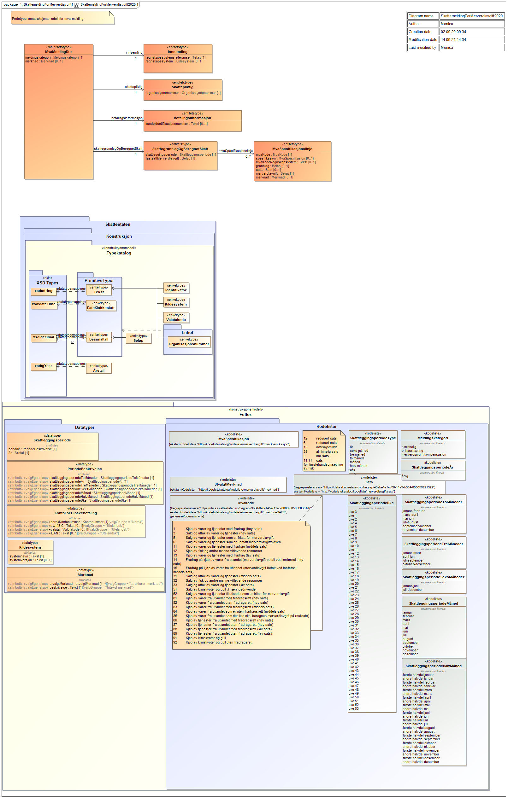

Grafisk fremstilling av xsd og kodelister for mva-meldingen:

Enkel prototype på ny mva-melding:

[revidert-protoype-mvamelding](revidert-protoype-mvamelding.xlsx)

# XSD for mva-meldingen

Versjon 9.0.0 av denne XSD'en ligger vedlagt og heter
[no.skatteetaten.fastsetting.avgift.mva.skattemeldingformerverdiavgift.v0.9](https://github.com/Skatteetaten/mva-meldingen/blob/master/docs/documentation/informasjonsmodell/xsd/no.skatteetaten.fastsetting.avgift.mva.skattemeldingformerverdiavgift.v0.9.xsd)

Eksempler på mva-meldinger i xml-format finnes under test.

# Kodelister

En oversikt over kodelistene finnes i [Oversikten over kodelister](https://github.com/Skatteetaten/mva-meldingen/blob/master/docs/documentation/informasjonsmodell/kodelister/)

- Kodeliste for mva-kode: [mvaKodeSAFT](https://github.com/Skatteetaten/mva-meldingen/blob/master/docs/documentation/informasjonsmodell/kodelister/mvaKodeSAFT.xml)
- Kodeliste for mva-spesifikasjon: [mvaSpesifikasjon](https://github.com/Skatteetaten/mva-meldingen/blob/master/docs/documentation/informasjonsmodell/kodelister/mvaSpesifikasjon.xml)
- Kodeliste for sats: [sats](https://github.com/Skatteetaten/mva-meldingen/blob/master/docs/documentation/informasjonsmodell/kodelister/sats.xml)
- Kodeliste for merknader: [merknader](https://github.com/Skatteetaten/mva-meldingen/blob/master/docs/documentation/informasjonsmodell/kodelister/merknader.xml)

# Merknader mot poster og hele meldingen

Oversikt over merknader knyttet opp mot de ulike SAF-T kodene i mva-meldingen [merknader mot poster og hele meldingen](merknader mot poster og hele meldingen.xlsx) og i [strukturert format i xml her](https://github.com/Skatteetaten/mva-meldingen/tree/master/docs/documentation/informasjonsmodell/kodelister)
