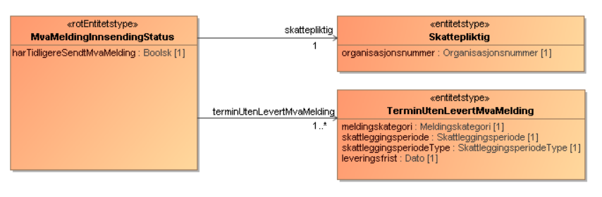
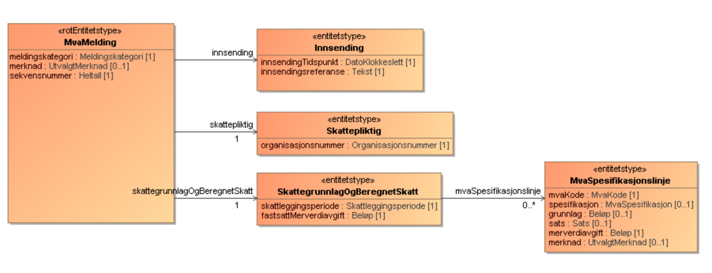

[English](https://skatteetaten.github.io/mva-meldingen/english/informationservices/)

# Innsynstjenester tilgjengelig som API

## Endringslogg

| Dato       | Hva ble endret?                                    |
| :--------- | :----------------------------------                |
| 2022.10.04 | Side for innsynstjenester opprettet                |
| 2022.12.02 | La til beskrivelse av tjeneste innsendte meldinger |

# MVA Innsyn API

##Introduksjon
API-ene for innsyn kan brukes av sluttbrukersystemer (SBS) for å innhente tilsvarende informasjon som tilbys via «Min Merverdiavgift».

## Forespørsel om innsyn

Forespørsler om innsyn gjøres som HTTP GET kall til Skatteetatens API-er og svar returneres på XML eller JSON format. Hvilket format som er ønsket angis i «Accept» header i HTTP forespørselen.
Sekvens for forespørsler om innsyn:

1. Autentisering med ID-porten.
2. Kall mot Skatteetaten

## Tjenester
   
### Status for innsending av mva-melding

Tjenesten gir status for inneværende termin(er) og terminer med manglende innsendt mva-melding.

**URL** : `GET https://<env>/api/mva/grensesnittstoette/innsyn/melding/innsending/status/v1/{organisasjonsnummer}`

Hvor `<env>` er miljøspesifikk adresse f.eks. `api-sbstest.sits.no`

**Eksempel** : Forespørsel om status for innsending for organisasjonsnummer 123456789

`GET https://mp-test.sits.no/api/mva/grensesnittstoette/innsyn/melding/innsending/status/v1/123456789`

Headers:  
`Accept: application/xml`  
`Authorization: Bearer <maskinportentoken>`

**Response**  
`status: 200 Innhold (body)`

<eksempelresultat>

**Feilmeldinger**  
_Respons 401 - Unauthorized:_  
Hvis token fra Maskinporten ikke stemmer overens med forespurt organisasjon.

### Informasjonsmodell

Grafisk fremstilling av xsd for [innsynstjenesten](Informasjonsmodell mvaInnsendingStatus.PNG):

Versjon 1.0 av XSD for responsen ligger her:
[no.skatteetaten.fastsetting.avgift.mva.skattemeldingformerverdiavgift.v1.0.xsd](https://github.com/Skatteetaten/mva-meldingen/blob/master/docs/informasjonsmodell_filer/xsd/no.skatteetaen.fastsetting.avgift.mva.mvaMeldingInnsendingStatus.v1.xsd)
   
   
### Innsendte meldinger
Tjenesten gir liste over innsendte meldinger med eventuelt fastsatt avgift. Kall uten referanse gir første side på 10 siste terminer, mens tidligere terminer kan hentes ut med referanse fra siste melding i resultat fra mottatt side.

**URL** : `GET https://<env>/api/mva/grensesnittstoette/innsyn/melding/innsending/melding/v1/{organisasjonsnummer}`
`GET https://<env>/api/mva/grensesnittstoette/innsyn/melding/innsending/melding/v1/{organisasjonsnummer} ?sekvensnummer=<sekvensnummer>`

Hvor `<env>` er miljøspesifikk adresse f.eks. `api-sbstest.sits.no`

**Eksempel** : Forespørsel om status for innsending for organisasjonsnummer 123456789 første side
`GET https://mp-test.sits.no/api/mva/grensesnittstoette/innsyn/melding/innsending/melding/v1/123456789`
   
**Eksempel** : Forespørsel om status for innsending for organisasjonsnummer 123456789 side fra sekvensnummer 1699575
`GET https://mp-test.sits.no/api/mva/grensesnittstoette/innsyn/melding/innsending/melding/v1/123456789?sekvensnummer=1699575`

Headers:
`Accept: application/xml`
`Authorization: Bearer <maskinportentoken>`

**Response**
`status: 200 Innhold (body)`

**Feilmeldinger**
_Respons 401 - Unauthorized:_
Hvis token fra Maskinporten ikke stemmer overens med forespurt organisasjon.

### Informasjonsmodell
Grafisk fremstilling av xsd for innsynstjenesten:

Versjon 1.0 av XSD for responsen ligger her: https://git.aurora.skead.no/projects/INMO/repos/xsd_for_merverdiavgift/browse/deling/Innsyn/no.skatteetaten.fastsetting.avgift.mva.innsendtemeldinger.v1.xsd
