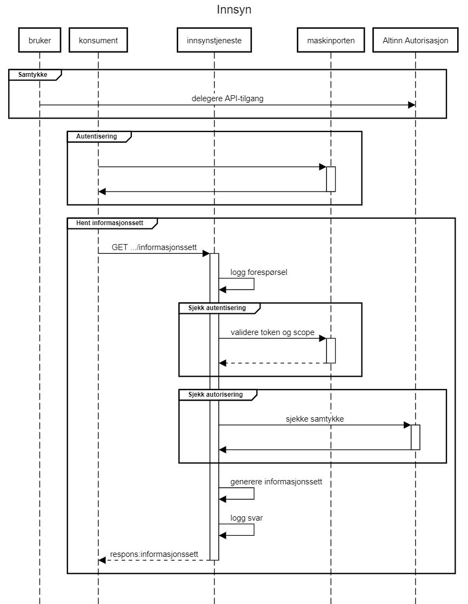

[English](https://skatteetaten.github.io/mva-meldingen/english/informationservices/)

# Innsynstjenester tilgjengelig som API

## Endringslogg

| Dato       | Hva ble endret?                     |
| :--------- | :---------------------------------- |
| 2022.10.04 | Side for innsynstjenester opprettet |

# Maskinporten og autentisering

## Introduksjon

For å autentisere med Maskinporten må det gjøres noen forberedelser av virksomheten som skal gjøre spørringer mot Skatteetatens tjenester

## Fremgangsmåte forå ta i bruk maskinporten

1\. Ta kontakt med Digitaliseringsdirektoratet for å få tilgang til Maskinporten
Dette kan gjøres via DIFIs samarbeidsportal (https://samarbeid.digdir.no/maskinporten/konsument/119)

2\. Opprette bruker i Samarbeidsportalen
Når avtale med Digdir er opprettet og tilgang er på plass i Altinn, kan du logge på Samarbeidsportalen. Hvis det er første gang du som konsument logger inn på Samarbeidsportalen, må du opprette en bruker i Samarbeidsportalen.

- Gå til samarbeid.difi.no
- Trykk på “Min profil” oppe i høyre hjørne.
- Trykk på “Registrer deg” i påloggingsvinduet
- Registrer bruker med din jobbadresse
- Bekreft brukeren ved å trykke på lenken som kommer på epost. (NB! Sjekk søppelpost om ikke eposten kommer frem).

NB! Digir har egne sider som kan benyttes ved feilsøking der man ikke får generert token, feks feilsøking. Hvis man fortsatt har problemer ber man at Servicedesk servicedesk@digdir.no kontaktes.

3\. Få tilgang til rettighetspakke (scope)
Tilgang til rettighetspakke (scope på Maskinporten) opprettes av Skatteetaten, og må søkes av konsument ved å sende en e-post til mva-modernisering@skatteetaten.no og oppgi organisasjonsnummer.
Følgende scopes er opprettet for innsynstjenstene:

- skatteetaten:mvameldinginnsendingsstatus

Når Skatteetaten godkjenner søknaden om tilgang til tjenestene gis virksomheten tilgang til å opprette tokens fra maskinporten for de angitte scopene

4\. Bruke Skatteetatens api med token fra Maskinporten.
For å gjøre kall til api med gyldig token gjøres følgende:

1. Gjøre et kall til Maskinporten for å få et token som kan brukes mot Skatteetatens tjeneste. Fremgangsmåten er beskrevet på Difi sine sider for hvordan bruke maskinporten som konsument:
2. Tokenet legges i Authorization-header på alle kall til Skatteetatens tjeneste på formatet:
   ‘Authorization: Bearer <token>’
3. Skatteetaten verifiserer tokenet mot Maskinporten som garanterer at tilbyder har tilgang til å opptre på vegne av angitt konsument på det angitte scopet.
4. Data returneres for angitt konsument

#MVA Innsyn API
##Introduksjon
API-ene for innsyn kan brukes av sluttbrukersystemer (SBS) for å innhente tilsvarende informasjon som tilbys via «Min Merverdiavgit».

## Forespørsel om innsyn

Bruk av innsyn API-ene forutsetter at SBS-en er autentisert via Maskinporten og at delegering mellom skatteyter og SBS er konfigurert i Altinn.

Forespørsler om innsyn gjøres som HTTP GET kall til Skatteetatens API-er og svar returneres på XML eller JSON format. Hvilket format som er ønsket angis i «Accept» header i HTTP forespørselen.
Sekvens for forespørsler om innsyn:

1. Autentisering mot maskinporten.
2. Kall mot Skatteetaten

## Status for innsending av mva-melding

Tjenesten gir status for inneværende termin(er) og terminer med manglende innsendt mva-melding.

**URL** : `GET https://<env>/api/mva/grensesnittstoette/innsyn/melding/innsending/status/v1/{organisasjonsnummer}`

Hvor `<env>` er miljøspesifikk adresse f.eks. `mp-test.sits.no`

**Eksempel** : Forespørsel om status for innsending for organisasjonsnummer 123456789

`GET https://mp-test.sits.no/api/mva/grensesnittstoette/innsyn/melding/innsending/status/v1/123456789`

Heades:  
`Accept: application/xml`  
`Authorization: Bearer <maskinportentoken>`

**Response**  
`status: 200 Innhold (body)`

<eksempelresultat>

**Feilmeldinger**  
_Respons 401 - Unauthorized:_  
Hvis token fra Maskinporten ikke stemmer overens med forespurt organisasjon.

## Informasjonsmodell

Grafisk fremstilling av xsd for [innsynstjenesten](Informasjonsmodell mvaInnsendingStatus.png):

Versjon 0.9 av XSD for responsen ligger her:
[no.skatteetaten.fastsetting.avgift.mva.skattemeldingformerverdiavgift.v1.0.xsd](https://github.com/Skatteetaten/mva-meldingen/blob/master/docs/documentation/informasjonsmodell/xsd/no.skatteetaen.fastsetting.avgift.mva.mvaMeldingInnsendingStatus.v1.xsd)
