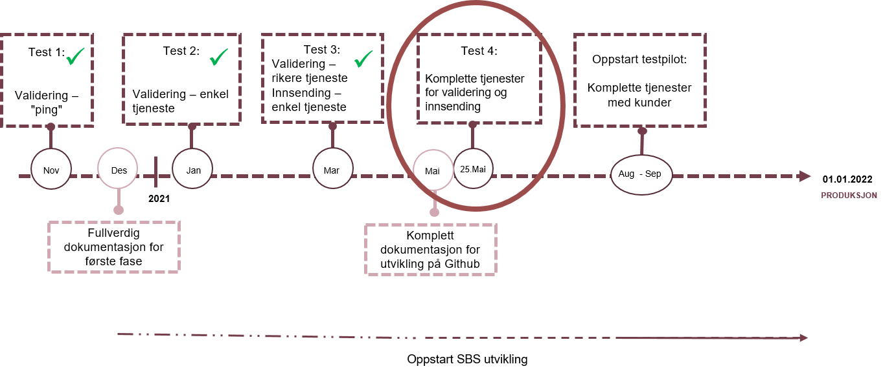

Informasjonen på denne siden er beregnet til de som har avtalt med Skatteetaten å delta i testløpet for modernisering av mva-meldingen. Ønsker du å delta ta gjerne kontakt via email: mva-modernisering@skatteetaten.no. Vi vil da sørge for at du får tilgang på testbruker, samt god tilgang til støtte for tekniske avklaringer. Testbrukeren er nødvendig for å få tilgang til å kjøre testapplikasjonen mot Skatteetatens tjenester. (Validering- og innsendingstjenesten)

Vi har kommet til Test 3. Se lengre ned på siden for fullstendig tidsplan.
Testdokumentasjonen i Test 3 består av

- Beskrivelse av api - https://skatteetaten.github.io/mva-meldingen/documentation/api/
- XSD - https://skatteetaten.github.io/mva-meldingen/documentation/informasjonsmodell/
- Valideringsregler - https://skatteetaten.github.io/mva-meldingen/documentation/forretningsregler/
- Valideringsregler som er en del av testen – se lenger ned på denne siden
- Eksempler på testtilfeller – se lenger nede på denne siden
- I tillegg er det behov for testbruker. Dette distribueres direkte til de som skal være med å teste.

# Valderingsregler

Valideringsregler klare for test:

- Summen av beregnet avgift fra hver avgiftslinje skal være lik sum avgift i Mva-meldingen
- Beregnet avgift skal stemme med oppgitt grunnlag ganger gjeldende sats
- Beløp med motsatt fortegn som gjelder utgående avgift skal ha en merknad
- Beløp med motsatt fortegn som gjelder fradragsført inngående avgift skal ha en merknad
- Spesifikasjonslinje som gjelder justering kan kun sendes inn på mva-kode 1
- Spesifikasjonslinje som gjelder tap på krav kan kun sendes inn på mva-kode 1, 11, 12 eller 13
- Spesifikasjonslinje som gjelder uttak kan kun sendes inn på mva-kode 3, 31, 32 eller 33
- Spesifikasjonslinje som gjelder tilbakeføring av inngående mva gitt i mva §9-6 og §9-7 kan kun sendes inn på mva-kode 1
- Ved omvendt avgiftsplikt for tjenester kjøpt fra utlandet med fradragsrett skal fradragsført beløp i inngående avgift være mindre enn eller lik utgående avgift
- Ved omvendt avgiftsplikt for tjenester kjøpt fra utlandet med fradragsrett skal det alltid være fradragsført inngående avgift dersom det er beregnet utgående avgift
- Ved kjøp av varer fra utlandet med fradragsrett skal det alltid være utgående avgift dersom det er fradragsført inngående avgift
- Ved kjøp av varer fra utlandet med fradragsrett skal det alltid være fradragsført inngående avgift dersom det er beregnet utgående avgift
- Ved omvendt avgiftsplikt for tjenester kjøpt fra utlandet med fradragsrett skal det alltid være utgående avgift dersom det er fradragsført inngående avgift
- Ved kjøp av varer fra utlandet med fradragsrett skal fradragsført beløp i inngående avgift være mindre enn eller lik utgående avgift

# Testtilfeller mva-melding

Se eksempler på testtilfeller for ny mva-melding [testtilfeller for ny mva-melding](Testtilfeller mva-melding.xlsx)

Eksempler på xml-filer: https://github.com/Skatteetaten/mva-meldingen/blob/master/docs/documentation/test/eksempler/melding/
Inntil videre skal det ikke være %-tegn i fila dere sender inn

# Testplan

## Innhold i testen

Konkret må sluttbrukersystemet gjøre følgende:

2. Logge inn hos ID-porten for å få en sesjon (og token).
3. Utvikle en applikasjon/klient som:
   - Sende en request til Skatteetatens tjeneste for å validere en mva-melding.
   - Oppretter Instans på Altinn3 appen.
   - Last Opp 1 MvaMeldingInnsending
   - Last Opp 1 MvaMelding
   - Last Opp 0 eller flere Vedlegg
   - Sender Inn MvaMeldingInnsending

Skatteetaten har tilgjengeliggjort en testapplikasjon som viser hvordan trinnene beskrevet over kan utføres.
Den er skrevet i [jupyter notebook formatet](https://jupyter.org/):

1. [Jupyter notebook demo for henting og validering](https://github.com/Skatteetaten/mva-meldingen/blob/master/docs/documentation/test/demo.ipynb). Last ned katalogen 'test' og kjør skriptet demo.ipynb (skriptet vil utføre alle trinn som inngår i prosessen: kalle ping tjeneste å sjekke kobling og validere mva-melding)
2. [Jupyter notebook demo for henting, validering og innsending](https://github.com/Skatteetaten/mva-meldingen/blob/master/docs/documentation/test/innsending-eksempel.ipynb). Kjør skriptet innsending.ipynb. Den vil kjøre alle stegene i prosessen.
3. [Pyton skript å hent token](https://github.com/Skatteetaten/mva-meldingen/blob/master/docs/documentation/test/Steg/logge_inn_idporten.py) og [postman skript å validere melding](https://github.com/Skatteetaten/mva-meldingen/blob/master/docs/documentation/test/MeldingValidering.postman_collection.json). Første logge inn hos ID-Porten (se nedover), og da lagre token i format "Bearer <em>hentet-token</em>" som miljø variabel med navn "test-bearer" i postman, og bruk postman skript å validere melding.
4. [Eksempel XML-er](https://github.com/Skatteetaten/mva-meldingen/tree/master/docs/documentation/test/eksempler/melding)

## Ta i bruk ID-porten

Når man starter å teste kan Skatteetatens ID-porten-integrasjon benyttes, men det anbefales å bestille egen integrasjon mot ID-porten så tidlig som mulig, både fordi når produksjonssetting intreffer må egen integrasjon mot ID-porten benyttes, og fordi prosessen er delvis manuell. Prosessen går mot Digitaliseringsdirektoratet (DigDir), og detaljer rundt hvordan man oppretter integrasjonen og tar i bruk ID-porten er beskrevet her: https://samarbeid.digdir.no/id-porten/id-porten/18. En annen fordel med å starte prosessen tidlig er at man kan teste integrasjonen i test-miljøet. Det må også opprettes egen integrasjon i produksjon. Under bestillingen må dere oppgi at dere ønsker tilgang til skattemeldings-API fra skatteetaten.

Kundeforholdet hos DigDir gir tilgang til deres selvbetjeningsløsning som igjen gir tilgang til administrasjon av Kundens bruk av ID-porten. I selvbetjeningsløsningen kan kunden opprette en såkalt client_id og definere en callback-url:

- client_id: en unik automatisk generert identifikator for tjenesten.
- callback-url: Uri-en som klienten får lov å redirigere nettleseren til etter innlogging. Etter en vellykket innlogging i ID-porten vil brukeren redirigeres til denne url-en.

Inntil kundeforhold hos DigDir er etablert og integrasjon opprettet, kan sluttbrukersystemene i benytte Skatteetatens integrasjon. For denne testen har Skatteetaten opprettet følgende `client_id` som kan benyttes av sluttbrukersystemene:

- `client_id: 38e634d9-5682-44ae-9b60-db636efe3156`
- Callback-URL til denne `client_id` er satt til http://localhost:12345/token (Hvis det er konsumenter som ønsker andre callback-URL kan vi ordne det)

**Nyttige lenker:**

- Klienten bruker test-miljøet i DigDir, "verifikasjon 2": https://samarbeid.difi.no/node/232
- OIDC-integrasjonen er beskrevet her: https://difi.github.io/felleslosninger/oidc_index.html
- Hvordan lage en klient i selvregistreringen: https://minside-samarbeid.difi.no/organization-home/services/service-admin#/

## Logge inn hos ID-porten

ID-porten login kan implementeres i alle typer sluttbrukersystemer

- Desktop Applikasjon
- Web Applikasjon

under forutsetning av at applikasjonen kan åpne en URL i en nettleser hvor login gjennomføres og samtidig som den kan kjøre en web-server som mottar en web-request (i form av en redirect fra ID-porten etter login) på callback-url'en.

Sluttbrukersystemet må gjøre følgende:

- Starte system browser og gjøre autorisasjonskall mot ID-porten. Les mer om det her: https://difi.github.io/felleslosninger/oidc_protocol_authorize.html
- Brukeren blir da sendt til ID-porten for innlogging. Dere kan benytte eksisterende test-brukere som dere benytter til test mot skattemeldingen i dag.
- Sette opp en webserver som venter på callback fra browseren. Etter vellykket pålogging i ID-porten sendes brukes til denne webserveren. Denne webserveren må være satt til å lytte på callback-URL http://localhost:12345/token (ref. forrige kapittel).
- Gjøre et tokenforespørsel. Les mer om det her: https://difi.github.io/felleslosninger/oidc_protocol_token.html

Vi benytter følgende testmiljø hos ID-porten:

- /authorize endpoint: https://oidc-ver2.difi.no/idporten-oidc-provider/authorize
- /token endpoint: https://oidc-ver2.difi.no/idporten-oidc-provider/token

For detaljer rundt hvilken HTTP parametere som må sendes med i kallet, se filen [logge_inn_idporten.py](https://github.com/Skatteetaten/mva-meldingen/blob/master/docs/documentation/test/Steg/logge_inn_idporten.py)

## Kalle Mva-Meldings-API

Etter login og tokenforespørsel vil man ha et ID-porten-access-token. Dette tokenet benyttes som Bearer-token i HTTP-kall mot valideringstjenesten og må også veklses til et altinn-acess-token som må benyttes som Bearer-token i HTTP-kallene i innsendingsprosessen mot Skatteetatens Altinn3-API for mva-melding-innsending. Se detaljer for API'ene under <a href="https://skatteetaten.github.io/mva-meldingen/documentation/api/" target="_blank">Api</a>.

Se også detaljer i kjørende eksempler for både login, validering og innsending, skrevet i Python nevnt under kapittelet "Innhold i testen".

# Tidsplan for test

Tidsplanen under viser når det vi være mulig å teste integrasjonene mot Skatteetaten sine nye løsninger.

<table align=center>
  <tr><th align=center>Hva</th><th align=center>Når</th><th align=center>Innhold</th></tr>
  <tr><td>Dokumentasjon XSD</td><td>28.09.2020</td><td><ul><li>Oppdatert xsd etter tilbakemeldinger i møte 14.9</li></ul></td></tr>
  <tr><td>Test 1 – teknisk verifikasjon</td><td>nov. 2020</td><td><ul><li>Valideringstjeneste -"Dummy"  (Ping fra SBS)</li></ul></td></tr> 
  <tr><td>Test 2 – syltynn valideringstjeneste og teknisk verifikasjon av innsendingstjenesten</td><td>jan. 2021</td>
  <td> 
  <ul>
	<li>Valideringstjeneste </li>
	<li>Helt enkel tjeneste med en eller få enkle valideringer </li>
  </ul>
  </td></tr>
  <tr><td>Test 3 - noe rikere valideringstjeneste og en enkel innsendingstjeneste</td><td>mar. 2021</td>
  <td>  
  <ul>
	<li>Valideringstjeneste - Valideringstjeneste som inneholder mange av de valideringene som skal brukes</li>
	<li>Innsendingstjeneste - Enkel innsendingstjeneste som skal verifisere innsendingen og gi kvittering tilbake</li>
  </ul>
  </td></tr>
  <tr><td>Test 4 – komplett tjeneste</td><td>mai.  2021</td><td>
  <ul>
	<li>Valideringstjeneste - Komplett tjeneste, sånn den skal være til pilot, er på plass</li>
	<li>Innsendingstjeneste - Komplett tjeneste, sånn den skal være til pilot, er på plass</li>
  </ul>
  </td></tr>
  <tr><td>Test 5 - hovedtest før pilot</td><td>aug. 2021</td><td></td></tr>
  <tr><td>Pilot</td><td>aug. 2021</td><td></td></tr>
  <tr><td>Produksjon</td><td>01.01.2022</td><td></td></tr>  
</table>

