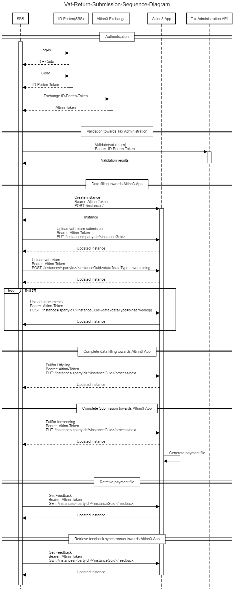
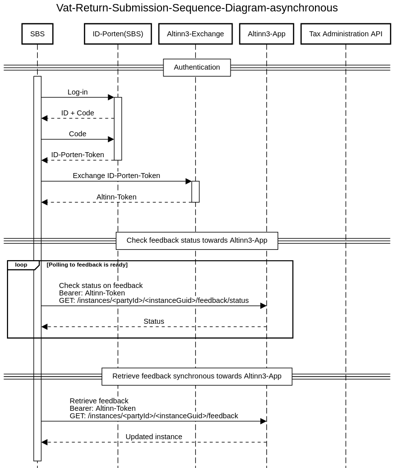

# VAT return Validation and Filing API

VAT returns to be sent to Skatteetaten from an end-user
system (SBS) should use these APIs:

1.  Skatteetaten VAT return Validation API
2.  Skatteetaten Altinn3 VAT-Return-Filing API

as described below.

# VAT return filing Process

Filing of VAT returns are done with the Skatteetaten
Altinn3 App Instance API. The Instance API is a generic Altinn Api and its detailed description can be found here <a href="https://docs.altinn.studio/teknologi/altinnstudio/altinn-api/app-api/instances/" target="_blank">Instance API</a>. In-depth knowledge of this API is not required as this documentation
covers the needed sequence for filing VAT returns.

It is recommended to use the <a href="https://skd.apps.tt02.altinn.no/skd/mva-melding-innsending-etm2/swagger/index.html" target="_blank">swagger documentation</a> along with this API description.

In addition, there are running examples of VAT return filing that use Jupyter Notebook and Python here: <a href="https://skatteetaten.github.io/mva-meldingen/english/test/" target="_blank">Test</a>

The filing process is performed with a sequence of calls to the Instance API and is described in detail below the sequence diagram and it is as follows:

1. Authentication
   - Change ID-Porten token to Altinn token
2. Validation
3. Data filling towards Altinn3-App
   - Create instance towards Altinn3-App
   - Upload vat-return submission towards Altinn3-App
   - Upload vat-return towards Altinn3-App
   - Upload attachements towards Altinn3-App
4. Complete data filling towards Altinn3-App
5. Complete submission towards Altinn3-App
6. Retrieve feedback towards Altinn3-App

The Instance VAT Filing API is available at this URL:

```
instanceApiUrl = "https://skd.apps.tt02.altinn.no/skd/mva-melding-innfiling-etm2/instances"
```

In the following sequence diagram, the application URL will be hidden, so if `POST: /intances/` is written it is
implicitly `POST: instanceApiUrl`



## Authentication

### Change ID-Porten token to the Altinn token

To change ID-Porten token, make the following calls:

```JSON
GET `https://platform.tt02.altinn.no/authentication/api/v1/exchange/id-porten`
    HEADERS:
        "Authorization": "Bearer " + "{IDPortenToken}"
           "content-type": "application/json"
```

and the response content will be a brand new altinnToken used as the
Bearer token in the subsequent requests. The token currently has a duration of 8 hours. Later in 2021, Altinn3 will offer refresh tokens so that one login can last for up to 3 months.

## Validate tax return

The service validates the content of a tax return and returns a response
with any errors, deviations and warnings. The service will do the
following:

1.  Check the message format.
2.  Control the content and composition of the elements in the VAT
    return.

Skatteetaten assumes that the validation service is called in
advance of filing the VAT return. This ensures that the VAT return
has the correct format, content and increases the probability that
the VAT return will be approved upon filing.

**URL** : `POST https://<env>/api/mva-melding/valider`

Where `<env>`is an environment-specific address
e.g.`mp-test.sits.no`

**Body** :

- According to XSD:<a href="https://github.com/Skatteetaten/mva-meldingen/tree/master/docs/english/informasjonsmodell/xsd/no.skatteetaten.fastsetting.avgift.mva.skattemeldingformerverdiavgift.v0.9.xsd" target="_blank">Skattemeldingformerverdiavgift.v0.9</a>

**Example** : filing XML in invalid format

POST <a href="https://mp-test.sits.no/api/mva-melding/skattemeldingformerverdiavgift/valider" target="_blank">https://mp-test.sits.no/api/mva-melding/skattemeldingformerverdiavgift/valider </a>

Header: `Content-Type: application/xml`

With content (http body) that does not pass <a href="https://github.com/Skatteetaten/mva-meldingen/tree/master/docs/english/informasjonsmodell/xsd/no.skatteetaten.fastsetting.avgift.mva.skattemeldingformerverdiavgift.v0.9.xsd" target="_blank">XSD</a> validation:

```xml
<?xml version='1.0' encoding='UTF-8'?>
    <mvaMeldingDto xmlns="no:skatteetaten:fastsetting:avgift:mva:skattemeldingformerverdiavgift:v0.9">

    </mvaMeldingDto>
```

### Response

status: 200
Content (body)

```xml
<valideringsresultat>
        <status>UGYLDIG_SKATTEMELDING</status>
        <valideringsfeil>
            <stiTilFeil>//innfiling</stiTilFeil>
            <valideringsDetaljer>
                <feilmelding>Mva meldingen må være på gyldig format og passere XML skjema valideringen</feilmelding>
                <alvorlighetsgrad>UGYLDIG_SKATTEMELDING</alvorlighetsgrad>
                <avvikKode>MvaMeldingsinnhold_Xml_SkjemaValideringsfeil</avvikKode>
                <informasjon>cvc-complex-type.2.4.b: The content of element 'mvaMeldingDto' is not complete. One of
                    '{"no:skatteetaten:fastsetting:avgift:mva:skattemeldingformerverdiavgift:v0.8":innfiling}' is expected.
                </informasjon>
            </valideringsDetaljer>
        </valideringsfeil>
    </valideringsresultat>
```

## Create Instance

An instance is an object in altinn that follows the process and the data model defined by the application. Skatteetaten has a VAT-Return-Filing application which has a process with currently three
steps for filing. The steps are uploading data, confirm and feedback.

In addition to being an object, an instance has a data object defined by a data model in the app.

Once an instance is created, it will be possible to update the data
object of the instance and add other data objects to the app's data
model. This is done in the next step.

To create an instance, you perform a POST request at the instanceApiUrl with an
`instanceOwner` object where you enter the organization
number for the organization that a VAT return is to be sent on behalf of:

```JSON
POST {instanceApiUrl}
    HEADERS:
        "Authorization": "Bearer " + "{altinnToken}"
        "content-type": "application/json"
    CONTENT/BODY:
        {
            "instanceOwner": {
                "organisationNumber": "{organizationNumber}"
                }
        }
```

This request will create the instance and return the following response

### Response

```JSON
Response HTTPCode: 201 (OK)
    Content:
    {
        "id": "{partyId}/{instanceGuid}",
        "instanceOwner": {
            "partyId": "{partyId}",
            "organisationNumber": "{organizationNumber}"
        },
        "appId": "skd/{ApplicationName}",
        "org": "skd",
        "selfLinks": {
            "apps": "{instanceUrl}", // the instanceUrl for the app
            "platform": "{platformUrl}" // the altinn3 plattform url for the instance
        },
        "data": [
            {
                "id": "{dataGuid}", // {dataGuid} can be used in the next step
                "instanceGuid": "{instanceGuid}",
                "dataType": "no.skatteetaten.fastsetting.avgift.mva.mvameldinginnsending.v0.1",
                "contentType": "application/xml",
                "blobStoragePath": "skd/{ApplicationName}/{instanceGuid}/data/{dataGuid}",
                "selfLinks": {
                    "apps": "{instanceDataAppUrl}", // {instanceDataAppUrl} can be used in the next step
                    "platform": "{instanceDataPlatformUrl}"
                },
                "size": 273,
                "locked": false,
                "refs": [],
                "isRead": true,
                "created": "2021-03-01T08:15:25.1139057Z",
                "createdBy": "86257",
                "lastChanged": "2021-03-01T08:15:25.1139057Z",
                "lastChangedBy": "86257"
            }
        ]
        // the rest of the object is snipped for documentation purposes
    }
```

The rest of the requests in the sequence for the filing use
`instanceUrl`. This can be found from the response at the
creation of the instance. See the example of the response above.

`instanceUrl` could either be picked from
`selflinks.apps` or derived from
`instanceApiUrl/{partyId}/{instanceGuid}`, where
`{partyId}` and `{instanceGuid}` can be
found in the `id` field in the returned instance.

Example instanceUrl:
`https://skd.apps.tt02.altinn.no/skd/mva-melding-innfiling-etm2/instances/3949387/abba061g-3abb-4bab-bab8-c9abbaf1ed50/data/28abba46-dea8-4ab7-ba90-433abba906df`

### Error messages

_Response 400 - Bad Request:_ <br>
Example Value

```JSON
{
  "type": "string",
  "title": "string",
  "status": 0,
  "detail": "string",
  "instance": "string"
}
```

_Response 403 - Forbidden:_ <br>
Example Value:

```JSON
{"type":"https://tools.ietf.org/html/rfc7231#section-6.5.3","title":"Forbidden","status":403,"traceId":"00-44eab35cb9ca2049b24de316f380a774-a724e045b09dfc44-00"}
```

This error message could occur if you try to create an instance where the logged-in user does not have the necessary rights to the organisation number defined in the request header.
This can also occur if the user does not have the correct roles necessary for creating an instance.

_Response 404 - Not Found:_ <br>
Example Value:

```JSON
"Cannot lookup party: Failed to lookup party by organisationNumber: 123456789. The exception was: 404 - Not Found - "
```

This error message can occur when you set an invalid organisation number in the request header.

## Upload VAT return filing

MvaMeldingInnsending is a data type for metadata for the VAT return filing.
The object to populate is created during the instantiation and can
be found in the instance object's `data` list and has
`"dataType": "no.skatteetaten.fastsetting.avgift.mva.mvameldinginnsending.v0.1"`.
Since this object already exists when uploading VAT return filing,
PUT is used to update the data element.

The model for VAT return filing can be found here:
<a href="../informasjonsmodell/xsd/no.skatteetaten.fastsetting.avgift.mva.mvameldinginnsending.v0.1.xsd" target="_blank">no.skatteetaten.fastsetting.avgift.mva.mvameldinginnsending.v0.1.xsd</a>

Url to MvaMeldingInnsending has this structure:

```
vatReturnFilingUrl = {instanceApiUrl}/{partyId}/{instanceGuid}/data/{dataGuid}
```

where `{dataGuid}` is the ID of the data object of the
instance.

There are 2 ways to derive the `vatReturnFilingUrl` and
both use the instance's data list element that has the data type
`no.skatteetaten.fastsetting.avgift.mva.mvameldinginnsending.v0.1`.
When the instance is created, there is only one element in the list.

From the data element you can either:

- merge `{dataGuid}` that exists as value in
  `"id"` in the structure above,
  - alternatively use `{instanceApiUrl}/data/{dataGuid}`
- or use the `selfLinks.apps` value
  `{instanceDataAppUrl}`, as shown in the instance
  response in the previous step.
  - `vatReturnFilingUrl = {instanceDataAppUrl}`

You upload VAT return filing by using the data api for the instance:

```
PUT {vatReturnFilingUrl}
    HEADERS:
        "Authorization": "Bearer " + "{altinnToken}"
        "content-type": "text/xml"
```

```xml
Content:
    <?xml version="1.0" encoding="UTF-8"?>
    <mvameldinginnsending>
        ...
    </mvameldinginnsending>
```

Example of xml file for VAT return filing can be found under <a href="https://skatteetaten.github.io/mva-meldingen/english/test/" target="_blank">Test</a>.

### Error Messages

_Response 403 - Forbidden:_ <br>
If the logged-in user attempt to upload a file to the instance, but the person does not have the correct roles, you will get the response code 403 in return.

## Upload VAT return

The model is found here:
<a href="../informasjonsmodell/xsd/no.skatteetaten.fastsetting.avgift.mva.skattemeldingformerverdiavgift.v0.9.xsd" target="_blank">no.skatteetaten.fastsetting.avgift.mva.skattemeldingformerverdiavgift.v0.9.xsd</a>

The URL for uploading the VAT return has this structure:

### Error Messages

_Response 403 - Forbidden:_ <br>
If the logged-in user attempt to upload a file to the instance, but the person does not have the correct roles, you will get the response code 403 in return.

```
{instanceUrl}/data?datatype=mvamelding
```

The VAT return is uploaded with the following request to the instance data api:

```JSON
POST {instanceUrl}/data?datatype=mvamelding
    HEADERS:
        "Authorization": "Bearer " + "{altinnToken}"
        "content-type": "text/xml"
        "Content-Disposition": "attachment; filename=mvaMelding.xml"
```

```xml
Content:
    <?xml version="1.0" encoding="UTF-8"?>
    <mvaMeldingDto xmlns="no:skatteetaten:fastsetting:avgift:mva:skattemeldingformerverdiavgift:v0.9">
        ...
    </mvaMeldingDto>
```

This call will upload the xml document to the instance.

## Upload Attachments

It is possible to upload from 0 to 57 attachments, with an individual
size of 25MB.

Url for uploading attachments has this structure:

```
{instanceUrl}/data?datatype=vedlegg
```

The following content types are allowed for attachments:

- text/xml
- application/pdf
- image/jpeg
- image/jpg
- image/png
- image/gif

Attachments are uploaded with the following request to the instance data api:

```JSON
POST {instanceUrl}/data?datatype=vedlegg
    HEADERS:
        "Authorization": "Bearer " + "{altinnToken}"
        "content-type": "application/pdf"
        "Content-Disposition": "attachment; filename=merknaderTilMvaMeldingen.pdf"
    Content:
    {pdf-attachment in binary format}
```

This request will upload the pdf document to the instance.

Remember that `content-type` should be appropriate for
the attachment to be uploaded and that the file name in the
`Content-Disposition` header should be appropriate
and unique. This is the file name Skatteetaten will refer to
for the attachment.

### Error Messages

_Response 403 - Forbidden:_ <br>
If the logged-in user attempt to upload a file to the instance, but the person does not have the correct roles, you will get the response code 403 in return.

## Complete Data Filling

This step uses the process api for the instance and the instance will go to the next step for VAT return filing in the application process.

To complete the data filling, the following call is made to the process api for the instance:

```JSON
PUT {instanceUrl}/process/next
    HEADERS:
        "Authorization": "Bearer " + "{altinnToken}"
        "content-type": "application/json"
```

The submission will now be in the confirmation step.

### Error Messages

_Response 403 - Forbidden:_ <br>
If the logged-in user attempt to update to the next task in the instance process, but does not have the correct roles, you will get the response code 403 in return.

_Response 409 - Conflict:_ <br>
Example Value

```JSON
{
  "type": "string",
  "title": "string",
  "status": 0,
  "detail": "string",
  "instance": "string"
}
```

```
"Valideringsfeil: Organisasjonsnummeret i instansen er forskjellig fra organisasjonsnummeret i MvaMeldingInnsending (\"konvolutt\")"
```

You will get this error message if the organisation number used when creating the instance is different from the organisation number defined in vat-return submission.

```
"Valideringsfeil: Organisasjonsnummeret i MvaMeldingInnsending (\"konvolutt\") er forskjellig fra organisasjonsnummeret i {filnavn}"
```

You will get this error message if the organisation number defined in vat. return submission is different from the organisation number defined in vat-return.

```
"Valideringsfeil: Liste med vedlegg definert i MvaMeldingInnsending (\"konvolutt\") er forskjellig fra listen med vedlegg som er lastet opp i instansen."
```

If the list of attachments defined in at-return submission is different from the attachments uploaded to the instance, you will get this error message.

```
"Valideringsfeil: Meldingskategorien i MvaMeldingInnsending (\"konvolutt\") er forsjellig fra Meldingskategorien i {filnavn}"
```

This error message will occur if the value of the field message category in vat-return submission is different from the message category in the vat-return.

## Complete vat-return submission

This step uses the process-api for the instance, and it will end the confirmation step for the submission.
It will also update the instance to the next step in the application, the feedback step.

To complete the submission, the following call is used towards the process-api on the instance:

```JSON
PUT {instansUrl}/process/next
HEADERS:
    "Authorization": "Bearer " + "{altinnToken}"
    "content-type": "application/json"
```

The submission will now be in the feedback step.

### Error Messages

_Response 403 - Forbidden:_ <br>
If the logged-in user attempt to update to the next task in the instance process, but does not have the correct roles, you will get the response code 403 in return.

## Retrieve feedback

This step will retrieve the feedback, which the Tax Administration have uploaded, on the instance.
When the instance has recieved the feedback from the Tax Administration, it will be located in archive in the altinn inbox.
To get the feedback one can either use a polling function using an asynchronous API-endpoint or by using a synchronous API-endpoint.

Alternative approach for retrieving feedback, by using an asynchronous API-endpoint.


To get the feedback using a synchronous API-endpoint a call towards the instance is used:

```JSON
GET {instansUrl}/{partyId}/{instanceGuid}/feedback
HEADERS:
    "Authorization": "Bearer " + "{altinnToken"
    "accept": "application/json"
```

### Error Messages

_Response 400 - Bad Request:_ <br>
Example Value

```JSON
{
  "type": "string",
  "title": "string",
  "status": 0,
  "detail": "string",
  "instance": "string"
}
```

_Response 403 - Forbidden:_ <br>
This error message will occur if the logged-in user attempt to retrieve the instance, but the person does not have the correct roles.

_Response 404 - Not Found:_ <br>
Example Value

```JSON
{
  "type": "string",
  "title": "string",
  "status": 0,
  "detail": "string",
  "instance": "string"
}
```
