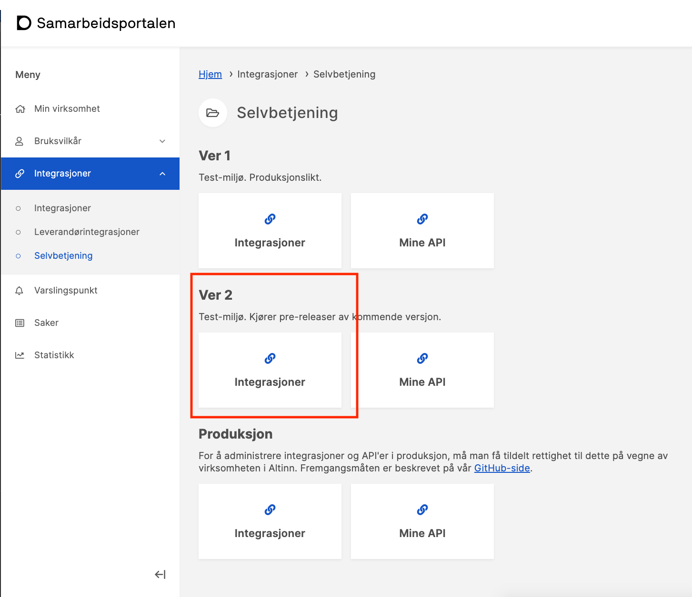
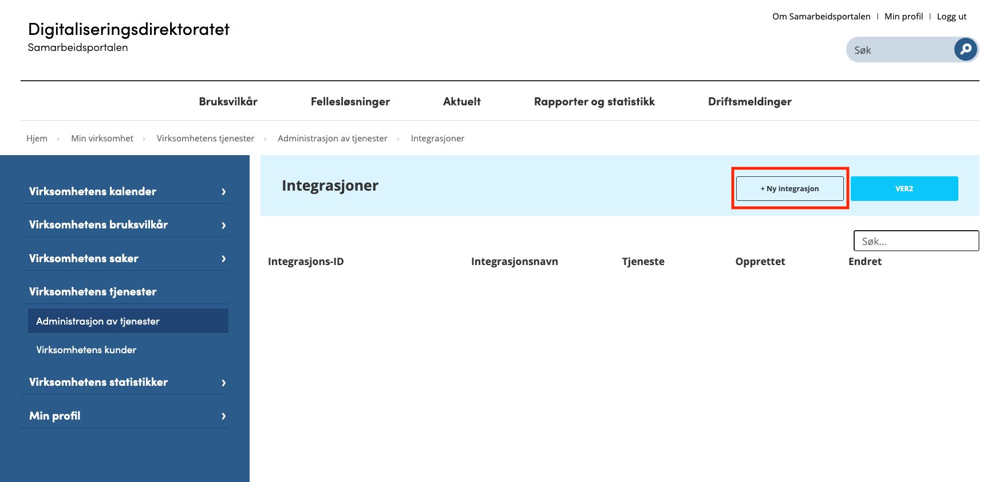
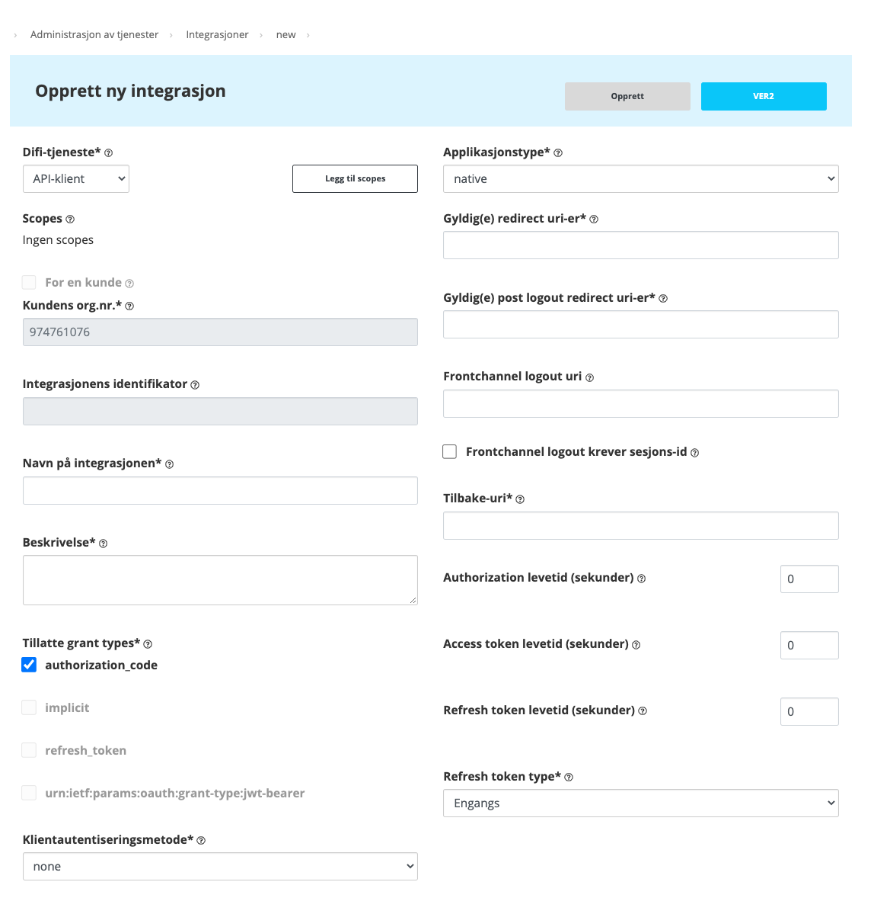
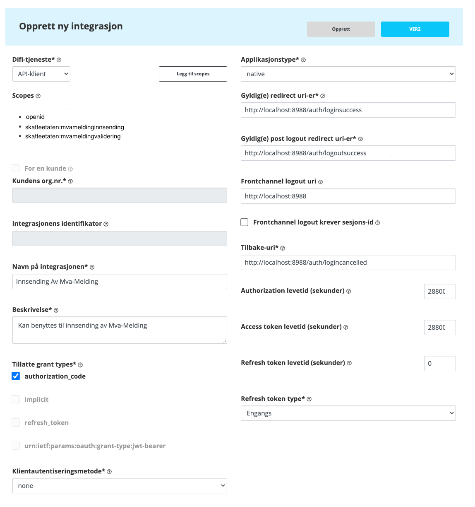

## Introduction

### Change log

| Date       | What changed?                                                  |
| :--------- | :------------------------------------------------------------- |
| 2021.08.26 | Added how to request the [Tax Administration scopes](#scopes). |

To authenticate with ID-Porten, you must implement an Open ID Connect solution against ID-Porten. It can be challenging to implement and should be considered the least trivial task to solve when developing a solution for submitting a VAT return.

The most important thing first: The Tax Administration have resources that can help you understand and find a good solution for your application.

This page contains information about what needs to be done and what is specific to the Tax Administration in the Open ID Connect integration.

Roughly speaking, the following must be done:

1. Get started with ID-Porten
2. Configure an Integration in Samarbeidsportalen
3. Configure the application to use the Integration from Samarbeidsportalen

It is beyond this documentation to describe Open ID Connect and OAuth2, but the details that are specific to the Integration and Tax Administration are described in the following.

## Get started with ID-Porten

It is recommended to get started with ID-Porten as early as possible as it will take calendar time. To get started, you must go through a process at the Norwegian Digitalisation Agency (DigDir), and in that process you will get access to Samarbeidsportalen where you can create Integrations. To submit VAT notifications, you must have an Integration that is configured correctly for your application and for the APIs your application is calling.

How to get started with ID-Porten is described here: <a href="https://samarbeid.digdir.no/id-porten/id-porten/18" target="_blank">ID-Porten </a>.

Another advantage of starting the process early is that you can test your Integration in the test environment, which includes APIs with both Altinn3 and the Tax Administration. Also a separate integration must be created for production.

The Tax Administration's Integration with identifier `client_id: 23cc2587-ea4e-4a5f-aa5c-dfce3d6c5f09` can be used until you are ready to use your own Integration. This will be removed at some point after you have received notification from the Tax Administration. See more [here](#configure-the-application-to-use-the-integration-from-samarbeidsportalen)

## Configuring an Integration in Samarbeidsportalen

Once access to Samarbeidsportalen has been acquired, an Integration can be created that can be used by the end-user system.

You open <a href="https://minside-samarbeid.digdir.no/" target="_blank"> https://minside-samarbeid.digdir.no/ </a>

And select Integrasjoner under Ver 2 as shown below.

Then you are taken on to the Integrations in Ver 2. Ver 2 is the test environment where users are synchronized with the Tax Administration test environment.

And by clicking Ny integrasjon, you can start configuring the Integration with the Tax Administration.

In this wizard, a Difi-tjeneste of the API client type will be configured, as shown above.

A review of the various fields in the configuration follows with Norwegian subsection headers that will correspond with the images and what you should see in Samarbeidsportalen (where Norwegian is the only language)

### Difi-tjeneste

Translates to Difi service and determines which service this integration will be configured for.

When selecting a value from this drop-down menu

- KRR
- ID-Porten
- API-klient
- Maskinporten

then something might happen to:

- Scopes
- Applicationstype
- Fields are locked or unlocked
- Fields suddenly get values ​​that are not reset when you change again.

This is confusing, so it is recommended to create a few, it is completely harmless and you can delete those you do not want to use.

As mentioned, API-klient is used. It will create an Open ID Connect client that does not have any pre-filled scopes that are not needed.

### Scopes

To use the validation and submission APIs, the following scopes must be added:

- openid
- skatteetaten:mvameldingvalidering
- skatteetaten:mvameldinginnsending

To add them use the "Add scopes" button.

If the Skatteetaten scopes are not found in the search, it is because Skatteetaten hasn't given your organization access to them yet. Your organization can now request access to the scopes using the following procedure.

#### Requesting the scopes

The scopes must be ordered by your organization by sending an e-mail to [mva-modernisering@skatteetaten.no](mailto:mva-modernisering@skatteetaten.no) and provide the **organization number** for the organization that manages the integration.

The tax authorities will provide access to the scopes and they can then be added to the integration. The scopes must also be added to the code that integrates with ID-Porten so that the scopes are included in the access token from ID-Porten.

The sample code <a href="https://github.com/Skatteetaten/mva-meldingen/blob/master/docs/documentation/test/Steg/log_in_idporten.py#L105-L164" target="_blank">log\_in\_idporten.py</a> has been updated to reflect the changes needed to the integration after the scopes are added to the integration in the Samarbeidsportalen.

### Kundens org.nr.

This should be the organization number of your organization.

### Integrasjonens identifikator

When the integration is created, a Guide appears here. This is the `client_id`

### Navn på integrasjonen & Beskrivelse

Texts for the name and description for the integration. The name of the integration will appear in the list of integrations, so give them sensible names.

### Tillatte grant types

This is required:

- authorization_code

You can choose:

- refresh_token

in cases where it is entirely certain that tokens or secrets are protected from robbers. In cases where protection is not certain it is not recommended to use them, thus refresh tokens can for example not be used in an SPA, where the browser is not trusted to protect secrets or tokens. It is therefore recommended not to use refresh_tokens in JS / SPA applications or in standalone applications installed on end users personal computers. ID-Porten therefore has restrictions on refresh_token use outside of a web applications, where tokens and secrets can be protected server side.

A refresh_token can have a very long lifespan and is used to issue new access_tokens.

### Klientautentiseringsmetode

Determines what authentication method your integration will be using to authenticate itself (not the end user)

Select none if refresh_token is not used.

### Applicationstype

It is in this selection that the mentioned refresh_token will be available if web is selected.

The application type determines whether the application for the integration is considered public or private, which in turn determines whether you can use refresh_tokens.

public:

- native
- browser

private:

- web

But this does not mean that web applications have to be private. One can safely use browser for web applications that do not use refresh tokens.

### Gyldig(e) redirect uri-er

Determines which uris are valid to use as redirect uri's after successful login.

When the authentication process starts, the user must be taken from the application to the login page at ID-Porten. And when the login is successful, the user is redirected back to the application.

This is accomplished by including `redirect_uri` in the parameters used to open a browser with ID-porten login. The `redirect_uri` is sent as parameter **MUST** be present in the list of Gyldig(e) redirect uri-er in the Integration.

The application depends on having an endpoint that can process requests to the redirect_uri.

### Gyldig(e) post logout redirect uri-er

Determines which uris are valid to use as redirect uri's after successful log out.

Like Gyldig(e) redirect uri-er, except that this redirection will occur if the application has asked ID-Porten to log out the user in the same way as when logging in.

### Frontchannel logout uri & Frontchannel logout krever sesjons-id

This is related to single logout and outside of the scope of this guide.

### Tilbake-uri

If the user cancels the login in ID-Porten, the user will be taken to this address. Note that this is only 1 uri.

### Levetider

It is possible to set the lifetime of

- Autorization
- Access token
- Refresh token

The combination of these will determine how long it takes between each time the user has to re-authenticate with ID-Porten.

The lifetime will be limited by the maximum lifetime of the added scope with the shortest maximum lifetime. The tax administration's scope will have a maximum lifetime of 8 hours.

### Refresh token type

You can choose between

- Engangs, translates to one-time
- Gjenbrukbart, translates to reusable

When using one-time refresh tokens, ID-Porten will issue a new refresh token at the same time as issuing a new access token. In this way, it will be possible to extend the total lifetime of access tokens.

Reusable refresh tokens can not be used again when the lifetime expires and the user must re-authenticate to be issued a new refresh token.

## Example of Integration

Below is a completed integration. This can be used by all types of applications that can listen to `http://localhost:8988`. Listening to `localhost` will, for example, be suitable for systems installed on end users' personal computers. It will also be a good fit for development of applications using an integration.

It is worth noting that although it is possible to have several redirect uris, for example for Gyldig(e) redirect uri-er, it is only possible with one Tilbake-uri. This will make it difficult to share an integration between domains, application types and development. Create a new one as soon as you want to share an integration.

## Configure the application to use the Integration from Samarbeidsportalen

ID-Porten authentication can be implemented in all types of end-user systems

- Desktop Application
- Web Application
- SPA

provided that the application can open a URL in a browser where login is performed and at the same time listen to requests.

The end user system must do the following:

Launch system browser and make authorization calls against ID-Porten. Read more about it here: <a href="https://difi.github.io/felleslosninger/oidc_protocol_authorize.html" target="_blank"> https://difi.github.io/felleslosninger/oidc_protocol_authorize.html</a>. The user is then sent to the ID-Porten login.
Set up a web server that can process requests for one of the [Gyldig(e) redirect uri-er](#gyldige-redirect-uri-er). After successfully logging in to ID-Porten, the browser will be redirected to the web server. In case the application is a SPA, a route must be set up and processed by the SPA for one of these uris.

- Make a token request. Read more about it here: <a href="https://difi.github.io/felleslosninger/oidc_protocol_token.html" target="_blank"> https://difi.github.io/felleslosninger/oidc_protocol_token.html</a>

We use the following test environment at ID-Porten:

- authorize endpoint: https://oidc-ver2.difi.no/idporten-oidc-provider/authorize
- token endpoint: https://oidc-ver2.difi.no/idporten-oidc-provider/token

For details about which HTTP parameters must be sent in the calls, see the file <a href="https://github.com/Skatteetaten/mva-meldingen/blob/master/docs/documentation/test/Steg/log_in_idporten.py" target="_blank">log_in_idporten.py</a>
