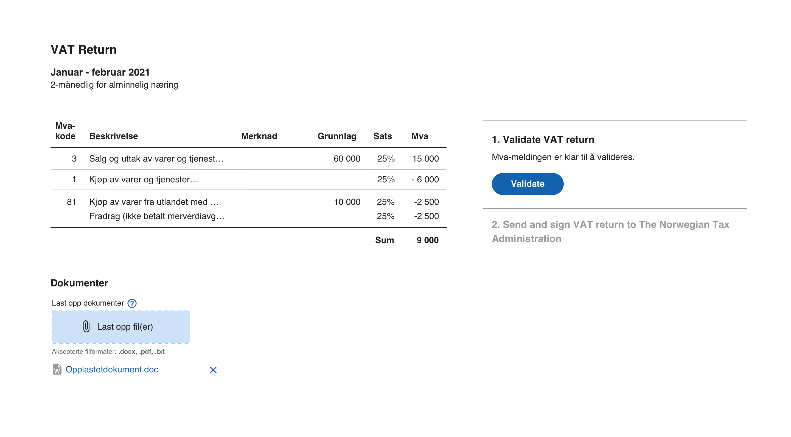
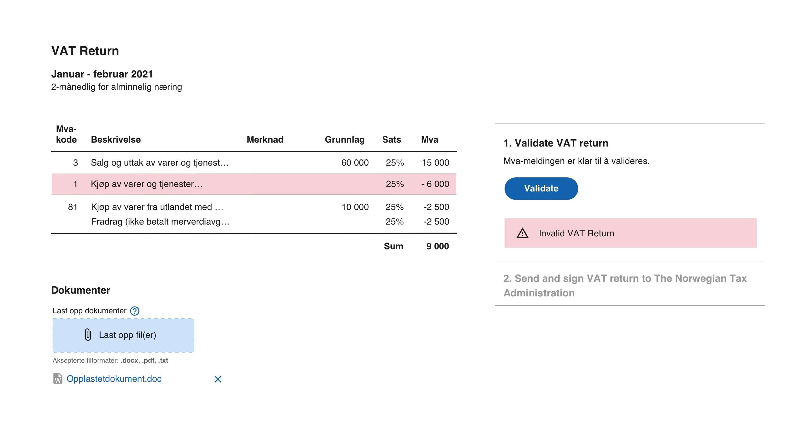
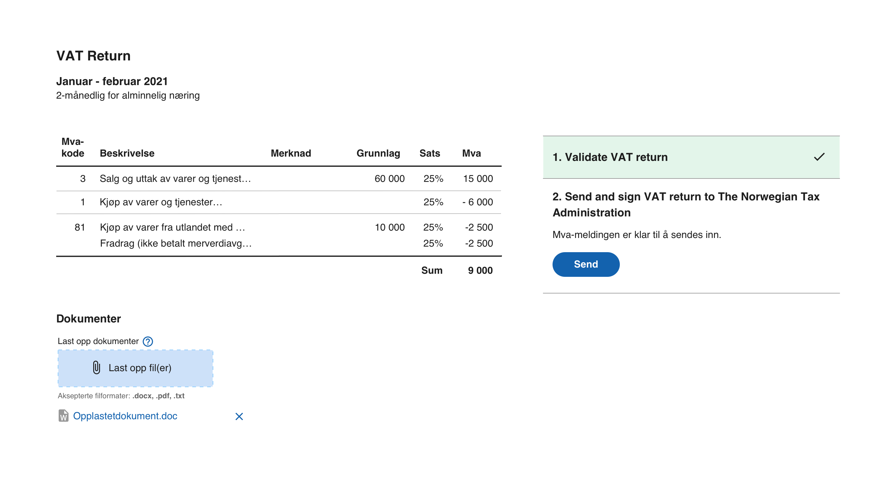
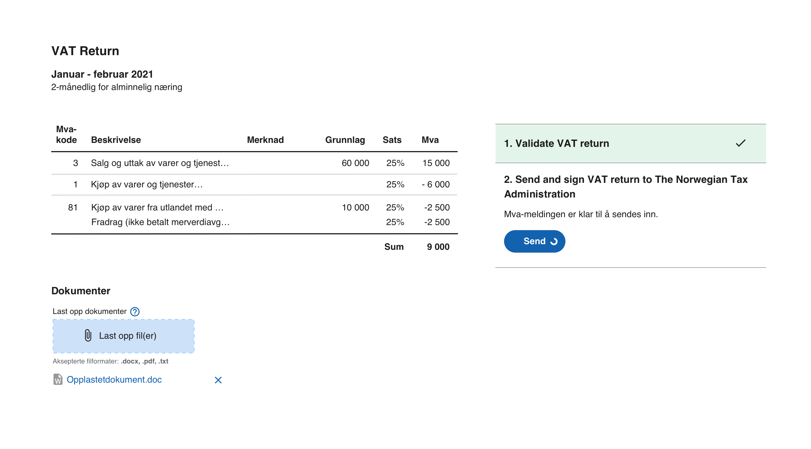
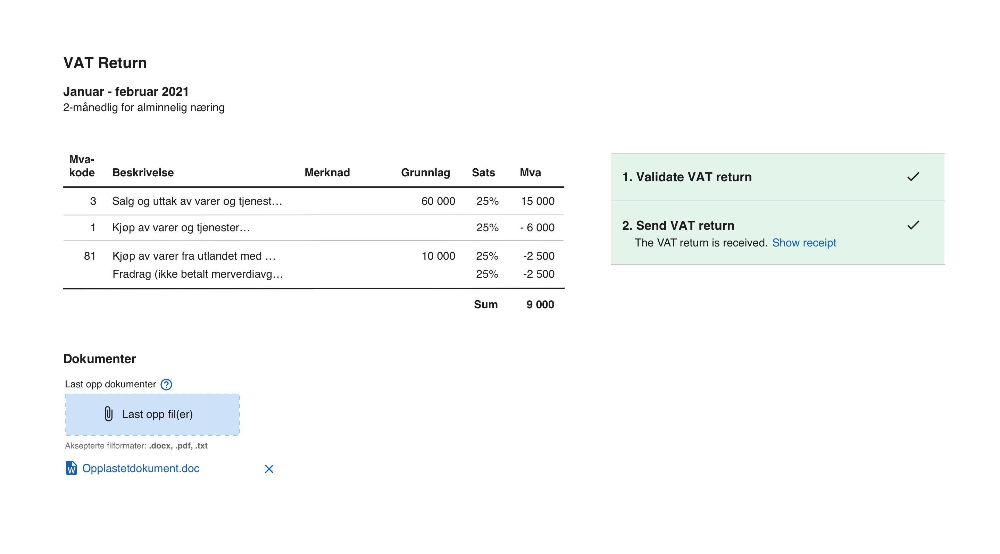

## Implementation Guide

## Preface

This guide has been written by a developer to give suppliers an overview of a planned project to implement electronic submission of a modernized VAT Return to the Tax Administration's APIs. The guide will help project managers and developers to understand the scope and highlight technical considerations.

## Overview

|  #  | Task                                                                                    | Addictions | Complexity |
| :-: | --------------------------------------------------------------------------------------- | :--------: | :--------: |
|  1  | Extraction of revenue from the accounting system for filling in a modernized VAT Return |     -      |  \* [^1]   |
|  2  | Display of the VAT Return in the Accounting System                                      |     1      |  \* [^1]   |
|  3  | ID-Porten integration                                                                   |     -      |     21     |
|  4  | Validate VAT Return against the Tax Administration's validation api                     |     3      |     1      |
|  5  | Interpretation and display of the validation result in the accounting system            |     4      |  \* [^1]   |
|  6  | Send VAT Return to the Tax Administration's submission api                              |     3      |     1      |
|  7  | Obtain the status of the submission from the Tax Administration's submission api        |     3      |     2      |
|  8  | Download and interpret the Tax Administration's feedback                                |     3      |     2      |

## Task details

Here are details about the tasks and an explanation of the complexity.

### 1. Extraction of revenue from the accounting system for filling in a modernized VAT Return

This is about searching for entries in the accounts and popularizing the new VAT Return. The task has no dependencies on other tasks and it is recommended to start this as early as possible.

Elements that can affect complexity:

- Create object model from xsd for the VAT Return
- Use of Code List for percentage rate and validity period
- Use of Code list for VAT codes in SAF-T standard used in VAT Return

The essence of this task is to extract the revenue, categorize and aggregate into SAF-T VAT codes.

### 2. Display of the VAT Return in the accounting system

A screen where the VAT Message's content is presented to the end user before validation and submission.

This screen could conceivably contain the functions for validating and submitting.

### 3. ID-Porten integration

Behind the high complexity, the following have been considered

- A process must be carried out with the ID-Porten
- The authentication process should be user-friendly for the end user
- The authentication process must be robust
- Token cache
- Application type and environment
- Experience with OAuth2 / OpenID

#### ID-Porten process

To use the validation and submission apis, an integration with ID-Porten must be in place. A customer relationship must be established if it does not exist, and several rounds of testing must be carried out before production can start.

#### The authentication process

It is assumed that there is an end user who is already logged in to the accounting system. When the time has come to validate or submit the VAT Return, we assume that the VAT Return will be displayed to the end user. ID-Porten authentication needs to be carried out before any api's are invoked when the user chooses to validate or submit. Once the authentication with the ID-Porten has been completed, the system will have an access token that can be used when calling the Tax Administration's validation or submission api's. To prevent the user from having to re-authenticate with the ID-Porten every time a VAT message is to be validated or submitted, one should create a cache for the Access token for the logged in user. The access token is issued with a lifetime and will exipire. When the access token expires, you should obtain a new one, and the user must either log in again, or if the application environment can keep a secret, you may use refresh tokens.

#### Token cache

In order for the user not to have to log in every time a VAT Message is to be submitted, it is recommended to develop a cache for logged in users ID-Porten access tokens. From the token you can retrieve the expiration time which can be used to find out if the user has to log in again before submission.

#### Application type and environment

Both the type of application and the environment will help determine whether it is possible to use refresh tokens. With the usage of refresh tokens it is possible to cache a valid token longer, reducing the need to log in again as often.

The ID-Porten login requires that the application can listen to a URL that is configured in the ID-Porten client when the end user has completed authentication via the ID-Porten. The complexity will be different in a web application or SPA compared to a desktop application.

The browser will redirect the user to the said URL and should not require changes to the network or firewall in an on-premise deployment if you configure the OIDC-Client with a returnURL for localhost. Listening to localhost should not require elevated rights for your application.

For a web application a return url will need to be configured to your web-application.

If you have both on-premise and web applications and they can share your OIDC-client, you can configure multiple valid return urls.

#### OAuth2 / OpenID experience

If the experience with OAuth2 / OpenID is limited, it will require some effort to understand and implement OpenID Connect. All elements of the ID-Porten integration are connected, and it is important to preserve the user experience.

### 4. Validate VAT Return against the Tax Administration's validation API

Calling the validation service with the ID-Porten token is almost trivial if you have a VAT message and you have a valid token from the ID-Porten. We highly recommend a process where the validation service is called with the VAT message before starting the submission.

The validation app only validates the VAT message file, which is one of several files in the submission.

### 5. Interpretation and display of the validation result in the accounting system

The validation service will return a validation result, and it will be appropriate to present the result to the end user, especially if the validation service finds the VAT return invalid. This is indicated in the validation result with status set to UGYLDIG_SKATTEMELDING. Invalid reports are not processed or considered as received by the Tax Administration. The validation result will also provide feedback at the element level and may be interesting to show in the context of the VAT return to be submitted.

**The tax authorities recommend canceling submission if the validation result's status is UGYLDIG_SKATTEMELDING.**

### 6. Send VAT Return to the Tax Administration's submission api

A submission consists of the following files:

- VAT-Return (MvaMelding)
- VAT-Return-Submission (MvaMeldingInnsending)
- Attachments

and needs to be uploaded to the submission api in several calls. The sequence of calls is documented under the API documentation, and consists of a series of simple Http calls.

The user initiating the submission must be authorized to do so for the organization. The end user must have one of the following Altinn roles:

- Ansvarlig revisor
- Regnskapsmedarbeider
- Regnskapsfører uten signeringsrett
- Revisormedarbeider

Once all the files have been uploaded, a call must be made to complete the upload, and the submission will be ready for completion if no validation error exists.

The tax authorities will validate the following:

- That the organization number is the same in the VAT-Return file, the VAT-Return-Submission file and that the same organization number was used when creating the submission at the submission API.
- That the attachments that have been uploaded are in the list of attachments in the VAT-Return-Submission file and vice versa.
- That the Message category is the same in the VAT-Return file and the VAT-Return-Submission file.

A 4xx error will be returned if the validation fails.

When the upload is complete, the submission can be completed. The user who completes the submission must be authorized for this for the relevant organization. The end user must have one of the following Altinn roles:

- Begrenset signeringsrett
- Kontaktperson NUF
- Regnskapsfører med signeringsrett

### 7. Obtain the feedback of the submission from the Tax Administration's submission api

Behind the scenes, this is an asynchronous operation involving multiple microservices. To facilitate a better user experience and ease the implementation of retrieving our feedback, we have made an extension to the rest-api that will block until the state of the submission has reached our definition of done. This will save you from implementing a loop that will poll the submission API for your submission status and interpret if we have provided feedback.

### 8. Download and interpret the Tax Administration's feedback

Our feedback currently consists of:

- A status for the submission (altinn instance substatus)
- A Receipt in PDF-format
- Payment information in xml
- Validation results in xml

When we have provided our feedback it will be possible to present the receipt for the end user.

## UI Proposal

In the following sketches we propose a user experience that will ensure a simple workflow for the end user and how we recommend invoking the validation service API.

### Assumptions

In the following sketches we assume that

- The user has a valid ID-Porten Access Token
- A VAT Return has been generated

### Step 1 - Invoke validation

We recommend that the the validation has been invoked and has been successful before enabling submission. If a VAT return is submitted that is rendered invalid by Skatteetaten, the submission is considered "Not delivered", even though it is technically possible to submit an invalid VAT Return.

### Validation fails

If the validation fails, there is no reason for the end user to submit it, because it will not be considered delivered and it will not be processed by the Tax Authorities. We recommend keeping submission disabled and display the validation errors for the VAT Return. The validation results will include which validation rule(s) fails and which MVA-codes entries are causing it.

### Validation succeeds

If the validation is successful, the submission feature can safely be enabled. If the validation succeeds, the Tax Authorities will most likely accept the VAT Return and process it automatically.

### Submitting the VAT Return

There are multiple steps in submitting the VAT Return using the submission API, more details are given in the API section of the documentation.

When clicking the Send-button we recommend that you

1. Invoke the series of API calls described in the API-documentation for submission.
2. Invoke the synchronous (and blocking) API call discussed in #7 above to wait for feedback

Both could be performed while som busy indicator like a spinner is being presented.

### VAT Return success

As mentioned, the Tax Authorities should be able to provide feedback before the request times out, and we believe that waiting for feedback in context of submission is valuable and the user will be able to finish the required work when submitting the VAT Return. If you don't wait for the feedback at this moment, the end user needs to return to it later.

[^1]: The complexity of this task depends on the implementation of the accounting system and is up to the supplier to evaluate.
