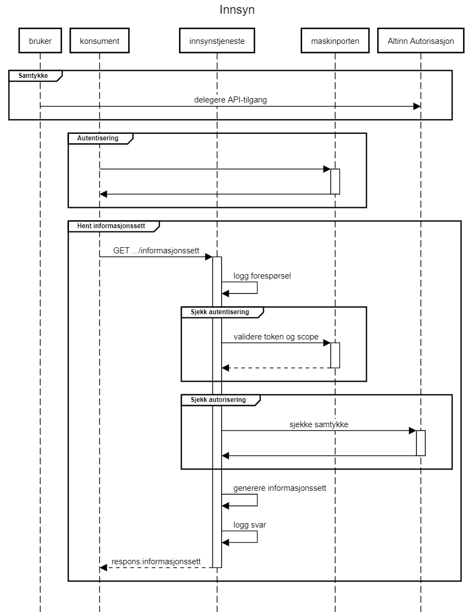

# Information services (Innsyn) available from API

## Changelog

| Date       | Change                                   |
| :--------- | :------------------------------------    |
| 2022.10.04 | Page for information services created    |
| 2022.12.02 | Addes description for additional service |

# MVA Innsyn API
## Introduction
The information services APIs can be used by end-user systems (ERPs) to obtain corresponding information offered via "Min Merverdiavgift".

## Request for information from the API
Requests for information are made as HTTP GET calls to the Tax Authority's APIs and responses are returned in XML or JSON format. Which format is desired is specified in the "Accept" header in the HTTP request. Sequence of requests:

1. Authentication in ID-porten.
2. Submit calls to the Tax Authority

## Services

### Status for submission of VAT return
The service provides status for the current term(s) and terms where the there are missing VAT-returns.

**URL** : GET https://<env>/api/mva/grensesnittstoette/innsyn/melding/innsending/status/v1/{organisasjonsnummer}
Where `<env>` is environment-specific address e.g. api-sbstest.sits.no

**Example** : Request for submission status for organization number 123456789

`GET https://mp-test.sits.no/api/mva/grensesnittstoette/innsyn/melding/innsending/status/v1/123456789`

Headers:
`Accept: application/xml`
`Authorization: Bearer <maskinportentoken>`

 **Response**
`status: 200 Innhold (body)`

 **Error messages**

 _Respons 401 - Unauthorized:_

 If the token from Maskinporten does not match the requested organization.

## Information model
Graphical representation of the xsd for the [information service](Informasjonsmodell mvaInnsendingStatus.png) :

Version 1.0 of the XSD for the response is located here: [no.skatteetaten.fastsetting.avgift.mva.skattemeldingformerverdiavgift.v1.0.xsd](https://github.com/Skatteetaten/mva-meldingen/blob/master/docs/informasjonsmodell_filer/xsd/no.skatteetaen.fastsetting.avgift.mva.mvaMeldingInnsendingStatus.v1.xsd)
 
### submitted VAT returns
The service provides a list of submitted VAT returns. Calls without a reference gives the first page of the latest 10 terms, while previous terms can be retrieved with a reference from the last report in the result from the received page.
 
 **URL** : `GET https://<env>/api/mva/grensesnittstoette/innsyn/melding/innsending/melding/v1/{organisasjonsnummer}`
`GET https://<env>/api/mva/grensesnittstoette/innsyn/melding/innsending/melding/v1/{organisasjonsnummer} ?sekvensnummer=<sekvensnummer>`

Where `<env>` is an environment specific adress e.g. `api-sbstest.sits.no`

**Example** : Request status for submissions for organization number 123456789 first page
`GET https://mp-test.sits.no/api/mva/grensesnittstoette/innsyn/melding/innsending/melding/v1/123456789`
   
**Example** : Request status for submissions for organization number 123456789 page from sequence number 1699575
`GET https://mp-test.sits.no/api/mva/grensesnittstoette/innsyn/melding/innsending/melding/v1/123456789?sekvensnummer=1699575`

Headers:
`Accept: application/xml`
`Authorization: Bearer <maskinportentoken>`

**Response**
`status: 200 Innhold (body)`

**Feilmeldinger**
_Respons 401 - Unauthorized:_
If the token from Maskinporten does not match the requested organization.

### Information model
Graphical representation of the xsd for the information service:

Version 1.0 of the XSD for the response is located here: https://git.aurora.skead.no/projects/INMO/repos/xsd_for_merverdiavgift/browse/deling/Innsyn/no.skatteetaten.fastsetting.avgift.mva.innsendtemeldinger.v1.xsd
 

