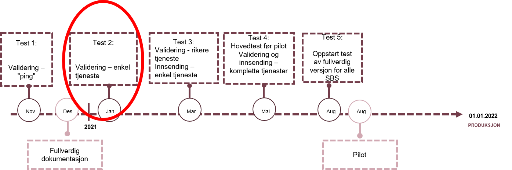

The information on this page is for ERP-providers that have made arrangments with the Norwegian Tax Administration to participate in testing the new verison of the VAT-report. If you wish to participate please contact us by e-mail mva-modernisering@skatteetaten.no. We will provide you with a test-user, as well as technical support if needed.  We are currently on 'Test 3'. For a complete test plan, see further down the page. Test documentation for test 3 consists of 

- Description of api - https://skatteetaten.github.io/mva-meldingen/documentation/api/
- XSD - https://skatteetaten.github.io/mva-meldingen/documentation/informasjonsmodell/
- Validation rules - https://skatteetaten.github.io/mva-meldingen/documentation/forretningsregler/
- Validation rules that are part of the test - see further down on this page
- Examples of test cases - see further down this page
  In addition, there is a need for a test user. This is distributed directly to participating ERPs.

# Validation rules

Validation rules ready for test:

- The sum of the calculated VAT from each VAT line shall be equal to the total VAT in the VAT return
- The calculated VAT must be in accordance with the stated VAT-basis multiplied by the current VAT-rate
- Amounts with opposite +/- sign that applies to output VAT must contain information in the field for additional information
- Amounts with opposite +/- sign that applies to input VAT that has been claimed deductable must contain information in the field for additional information
- Specification lines that applies to adjustment can only be submitted on VAT code 1
- Specification lines that applies to losses on outstanding claims can only be submitted on VAT code 1, 11, 12 or 13
- Specification lines that applies to withdrawals can only be submitted on VAT code 3, 31, 32 or 33
- Specification lines that applies to the reversal of input VAT given in VAT §9-6 and §9-7 can only be submitted on VAT code 1
- In the event of a reverse tax liability for deductable services purchased from abroad, the amount deducted in input VAT shall be less than or equal to the output VAT
- In the event of a a reverse tax liability for deductable services purchased from abroad, the input VAT must always be deducted if output tax is calculated
- When buying deductable goods from abroad, there must always be output VAT if input VAT has been deducted
- When buying deductable goods from abroad, the input VAT must always be deducted if output tax is calculated
- In the event of a a reverse tax liability for deductable services purchased from abroad, there must always be output VAT if input VAT has been deducted
- When buying deductable goods from abroad, the amount deducted in input VAT shall be less than or equal to the output VAT

# Test cases the VAT tax return

Examples of test cases for the new VAT tax return [Test cases for the VAT tax retun](Testtilfeller mva-melding.xlsx)

XML examples: https://github.com/Skatteetaten/mva-meldingen/blob/master/docs/documentation/test/eksempler/
Untill further notice there should not be % sign in the file to be sent in

# Test plan

## Content of the test

The ERP-system must do the following:

1. Log into ID-porten to obtain a session (and token).
2. Develop an application/ client that should
	- Send a request to Skatteetaten validation service in order to validate a vat tax return
	- Create an instance in the Altinn3 app
	- Upload 1 MvaMeldingInnsending
	- Upload 1 MvaMelding
	- Upload 0 or more attachements
	- Submit MvaMeldingInnsending

Skatteetaten have made available a test application that shows how the steps described above can be done. This is written in [jupyter notbook format](https://jupyter.org/):

1. [Jupyter notebook demo for retrieving, validation](https://github.com/Skatteetaten/mva-meldingen/blob/master/docs/documentation/test/demo.ipynb)Download the folder testinnsending and run the script demo.ipynb (the script will execute all steps in the process: call ping service to check the connection and validate the mva tax return.
2. [Jupyter notebook demo for retrieving, validation and submitting](https://github.com/Skatteetaten/mva-meldingen/blob/master/docs/documentation/test/innsending-eksempel.ipynb). Run the script demo.ipynb. The script will execute all steps in the process.
3. [Pyton script to fetch token](https://github.com/Skatteetaten/mva-meldingen/blob/master/docs/documentation/test/Steg/logge_inn_idporten.py) and [postman script to validate mva tax return](https://github.com/Skatteetaten/mva-meldingen/blob/master/docs/documentation/test/MeldingValidering.postman_collection.json). First step is to log in to ID-porten (described later), and store the token in the format "Bearer <em>hentet-token</em>" as an environment variable by the name "test-bearer" in postman, then use the postman script in order to validate the mva vat return.
4. [Example XML files](https://github.com/Skatteetaten/mva-meldingen/tree/master/docs/documentation/test/eksempler/melding)

## Start using ID-porten

When starting testing it is possible to use the Norwegian Tax administration ID-porten integration , however we recommend setting up your own integration, as the process is partially manual, and when using the service in production each user must have their own integration. Another advantage of starting the integration process early is that the integration can be tested in the test environment. ID-porten is owned by the Norwegian Digitalisation Agency (Digdir) and details on how to start using ID-porten is provided here: https://samarbeid.digdir.no/id-porten/id-porten/18.  When ordering access provide information that you would like to access the skattemeldings-API from Skatteetaten.

A customer relationship with DigDir provides access to their self-service solution, which in turn provides access to the administration of the Customer's use of the ID port. In the self-service solution, the customer can generate a so-called client_id and define a callback url:

- client_id: is an automatically generated unique identifier for the service.
- callback url: The Uri that the client is allowed to go to after logging in. After a successful login in the ID port, this url will be called.
  If it takes too long to establish a customer relationship with DigDir, the end-user systems can use Skatteetaten's client_id in the meantime. For this test, Skatteetaten has created the following client_id that can be used by the end-user systems:

      - `client_id: 38e634d9-5682-44ae-9b60-db636efe3156`
      	  - Callback URL for this client_id is set to  http://localhost:12345/token  (If there are consumers who want other callback URLs it can be provided)

**Useful links:**

- The client is using the test environment in DigDir called "verifikasjon 2": https://samarbeid.difi.no/node/232
- OICD integration is described here: https://difi.github.io/felleslosninger/oidc_index.html
- How to create a client in the self service solution: https://minside-samarbeid.difi.no/organization-home/services/service-admin#/

## Login at ID-porten

ID-porten login can be implemented in all types of end-user systems

- Desktop applications
- Web applications

Under the condition that the application can open a URL in a web browser, where login is carried out, and also has to be able run a web-server receiving a web-request (in the form of a redirect from ID-porten after login) on the callback-url.

The client must do the following REST call towards ID-porten:

- Launch the system browser and make authorization calls against ID-porten. Read more about it here: https://difi.github.io/felleslosninger/oidc_protocol_authorize.html
- The user is then sent to ID-porten for login. Existing test users for testing towards Skatteetaten's services today can be used.
- Set up a web server waiting for callback from the browser. After successful login the ID port is sent used to this web server. This web server must be set to listen to callback URLs http://localhost:12345/token (as according to previous section).
- Make a token request. Read more about it here: https://difi.github.io/felleslosninger/oidc_protocol_token.html

The following test environment at ID-porten is used:

- /authorize endpoint: https://oidc-ver2.difi.no/idporten-oidc-provider/authorize
- /token endpoint: https://oidc-ver2.difi.no/idporten-oidc-provider/token

For details on which HTTP parameters must be sent in the call, see the file [logge_inn_idporten.py](https://github.com/Skatteetaten/mva-meldingen/blob/master/docs/documentation/test/Steg/logge_inn_idporten.py)

## Call the vat tax return API

After login and and token request you will have an ID-porten access-token. This token is used as a bearer token in a HTTP-call on the validation service, and must be exchanged for an Altinn-token, which is used as a bearer token in the HTTP-calls in the submission process on The tax administrations Altinn3-API for VAT tax return submission.   For details, see <a href="https://skatteetaten.github.io/mva-meldingen/documentation/api/" target="_blank">Api</a>.

# Test time line

The time line below outlines when it will be possible to test integrations towards the new solutions from Skatteetaten.

<table align=center>
  <tr><th align=center>What</th><th align=center>When</th><th align=center>Content</th></tr>
  <tr><td>Documentation XSD</td><td>28.09.2020</td><td><ul><li> Updated xsd after feedback from meeting 14.9</li></ul></td></tr>
  <tr><td>Test 1 – techincal verification</td><td>nov. 2020</td><td><ul><li>Validation service -"Dummy"  (Ping from SBS)</li></ul></td></tr> 
  <tr><td>Test 2 – thin validation service and technical verification for VAT return service</td><td>jan. 2021</td>
  <td> 
  <ul>
	<li>Validation service </li>
	<li>Simple validation service with one or a few validations </li>
    <li>VAT return service  - "Dummy"  (Ping from SBS)</li>
  </ul>
  </td></tr>
  <tr><td>Test 3 - more validations from the validation service, simple VAT return service</td><td>mar. 2021</td>
  <td>  
  <ul>
	<li>Validation service - Validation servcie containing a larger number of the validations to be provided. </li>
	<li>VAT return service  - Simple VAT return service that will verify the VAT return and provide back a confirmation message. </li>
  </ul>
  </td></tr>
  <tr><td>Test 4 – complete service</td><td>mai. 2021</td><td>
  <ul>
	<li>Validation service - Complete service, as it will be in the pilot , is available</li>
	<li>VAT return service  - Complete service, as it will be in the pilot , is available</li>
  </ul>
  </td></tr>
  <tr><td>Test 5 - main test before pilot</td><td>aug. 2021</td><td></td></tr>
  <tr><td>Pilot</td><td>aug. 2021</td><td></td></tr>
  <tr><td>Production </td><td>01.01.2022</td><td></td></tr>  
</table>

