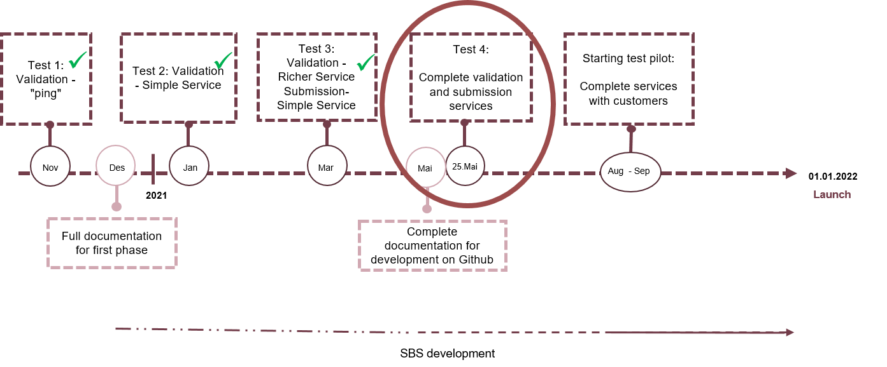

## Testing requirements

System providers are responsible for carrying out tests themselves. Focus should be to verify that the validation and submission services work as expected. The implementation guide is the essential guide for getting the solution in place for system providers.

The project team will contribute with debugging, bug fixing, and following up of cases that are sent into the test environment.

The project team is available via Slack for technical clarifications and for direct contact with developers and test managers. The project team can also be reached via mva-modernisering@skatteetaten.no. Contact us here to receive access to Slack.

## The test environment and test data

System providers must have test environments which can make use of synthetic data

Connection against the test environment occurs through ID-porten and for the purpose of testing, Skatteetaten's ID-porten integration can be used. It is recommended that the providers order their own integration against ID-porten as soon as possible because the process is partly manual and can be time consuming. See more in [implementation guide section 3. ID-porten integration.](https://skatteetaten.github.io/mva-meldingen/english/implementationguide/#3-id-porten-integration)

The system providers will receive synthetic test users that can also be found in the test environments in the ID-porten (ver2) and Altinn (TT02).

Skatteetaten's test environment will be available at agreed periods between May 2021 and January 2022. In July 2021 it should not be expected that the environment will be available.

## Test planning

The project team will offer meetings with a focus on test planning and carrying out the tests. Here the agendae will cover, amongst other things, carrying out the tests, which scenarios should be tested and the test data.

## Summary of tests and moving into production

The system providers will, after the end of the test period and in advance of production, summarise their tests. The summary will show what has been tested, along with the status of the carried out tests, including a summary of bugs and inadequacies. The providers will, at Skatteetatens request, provide documentation on how the integration has been tested.

## 'Test 4'

During week 19 will all of the documentation be updated and available here on github.

The test environment will be available from 25th May.

