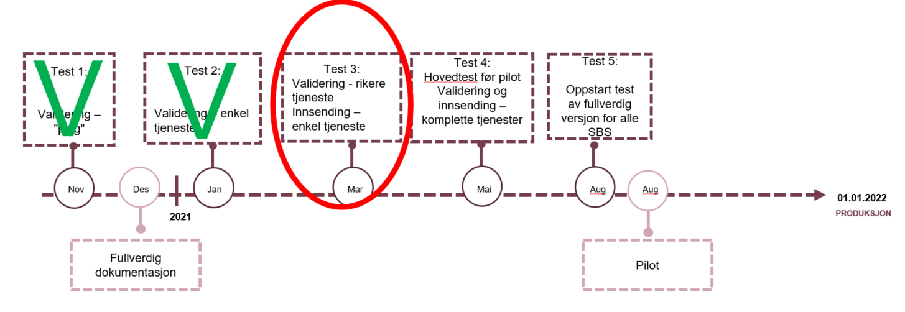

The information on this page is for ERP-providers that have made arrangments with the Norwegian Tax Administration to participate in testing the new verison of the VAT-report. If you wish to participate please contact us by e-mail mva-modernisering@skatteetaten.no. We will provide you with a test-user, as well as technical support if needed. We are currently on 'Test 3'. For a complete test plan, see further down the page. Test documentation for test 3 consists of

- Description of api - <a href="https://skatteetaten.github.io/mva-meldingen/english/api/" target="_blank">Api</a>
- XSD - <a href="https://skatteetaten.github.io/mva-meldingen/english/informasjonsmodell/" target="_blank">Information models</a>
- Validation rules - <a href="https://skatteetaten.github.io/mva-meldingen/english/forretningsregler/" target="_blank">Validation rules</a>
- Validation rules that are part of the test - see further down on this page
- Examples of test cases - see further down this page
  In addition, there is a need for a test user. This is distributed directly to participating ERPs.

# Test plan

## Content of the test

The ERP-system must do the following:

1. Log into ID-porten to obtain a session (and token).
2. Develop an application/ client that should
   - Send a request to Skatteetaten validation service in order to validate a vat tax return
   - Create an instance in the Altinn3 app
   - Upload 1 MvaMeldingInnsending
   - Upload 1 MvaMelding
   - Upload 0 or more attachements
   - Submit MvaMeldingInnsending

Skatteetaten have made available a test application that shows how the steps described above can be done. This is written in [jupyter notebook format](https://jupyter.org/):

1. [Jupyter notebook demo for retrieving, validation](https://github.com/Skatteetaten/mva-meldingen/blob/master/docs/documentation/test/demo.ipynb). Download the folder test and run the script demo.ipynb (the script will execute all steps in the process: call ping service to check the connection and validate the mva tax return.
2. [Jupyter notebook demo for retrieving, validation and submitting](https://github.com/Skatteetaten/mva-meldingen/blob/master/docs/documentation/test/innsending-eksempel.ipynb). Run the script demo.ipynb. The script will execute all steps in the process.
3. [Pyton script to fetch token](https://github.com/Skatteetaten/mva-meldingen/blob/master/docs/documentation/test/Steg/log_in_idporten.py) and [postman script to validate mva tax return](https://github.com/Skatteetaten/mva-meldingen/blob/master/docs/documentation/test/MeldingValidering.postman_collection.json). First step is to log in to ID-porten (described later), and store the token in the format `Bearer <token-here>` as an environment variable by the name "test-bearer" in postman, then use the postman script in order to validate the mva vat return.
4. [Example XML files](https://github.com/Skatteetaten/mva-meldingen/tree/master/docs/documentation/test/eksempler/melding)

## Start using ID-porten

When starting testing it is possible to use the Norwegian Tax Administration ID-porten integration , however we recommend setting up your own integration, as the process is partially manual, and when using the service in production each user must have their own integration. Another advantage of starting the integration process early is that the integration can be tested in the test environment. ID-porten is owned by the Norwegian Digitalisation Agency (Digdir) and details on how to start using ID-porten is provided here: <a href="https://samarbeid.digdir.no/id-porten/id-porten/18" target="_blank">ID-Porten documentation</a>. When ordering access, please provide information that you would like to access the skattemeldings-API from Skatteetaten.

A customer relationship with DigDir provides access to their self-service solution, which in turn provides access to the administration of the customer's use of ID-Porten. In the self-service solution, the customer can generate a so-called client_id and define a callback url:

- client_id: is an automatically generated unique identifier for the service.
- callback url: The Uri that the client is allowed to go to after logging in. After a successful login in ID-Porten, this url will be called.
  If it takes too long to establish a customer relationship with DigDir, the end-user systems can use Skatteetaten's client_id in the meantime. For this test, Skatteetaten has created the following client_id that can be used by the end-user systems:

      - `client_id: 23cc2587-ea4e-4a5f-aa5c-dfce3d6c5f09`
      	  - Callback URL for this client_id is set to  http://localhost:12345/token  (If there are consumers who want other callback URLs it can be provided)

**Useful links:**

- The client is using the test environment in DigDir called "verifikasjon 2": <a href="https://samarbeid.difi.no/node/232" target="_blank">https://samarbeid.difi.no/node/232</a>
- OICD integration is described here: <a href="https://difi.github.io/felleslosninger/oidc_index.html" target="_blank">https://difi.github.io/felleslosninger/oidc_index.html</a>
- How to create a client in the self service solution: <a href="https://minside-samarbeid.difi.no/organization-home/services/service-admin#/" target="_blank">https://minside-samarbeid.difi.no/organization-home/services/service-admin#/</a>

## Login with ID-porten

ID-porten login can be implemented in all types of end-user systems

- Desktop applications
- Web applications

Under the condition that the application can open a URL in a web browser, where login is carried out, and also has to be able run a web-server receiving a web-request (in the form of a redirect from ID-porten after login) on the callback-url.

The client must do the following REST call towards ID-porten:

- Launch the system browser and make authorization calls against ID-porten. Read more about it here: <a href="https://difi.github.io/felleslosninger/oidc_protocol_authorize.html" target="_blank">https://difi.github.io/felleslosninger/oidc_protocol_authorize.html</a>
- The user is then sent to ID-porten for login. Existing test users for testing towards Skatteetaten's services today can be used.
- Set up a web server waiting for callback from the browser. After successful login ID-Porten is sent used to this web server. This web server must be set to listen to callback URLs http://localhost:12345/token (as according to previous section).
- Make a token request. Read more about it here: <a href="https://difi.github.io/felleslosninger/oidc_protocol_token.html" target="_blank">https://difi.github.io/felleslosninger/oidc_protocol_token.html</a>

The following test environment at ID-porten is used:

- /authorize endpoint: `https://oidc-ver2.difi.no/idporten-oidc-provider/authorize`
- /token endpoint: `https://oidc-ver2.difi.no/idporten-oidc-provider/token`

For details on which HTTP parameters must be sent in the call, see the file [log_in_idporten.py](https://github.com/Skatteetaten/mva-meldingen/blob/master/docs/documentation/test/Steg/log_in_idporten.py)

## Call the vat tax return API

After login and and token request you will have an ID-porten access-token. This token is used as a bearer token in a HTTP-call on the validation service, and must be exchanged for an Altinn-token, which is used as a bearer token in the HTTP-calls in the filing process on the Tax Administrations Altinn3-API for VAT tax return filing. For details, see <a href="https://skatteetaten.github.io/mva-meldingen/english/api/" target="_blank">Api</a>.

# Validation rules

Validation rules ready for test:

- The sum of the calculated VAT from each VAT line shall be equal to the total VAT in the VAT return
- The calculated VAT must be in accordance with the stated VAT-basis multiplied by the current VAT-rate
- Additional information is lacking for output VAT amounts with opposite +/- sign
- Additional information is lacking for input VAT amounts that have been claimed deductable with opposite +/- sign
- Additional information for specification lines that apply to the reversal of input VAT given in VAT §9-6 and §9-7
- Input VAT that has been claimed deductable on goods purchased from abroad must be less than or equal to output VAT (code 81)
- Input VAT that has been claimed deductable on goods purchased from abroad must be less than or equal to output VAT (code 83)
- Input VAT that has been claimed deductable on services purchased from abroad must be less than or equal to output VAT (code 86)
- Input VAT that has been claimed deductable on services purchased from abroad must be less than or equal to output VAT (code 88)
- Input VAT that has been claimed deductable on climate quotas and gold must be less than or equal to output VAT
- There must be output VAT if input VAT has been deducted for deductable goods purchased from abroad (code 81)
- There must be output VAT if input VAT has been deducted for deductable goods purchased from abroad (code 83)
- There must be output VAT if input VAT has been deducted for deductable services purchased from abroad (code 86)
- There must be output VAT if input VAT has been deducted for deductable services purchased from abroad (code 88)
- There must be output VAT if input VAT has been deducted for deductable climate quotas and gold
- There must be deductable input VAT if there is output VAT on goods purchased from abroad (code 81)
- There must be deductable input VAT if there is output VAT on goods purchased from abroad (code 83)
- There must be deductable input VAT if there is output VAT on services purchased from abroad (code 86)
- There must be deductable input VAT if there is output VAT on services purchased from abroad (code 88)
- There must be deductable input VAT if there is output VAT on deductable climate quotas and gold
- Specification lines that apply to losses on outstanding claims can only be submitted on VAT codes 1, 11, 12 or 13
- Specification lines that apply to withdrawals can only be submitted on VAT codes 3, 31, 32 of 33
- Specification lines that apply to adjustment can only be submitted on VAT code 1
- Specification lines that apply to the reversal of input VAT given in VAT §9-6 and §9-7 can only be submitted on VAT code 1
- Revenue before registration can not be submitted as information on this VAT code
- Refund information can not be submitted on this VAT code
- Temporary import information can not be submitted on this VAT code
- Re-importation information can not be submitted on this VAT code
- Toll declaration information regarding the wrong organisation number can not be submitted on this VAT code
- Re-exportation information can not be submitted on this VAT code.
- Re-exportation or refund information can not be submitted on this VAT code
- Temporary export information can not be submitted on this VAT code
- Export of services information can not be submitted on this VAT code
- Large procurement information can not be submitted on this VAT code
- Information about procurements before being VAT registered can not be submitted on this VAT code
- Insurance settlement information can not be submitted on this VAT code
- Seasonal variation information can not be submitted on this VAT code
- Credit not information can not be submitted on this VAT code

# Test cases the VAT tax return

Examples of test cases for the new VAT tax return [Test cases for the VAT tax retun](Testtilfeller mva-melding.xlsx)

XML examples: <a href="https://github.com/Skatteetaten/mva-meldingen/blob/master/docs/documentation/test/eksempler/" target="_blank">https://github.com/Skatteetaten/mva-meldingen/blob/master/docs/documentation/test/eksempler/</a>
Until further notice there should not be % sign in the file to be sent in

# Test time line

The time line below outlines when it will be possible to test integrations towards the new solutions from Skatteetaten.

<table align=center>
  <tr><th align=center>What</th><th align=center>When</th><th align=center>Content</th></tr>
  <tr><td>Documentation XSD</td><td>28.09.2020</td><td><ul><li> Updated xsd after feedback from meeting 14.9</li></ul></td></tr>
  <tr><td>Test 1 – techincal verification</td><td>nov. 2020</td><td><ul><li>Validation service -"Dummy"  (Ping from SBS)</li></ul></td></tr> 
  <tr><td>Test 2 – thin validation service and technical verification for VAT return service</td><td>jan. 2021</td>
  <td> 
  <ul>
	<li>Validation service </li>
	<li>Simple validation service with one or a few validations </li>
    <li>VAT return service  - "Dummy"  (Ping from SBS)</li>
  </ul>
  </td></tr>
  <tr><td>Test 3 - more validations from the validation service, simple VAT return service</td><td>mar. 2021</td>
  <td>  
  <ul>
	<li>Validation service - Validation servcie containing a larger number of the validations to be provided. </li>
	<li>VAT return service  - Simple VAT return service that will verify the VAT return and provide back a confirmation message. </li>
  </ul>
  </td></tr>
  <tr><td>Test 4 – complete service</td><td>mai. 2021</td><td>
  <ul>
	<li>Validation service - Complete service, as it will be in the pilot , is available</li>
	<li>VAT return service  - Complete service, as it will be in the pilot , is available</li>
  </ul>
  </td></tr>
  <tr><td>Test 5 - main test before pilot</td><td>aug. 2021</td><td></td></tr>
  <tr><td>Pilot</td><td>aug. 2021</td><td></td></tr>
  <tr><td>Production </td><td>01.01.2022</td><td></td></tr>  
</table>

