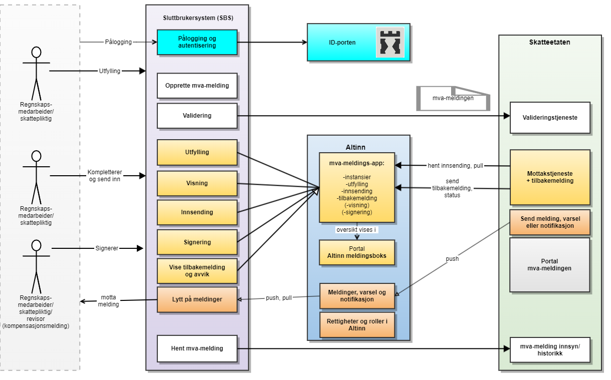

# Introduksjon til systeminnsending av mva-meldingen

## Bakgrunn og behov

MEMO-prosjektet utvikler ny skattemelding for merverdiavgift, heretter kalt mva-meldingen. Målet med MEMO-prosjektet er å oppnå bedre etterlevelse, likere konkurransevilkår, forenkling for næringslivet og en mer effektiv forvaltning. Noe forenkling følger direkte av endringene i mva-meldingen. Vi får færre feilkilder, enklere tilbakebetaling, og det blir enklere å oppfylle opplysningsplikten.

En ny mva-melding vil også gi nye muligheter for veiledning og dialog gjennom for eksempel validering før innsending og påminnelse om arbeidsoppgaver ved hjelp av arbeidsliste. I tillegg ønsker man å tilby økt grad av oppslag og innsyn for å oppå effektivisering og trygghet gjennom digital avstemming. Det er også et ønske om bedre samspill mellom regnskapssystemene og Altinn / Skatteetaten, for eksempel gjennom automatisk kvittering til regnskapssystem.

Ønsker du mer informasjon om moderniseringsprosjektet for mva-området kan du lese mer på [skatteetaten.no/nymva](http://skatteetaten.no/nymva)

## Hva er nytt

- Felles informasjonsstruktur og regelsett for alle typer mva-melding
- Fleksibilitet: kodebasert i stedet for faste felter

  - Fra strøm på papir til digital samhandling
  - Går bort fra dagens nummererte poster – erstattes med en dynamisk liste av spesifikasjonslinjer
  - Mva-meldingen gjenbruker kodelisten Standard Tax Codes fra SAF-T standarden (NB: Den nye mva-meldingen må ikke forveksles med SAF-T filen for utveksling av regnskapsdata. Det er kun kodelisten som gjenbrukes - mva-meldingenv vil fortsatt være på et svært aggregert nivå)

- Enklere for skattepliktige å oppfylle opplysningsplikten. Mulighet for merknader for melding totalt og per linje:
  - Tar bort mye av behovet for merknader - en mva-melding som dekker mer
  - Strukturerte merknader for de vanligste forholdene
  - Merknader i fritekst
  - Vedlegg
- Tilbakebetaling: mva-pliktig kan oppgi KID for tilbakebetaling
- Færre feilkilder gjennom validering før innsending
- Hver melding får unik identifikator for lettere å identifisere hver melding
- Forbedret oppsett/visuell fremstilling av mva-meldingen

## Overordnet løsningsoversikt - komponenter, API og meldinger

Her beskrives arkitekturen i den nye løsningen. Figuren under viser en oversikt over aktører og komponenter.

- Et SBS oppretter mva-meldingen gjennom et brukergrensesnitt mot sluttbrukere.
- SBS kan utføre operasjoner på skattemeldingene gjennom et API mot Altinn3. Disse API-en blir nye og er ikke de samme som benyttes i dag for Altinn2-innsending.
- Det tilbys API for å validere mva-meldingen, signere og sende inn.
- Eksisterende funksjonalitet i Altinn2 for Innboks og roller og rettigheter vil videreføres i den nye løsningen.
- Skattepliktig og ev regnskapsfører eller revisor kan gå i Altinn for å se på innsendte data og signere og sende inn til Skatteetaten
- Skatteetaten vil tilby portalløsning som gir personlige skattepliktige mulighet til innsyn og ev endring med påfølgende innsending av mva-melding.
- Pålogging, autentisering av sluttbrukeren og/eller sluttbrukersystemet skal gjøres via ID-porten. Prosjektet ser på å utvikle støtte for Maskinporten etter hvert.
