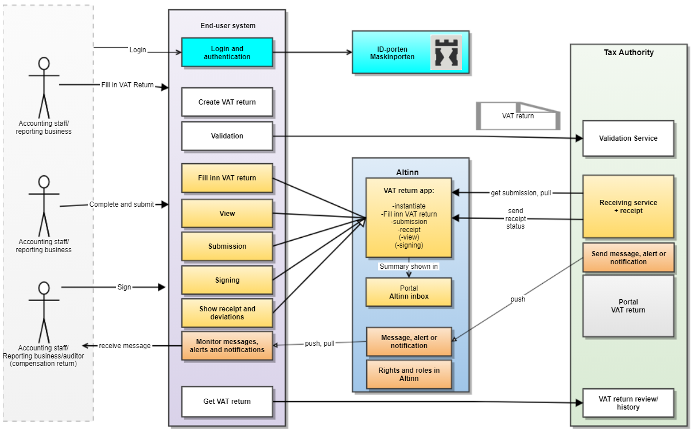

# Introduction to system submission of VAT-report

## Background

The MEMO-project has developed a new tax return for VAT compensation (VAT return). The goal of the MEMO-project was to achieve increased compliance, equal competitive conditions, simplification for reporting businesses, and a more effective administration of the VAT system.
Some simplification is a result of changes in the VAT return; fever sources of errors, easier returns, and making it easier to fulfil the duty to provide information.
The VAT return also provides new opportunities for guidance and dialog through validation before submission, and reminders for tasks. In addition, it is possible to offer an increased degree of access to information to achieve effectiveness and safety through digital reconciliation of the VAT return. The new VAT-report provides better interaction between accounting/ERP systems and Altinn/Tax Authority systems, for example automatic receipt for submitted VAT returns.

If you want more information about the project go to [skatteetaten.no/nymva](http://www.skatteetaten.no/nymva).
If you want information or news for ERPs go to our pages at [Nyheter og driftsvarsler](https://skatteetaten.github.io/api-dokumentasjon/nyheter-og-driftsvarsler).

## What's new

- Common information structure and rules for all types of VAT returns
- Flexibility; code based rather than fixed fields
  - From electronic forms to digital interaction
  - No longer numbered fields, these are replaced by a dynamic list of specifications
  - The new VAT-return re-uses the Standard Tax Codes from the SAF-T standard. (Note: the new VAT-return must not be confused with the SAF-T Financial file. Only the codes are re-used - The VAT-return is still at a very aggregated level).
- Easier to provide the correct information; remarks for VAT returns per line and in total:
  - Removes the need for remarks as the new return covers more cases
  - Structured remarks for common cases
  - Free form remarks
  - Attachments
- Refund; reporting businesses can submit a KID for reimbursement
- Removing errors prior to submission by validating submissions
- Each return has a unique identifier, to more easily identify each VAT-return
- Improved setup/New visual interface for the VAT returns

## Overview of the new service - components, API and message flow

This illustration describes the architecture of the new solution
Frontpage in English

- An end-user system creates a VAT return through a user interface.
- The end-user system can execute operations on VAT returns through an API between the system and Altinn 3. These API's are new, and not the same as the ones currently being used in Altinn 2.
- API's for validation, signing and submitting VAT returns will be available
- Functionality in Altinn 2, such as inbox, roles and rights will also be available in the new service.
- Reporting business, accountants and advisors can access submitted information, sign VAT returns and submit returns to the tax authority.
- The tax authority offers a portal solution where taxable persons can access submitted information, make changes and submit VAT returns.
- Login and authentication of the end user or system is carried out using ID-porten. The project will consider support for Maskinporten at a later stage.
