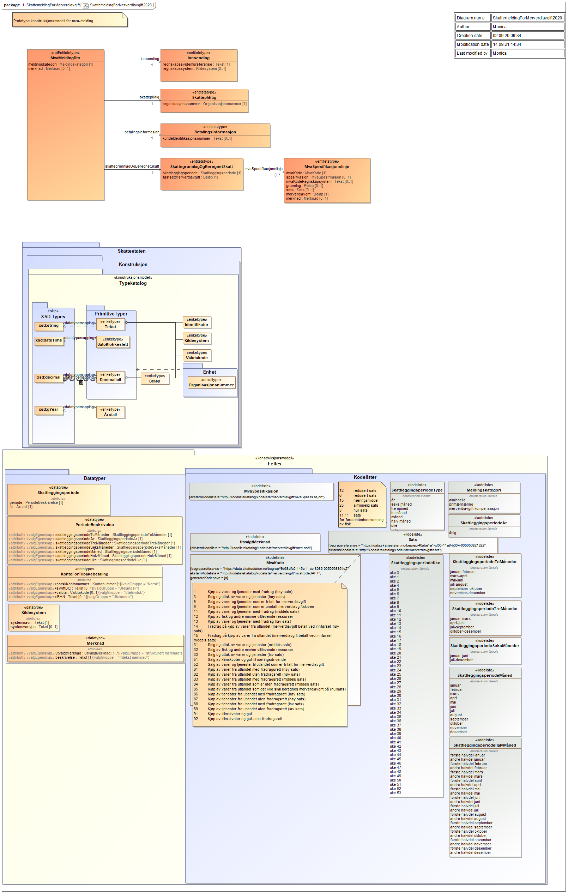

# XSD for the VAT return

### Change log

| Date       | What changed?                                                                                                                                                                                                                                                                                                                                                                                                                                                                                                                                               |
| :--------- | :---------------------------------------------------------------------------------------------------------------------------------------------------------------------------------------------------------------------------------------------------------------------------------------------------------------------------------------------------------------------------------------------------------------------------------------------------------------------------------------------------------------------------------------------------------- |
| 2021.06.21 | Updated code list [mvaSpesifikasjon](https://github.com/Skatteetaten/mva-meldingen/blob/master/docs/documentation/informasjonsmodell/kodelister/mvaSpesifikasjon.xml), correcting "tap på krav" to "tapPåKrav"                                                                                                                                                                                                                                                                                                                                              |
| 2021.08.31 | Updated with description of the fields in the VAT return submission                                                                                                                                                                                                                                                                                                                                                                                                                                                                                         |
| 2021.09.13 | New table describing the usage of SAF-T codes                                                                                                                                                                                                                                                                                                                                                                                                                                                                                                               |
| 2021.09.21 | Information model for VAT return updated. SAF-T codes not to be reported (0,7, 20,21 and 22) are removed.                                                                                                                                                                                                                                                                                                                                                                                                                                                   |
| 2021.10.12 | Updated code list [merknadTilsvarendeMvaKode](https://github.com/Skatteetaten/mva-meldingen/blob/master/docs/documentation/informasjonsmodell/kodelister/merknadTilsvarendeMvaKode.xml), including removal of duplicates                                                                                                                                                                                                                                                                                                                                    |
| 2021.10.15 | Updated code lists                                                                                                                                                                                                                                                                                                                                                                                                                                                                                                                                          |
| 2021.10.21 | Updated description of period and taxation period with information about SkattleggingsperiodeUke and SkattleggingsperiodeHalvmåndelig                                                                                                                                                                                                                                                                                                                                                                                                                       |
| 2021.10.22 | Updated code lists, correcting English texts in [merknad](https://github.com/Skatteetaten/mva-meldingen/blob/master/docs/documentation/informasjonsmodell/kodelister/merknad.xml), added new element "fradrag" in [merknadTilsvarendeMvaKode](https://github.com/Skatteetaten/mva-meldingen/blob/master/docs/documentation/informasjonsmodell/kodelister/merknadTilsvarendeMvaKode.xml), nynorsk translations in [mvaKodeSAFT](https://github.com/Skatteetaten/mva-meldingen/blob/master/docs/documentation/informasjonsmodell/kodelister/mvaKodeSAFT.xml). |
| 2021.11.02 | Updated code lists, added valid remarks for SAFT VAT codes 81, 1, 11, 12 and 13 in [merknadTilsvarendeMvaKode](https://github.com/Skatteetaten/mva-meldingen/blob/master/docs/documentation/informasjonsmodell/kodelister/merknadTilsvarendeMvaKode.xml), small update to kodetillegg for SAFT VAT code 12, 1 and 81 in [mvaKodeSAFT](https://github.com/Skatteetaten/mva-meldingen/blob/master/docs/documentation/informasjonsmodell/kodelister/mvaKodeSAFT.xml).                                                                                          |
| 2021.11.09 | Updated code lists, removed remarks with "uttak" for code 32 [merknadTilsvarendeMvaKode](https://github.com/Skatteetaten/mva-meldingen/blob/master/docs/documentation/informasjonsmodell/kodelister/merknadTilsvarendeMvaKode.xml).                                                                                                                                                                                                                                                                                                                         |
| 2021.11.29 | Updated code lists, corrections to code 81 in [merknadTilsvarendeMvaKode](https://github.com/Skatteetaten/mva-meldingen/blob/master/docs/documentation/informasjonsmodell/kodelister/merknadTilsvarendeMvaKode.xml).                                                                                                                                                                                                                                                                                                                                        |
| 2021.12.03 | Updated code list summary, added adjustment specification for code 81.                                                                                                                                                                                                                                                                                                                                                                                                                                                                                      |
| 2021.12.07 | Minor updates to description of spraakTekst in mvaKodeSAFT.xml                                                                                                                                                                                                                                                                                                                                                                                                                                                                                              |

## Version 1.0 of the XSD for the VAT return

Version 1.0 of this XSD is found here [no.skatteetaten.fastsetting.avgift.mva.skattemeldingformerverdiavgift.v1.0](https://github.com/Skatteetaten/mva-meldingen/blob/master/docs/documentation/informasjonsmodell/xsd/no.skatteetaten.fastsetting.avgift.mva.skattemeldingformerverdiavgift.v1.0.xsd)

Graphical representation of the XSD and encoding for the [VAT return](SkattemeldingForMerverdiavgift2020.png):

The SAF-T standard also contains the codes 0 (No VAT treatment), 7 (No VAT treatment - no turnover according to the VAT legislation), 20 (No VAT treatment), 21 (Basis on import of goods, regular rate) and 22 (Basis on import of goods, reduced rate, middle). These should not be reported in the VAT return

Examples of new VAT-return in Excel:

[Test cases VAT-return](https://github.com/Skatteetaten/mva-meldingen/blob/master/docs/documentation/test/Testtilfeller%20mva-melding.xlsx?raw=true)

Corresponding example files for VAT return in XML format can be downloaded from the test section: https://github.com/Skatteetaten/mva-meldingen/blob/master/docs/documentation/test/eksempler/melding/

## Description of the fields in the VAT return

### VAT-return

<table align=center>
  <tr><th style="width:25%" align=left>Field</th><th align=left>Description</th></tr>
  <tr><td>meldingskategori</td><td>The subtype of the VAT return  
	Purpose: to ensure that the user can fulfill their VAT reporting obligations
	</td>
  </tr>
    <tr><td>merknad</td><td>Additional information about the content of the VAT return 
	Purpose: to ensure that the taxpayer have the possibility to explain their application of law when necessary
	</td>
  </tr>
</table>

### Skattepliktig

<table align=center>
  <tr><th style="width:25%" align=left>Field</th><th align=left>Description</th></tr>
  <tr><td>organisasjonsnummer</td><td>Unique identifier for the taxable organisation   
  Purpose: to take care of the rights and obligations of the taxpayer
	</td>
  </tr>	
</table>

### Innsending

<table align=center>
  <tr><th style="width:25%" align=left>Field</th><th align=left>Description</th></tr>
  <tr><td>regnskapssystemrefereanse</td><td>The taxpayers unique reference for the submission  
  Purpose: To ensure that the taxpayer and the tax office refer to the same message. 
	</td>
  </tr>
    <tr><td>system</td><td>Name and possible version of accounting system  
Purpose: To be able to follow up systematic errors with the system supplier instead of following up each individual taxpayer. 
	</td>
  </tr>
</table>

### Payment information

KID oppgis bare dersom det er tilgodebeløp.

<table align=center>
  <tr><th style="width:25%" align=left>Field</th><th align=left>Description</th></tr>
  <tr><td>KID</td><td>The recipient's identification of a payment  
Purpose: To be able to pay to the bank accounts that require KID 
</table>

### Tax basis and calculated tax

<table align=center>
  <tr><th style="width:25%" align=left>Field</th><th align=left>Description</th></tr>
  <tr><td>skattleggingsperiode</td><td>The taxation period for which the VAT return applies  
  Period is stated in accordance with the code list for the Skattleggingsperiode. SkattleggingsperiodeUke follows the calendar's week numbering, for example week 1 in 2022 runs from 3 to 9 January. For SkattleggingsperiodeHalvmåndelig, the first half runs from the 1st to the 15th of the month and the second half runs from the 16th to the last of the month.  
Purpose: to ensure consistency between bookkeeping and VAT return period 
	</td>
  </tr>
    <tr><td>fastsattMerverdiavgift</td><td>Sum to pay / sum to be refunded  
Purpose: to ensure that the correct amount is being paid
	</td>
  </tr>
</table>

### MvaSpesifikasjonslinje

<table align=center>
  <tr><th style="width:25%" align=left>Field</th><th align=left>Description</th></tr>
  <tr><td>mvaKode</td><td>Classification of incoming and outgoing VAT in accordance with the Norwegian SAF-T standard  
Purpose: dissemination of which VAT assessments have been carried out
	</td>
  </tr>
  <tr><td>spesifikasjon</td><td>Detailing some VAT conditions that are not included in the Norwegian SAF-T standard  
Purpose: dissemination of which VAT assessments have been carried out
	</td>
  </tr> 
  <tr><td>mvaKodeRegnskapssystem</td><td>Internal VAT code in the accounting system. There may be several internal VAT codes for a VAT code and possibly a specification. In that case, there will be several lines in the VAT message per VATCode and specification; one per combination of VAT code, specification and VAT CodeAccounting system.  
Purpose: Two considerations  
Users: recognizable in relation to what they see in the accounting system.  
The system suppliers will not have to change VAT codes in the systems
	</td>
  </tr>
  <tr><td>grunnlag</td><td>The amount of which VAT is calculated.
The field must not be filled in for input VAT.  
Purpose: Basis for control from the Tax Administration
	</td>
  </tr>
  <tr><td>sats</td><td>The VAT rate used in calculating outgoing VAT. 
The field must not be filled in for incoming VAT.  
Purpose: To ensure that only valid rates are used for invoicing
	</td>
  </tr>
  <tr><td>merverdiavgift</td><td>Fixed VAT  
Purpose: to show calculated VAT per line
      </td>
  </tr>  
  <tr><td>merknad</td><td>Information about the content of mvaKode  
Purpose: to ensure that the taxpayer can explain his own application of the law where necessary 
  </tr>

</table>

## Description of the fields in the VAT return submission

### MvaMeldingInnsending

<table align=center>
  <tr><th style="width:25%" align=left>Felt</th><th align=left>Description</th></tr>
  <tr><td>meldingskategori</td>
    <td>
        The subtype of the VAT return  
        Purpose: to ensure that the user can fulfill their VAT reporting obligations
	</td>
  </tr>
  <tr><td>innsendingstype</td>
    <td>
        A VAT return with meldingskategori alminnelig og primær will always be <strong>komplett</strong>  
        Purpose: The field is kept so at a later date it can be opened for auditors to comment/write notes on those vat returns (e.g. VAT compensation) that should be approved by an auditor before submission.
</td>
  </tr>
  <tr><td>instansstatus</td>
    <td>
        This field will be removed since we get the required information from the events on the instance.  
        This will be done by making the field optional in a transition and removed at a appropriate time.
	</td>
  </tr>
  <tr><td>opprettetAv</td>
    <td>
        This field should contain the name of the logged in user.  
        Purpose: The content of this field will be displayed in Altinn.
	</td>
  </tr>
  <tr><td>opprettingstidspunkt</td>
    <td>
        This field will be removed since we get the required information from the events on the instance.  
        This will be done by making the field optional in a transition and removed at a appropriate time.
	</td>
  </tr>
</table>

 
Identifier (Either organisasjonsnummer or foedselsnummer)
<table align=center>
  <tr><th style="width:25%" align=left>Felt</th><th align=left>Description</th></tr>
  <tr>
    <td>organisasjonsnummer</td>
    <td>
        Unique identifier for the taxable organisation  
        Purpose: to take care of the rights and obligations of the taxpayer
	</td>
  </tr>
  <tr><td>foedselsnummer</td>
    <td>
        Unique identifier for the taxable organisation  
        Purpose: to take care of the rights and obligations of the taxpayer
	</td>
  </tr>
</table>

 
Skattleggingsperiode
<table align=center>
  <tr><th style="width:25%" align=left>Felt</th><th align=left>Description</th></tr>
  <tr>
    <td>periode</td>
    <td>
        The taxation period for which the VAT return applies  
	Period is stated in accordance with the code list for the Skattleggingsperiode. SkattleggingsperiodeUke follows the calendar's week numbering, for example week 1 in 2022 runs from 3 to 9 January. For SkattleggingsperiodeHalvmåndelig, the first half runs from the 1st to the 15th of the month and the second half runs from the 16th to the last of the month.  
        Purpose: to ensure consistency between book keeping and VAT return period.
	</td>
  </tr>
  <tr><td>aar</td>
    <td>
        The taxation year for which the VAT return applies  
        Purpose: to ensure consistency between book keeping and VAT return period.
	</td>
  </tr>
</table>

 
Vedlegg
<table align=center>
  <tr><th style="width:25%" align=left>Felt</th><th align=left>Description</th></tr>
  <tr>
    <td>vedleggstype</td>
    <td>
        Type of attachments which is uploaded to the instance on Altinn.
        Where you can either use <strong>mva-melding</strong> for the VAT return, or <strong>binaerVedlegg</strong> for general attachments.
	</td>
  </tr>
  <tr><td>kildegruppe</td>
    <td>
        Which group the submission comes from.  
        Options: <strong>etat</strong>, <strong>sluttbrukersystem</strong>, <strong>sluttbruker</strong> 
	</td>
  </tr>
  <tr><td>opprettetAv</td>
    <td>
        This field should contain the name of the logged in user.  
        Purpose: The content of this field will be displayed in Altinn.
	</td>
  </tr>
  <tr><td>opprettingstidspunkt</td>
    <td>
        This field will be removed since we get the required information from the events on the instance.  
        This will be done by making the field optional in a transition and removed at a appropriate time.
	</td>
  </tr>
</table>

 
Vedleggsfil
<table align=center>
  <tr><th style="width:25%" align=left>Felt</th><th align=left>Description</th></tr>
  <tr>
    <td>filnavn</td>
    <td>
        Name of the file which is uploaded as attachment  
	</td>
  </tr>
  <tr><td>filekstensjon</td>
    <td>
        The file extension for the file which is uploaded as attachment  
	</td>
  </tr>
  <tr><td>filinnhold</td>
    <td>
        Description of the contents of the file which is uploaded as attachment  
	</td>
  </tr>
</table>

## Encoding

| Group and code                                           | Description of code, deductions and specification                                          |
| -------------------------------------------------------- | ------------------------------------------------------------------------------------------ |
| Sales of goods and services in Norway                    |                                                                                            |
| 3                                                        | Sales and withdrawals of goods and services (standard rate)                                |
| Specification line for code 3                            | withdrawal                                                                                 |
| 31                                                       | Sales and withdrawals of goods and services (middle rate)                                  |
| Specification line for code 31                           | withdrawal                                                                                 |
| 33                                                       | Sales and withdrawals of goods and services (low rate)                                     |
| Specification line for code 33                           | withdrawal                                                                                 |
| 5                                                        | Sales and withdrawals of goods and services exempt from value added tax                    |
| Specification line for code 5                            | withdrawal                                                                                 |
| 6                                                        | Sales and withdrawals of goods and services outside the scope of the Value Added Tax Act   |
| Sales of goods and services to other countries (exports) |                                                                                            |
| 52                                                       | Sales of goods and services exempt from value added tax to other countries                 |
| Purchases of goods and services in Norway (Deductions)   |                                                                                            |
| 1                                                        | Purchases of goods and services with deductions (standard rate)                            |
| Specification line for code 1                            | losses on outstanding claims and cancellations                                             |
| Specification line for code 1                            | adjustment of input VAT on capital goods                                                   |
| Specification line for code 1                            | reversal of input VAT on passenger vehicles or Sale etc of real property before completion |
| 11                                                       | Purchases of goods and services with deductions (middle rate)                              |
| Specification line for code 11                           | losses on outstanding claims and cancellations                                             |
| 13                                                       | Purchases of goods and services with deduction entitlement (low rate)                      |
| Specification line for code 13                           | losses on outstanding claims and cancellations                                             |
| Purchases of goods from abroad (import)                  |                                                                                            |
| 81                                                       | Purchases of goods from abroad with deductions (standard rate)                             |
| 81                                                       | Deductions on purchases of goods from abroad with deductions (standard rate)               |
| Specification line for code 81                           | reversal of input VAT on passenger vehicles or Sale etc of real property before completion |
| Specification line for code 81                           | adjustment of input VAT on capital goods                                                   |
| 14                                                       | Purchases of goods from abroad, value added tax paid upon import (standard rate)           |
| 82                                                       | Purchases of goods from abroad without deduction entitlement (standard rate)               |
| 83                                                       | Purchases of goods from abroad with deductions (middle rate)                               |
| 83                                                       | Deductions on purchases of goods from abroad with deductions (middle rate)                 |
| 15                                                       | Purchases of goods from abroad, value added tax paid upon import (middle rate)             |
| 84                                                       | Purchases of goods from abroad without deduction entitlement (middle rate)                 |
| 85                                                       | Purchases of goods from abroad with a zero-rate                                            |
| Purchases of services from abroad (import)               |                                                                                            |
| 86                                                       | Purchases of services from abroad with deductions (standard rate)                          |
| 86                                                       | Deductions on purchases of services from abroad with deductions (standard rate)            |
| 87                                                       | Purchases of services from abroad without deduction entitlement (standard rate)            |
| 88                                                       | Purchases of services from abroad with deductions (low rate)                               |
| 88                                                       | Deductions on purchases of services from abroad with deductions (low rate)                 |
| 89                                                       | Purchases of services from abroad without deduction entitlement (low rate)                 |
| Fish etc.                                                |                                                                                            |
| 32                                                       | Sales of fish and other marine wildlife resources                                          |
| 12                                                       | Purchase of fish and other marine wildlife resources                                       |
| Specification line for code 12                           | Losses on outstanding claims and cancellations                                             |
| Emission allowances and gold                             |                                                                                            |
| 51                                                       | Sales of emission allowances and gold to businesses/self-employed persons                  |
| 91                                                       | Purchases of emission allowances and gold                                                  |
| 91                                                       | Deductions on purchases of emission allowances and gold                                    |
| 92                                                       | Purchases of emission allowances and gold without deduction entitlement                    |

[Overview of encoding/ code list:](https://github.com/Skatteetaten/mva-meldingen/tree/master/docs/documentation/informasjonsmodell/kodelister/)

- Encoding for VAT code: [mvaKodeSAFT](https://github.com/Skatteetaten/mva-meldingen/blob/master/docs/documentation/informasjonsmodell/kodelister/mvaKodeSAFT.xml)
- Encoding for VAT specification: [mvaSpesifikasjon](https://github.com/Skatteetaten/mva-meldingen/blob/master/docs/documentation/informasjonsmodell/kodelister/mvaSpesifikasjon.xml)
- Encoding for VAT rate: [sats](https://github.com/Skatteetaten/mva-meldingen/blob/master/docs/documentation/informasjonsmodell/kodelister/sats.xml)
- Encoding for remarks: [merknader](https://github.com/Skatteetaten/mva-meldingen/blob/master/docs/documentation/informasjonsmodell/kodelister/merknad.xml)
- Encoding for remarks and corresponding VAT code: [merknadTilsvarendeMvaKode.xml](https://github.com/Skatteetaten/mva-meldingen/blob/master/docs/documentation/informasjonsmodell/kodelister/merknadTilsvarendeMvaKode.xml)

# XSD for uploading metadata

The submission of the VAT return requires an XML file containg metadata. This file must be according to the XSD for submission.

[no.skatteetaten.fastsetting.avgift.mvamvameldinginnsending.v1.0.xsd](https://github.com/Skatteetaten/mva-meldingen/blob/master/docs/documentation/informasjonsmodell/xsd/no.skatteetaten.fastsetting.avgift.mvamvameldinginnsending.v1.0.xsd)

# XSD for validation response

XSD for validation documents the structure of the response from the validation service. The feedback will also be according to this XSD.
[no.skatteetaten.fastsetting.avgift.mva.valideringsresultat.v1.xsd](https://github.com/Skatteetaten/mva-meldingen/blob/master/docs/documentation/informasjonsmodell/xsd/no.skatteetaten.fastsetting.avgift.mva.valideringsresultat.v1.xsd)

# XSD for payment information

[no.skatteetaten.fastsetting.avgift.mva.skattemeldingformerverdiavgift.betalingsinformasjon.v1.0.xsd](https://github.com/Skatteetaten/mva-meldingen/blob/master/docs/documentation/informasjonsmodell/xsd/no.skatteetaten.fastsetting.avgift.mva.skattemeldingformerverdiavgift.betalingsinformasjon.v1.0.xsd)
