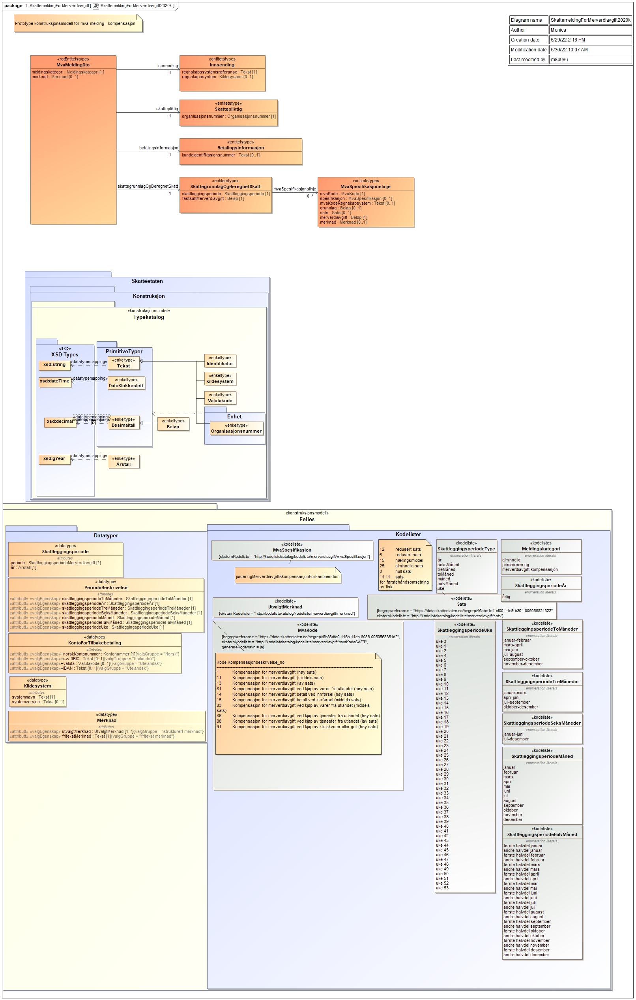

[English](https://skatteetaten.github.io/mva-meldingen/omvendt_eng/informasjonsmodell/)

# XSD for mva-melding for omvendt avgiftsplikt

### Endringslogg

| Dato       | Hva ble endret?                                                                |
| :--------- | :----------------------------------------------------------------------------- |
| 2022.06.22 | Side opprettet for omvendt avgiftsplikt                                        |

## Endring i kodelister som en konsekvens av innføring av mva-melding for omvendt avgiftsplikt: 

I kodelisten for merknad (merknad.xml) og SAFT-T (mvaKodeSAFT.xml) er følgende kodetillegg lagt til:

    <omvendtAvgiftsplikt>SANN</omvendtAvgiftsplikt>

Dette kodetillegget skal benyttes til å vise at den aktuelle koden gjelder omvendt avgiftsplikt.

Merk at når systemleverandør tar i bruk ny versjon av kodelistene så må det taes hensyn til kodetillegget.
Koder blir da valgt basert på om koden har kodetillegg omvendtAvgiftsplikt=SANN, kompensasjon=SANN eller alminneligPrimær=SANN.

## XSD for mva-melding for omvendt avgiftsplikt versjon 1.0

Mva-melding for omvendt avgiftsplikt skal sendes inn i XML-format. Den må være i henhold til strukturen dokumentert i XSD for mva-melding. Det er altså samme XSD for begge meldingene.

Versjon 1.0 av denne XSD'en ligger her:
[no.skatteetaten.fastsetting.avgift.mva.skattemeldingformerverdiavgift.v1.0.xsd](https://github.com/Skatteetaten/mva-meldingen/blob/master/docs/informasjonsmodell_filer/xsd/no.skatteetaten.fastsetting.avgift.mva.skattemeldingformerverdiavgift.v1.0.xsd)

Grafisk fremstilling av xsd og kodelister for [mva-meldingen](SkattemeldingForMerverdiavgiftKompensasjon.jpg):

Eksempler på mva-melding for omvendt avgiftsplikt i XML-format finnes [her](https://github.com/Skatteetaten/mva-meldingen/tree/master/docs/informasjonsmodell_filer/example_files/melding)

## Feltbeskrivelse for mva-melding for omvendt avgiftsplikt

### Mva-melding for omvendt avgiftsplikt

<table align=center>
  <tr><th style="width:25%" align=left>Felt</th><th align=left>Beskrivelse</th></tr>
  <tr><td>meldingskategori</td><td>Beskrivelse: type skjema som sendes inn  
	Formål: å sikre at brukeren dekker sin plikt for egenfastsetting
	</td>
  </tr>
    <tr><td>merknad</td><td>Beskrivelse: informasjon om innholdet i mva-melding for omvendt avgiftsplikt  
	Formål: å sikre at skattepliktig kan forklare egen rettsanvendelse der det er nødvendig
	</td>
  </tr>
</table>

### Skattepliktig

<table align=center>
  <tr><th style="width:25%" align=left>Felt</th><th align=left>Beskrivelse</th></tr>
  <tr><td>organisasjonsnummer</td><td>Beskrivelse: unik identifikator for den skattepliktige som foretar egenfastsetting  
  Formål: ivareta den skattepliktiges rettigheter og plikter
	</td>
  </tr>	
</table>

### Innsending

<table align=center>
  <tr><th style="width:25%" align=left>Felt</th><th align=left>Beskrivelse</th></tr>
  <tr><td>regnskapssystemrefereanse</td><td>Beskrivelse: Skattepliktiges unike referanse for innsending  
  Formål: Sikre at skattepliktig og skattekontoret refererer til samme melding.
	</td>
  </tr>
    <tr><td>system</td><td>Beskrivelse: Navn og evt versjon for regnskapssystem  
	Formål: Å kunne følge opp systematiske feil med systemleverandør i stedet for å følge opp hver enkelt skattepliktig.
	</td>
  </tr>
</table>

### Betalingsinformasjon

Kid oppgis bare dersom det er tilgodebeløp.

<table align=center>
  <tr><th style="width:25%" align=left>Felt</th><th align=left>Beskrivelse</th></tr>
  <tr><td>KID</td><td>Beskrivelse: Mottakerens identifikasjon av en betaling  
  Formål: Å kunne betale til de bankkontoene som krever KID
  </td>
</table>

### Skattegrunnlag og beregnet skatt

<table align=center>
  <tr><th style="width:25%" align=left>Felt</th><th align=left>Beskrivelse</th></tr>
  <tr><td>skattleggingsperiode</td><td>Beskrivelse: den perioden skattefastsettingen gjelder for  
  Periode angis i henhold til kodeverket for Skattleggingsperiode. For mva-melding for omvendt avgiftsplikt gjelder kvartalsvis skattleggingsperiode.     
  Formål: sikre samsvar mellom bokføring og egenfastsetting
	</td>
  </tr>
    <tr><td>fastsattMerverdiavgift</td><td>Beskrivelse: sum å betale/sum til gode  
	Formål: å sikre at riktig beløp blir betalt
	</td>
  </tr>
</table>

### MvaSpesifikasjonslinje

<table align=center>
  <tr><th style="width:25%" align=left>Felt</th><th align=left>Beskrivelse</th></tr>
  <tr><td>mvaKode</td><td>Beskrivelse: Klassifikasjon av inngående og utgående mva ihht til norsk SAF-T standard 
  Formål: formidling av hvilke mva-vurderinger som er utført
	</td>
  </tr>
  <tr><td>spesifikasjon</td><td>Beskrivelse: detaljering av noen mva-forhold som ikke inngår i norsk SAF-T standard 
	Formål: formidling av hvilke mva-vurderinger som er utført
	</td>
  </tr> 
  <tr><td>mvaKodeRegnskapssystem</td><td>Beskrivelse: intern mva-kode i regnskapssystemet. Det kan være flere interne mva-koder for en mvaKode og evt spesifikasjon. I det tilfellet vil det bli flere rader i mva-melding for omvendt avgiftsplikt pr mvaKode og spesifikasjon; en pr kombinasjon av mva-kode, spesifikasjon og mvaKodeRegnskapssystem. 
  Formål: To hensyn  
Brukerne: gjenkjennelig i forhold til det de ser i regnskapet.  
Systemleverandørene skal slippe å legge om mva-koder i systemene
	</td>
  </tr>
  <tr><td>grunnlag</td><td>Beskrivelse: Det beløpet det er regnet utgående mva av.  Feltet skal ikke fylles ut for inngående mva. 
Formål: Grunnlag for kontroll ifra Skatteetaten
	</td>
  </tr>
  <tr><td>sats</td><td>Beskrivelse: Den mva-satsen som er benyttet ved beregning av utgående mva. Feltet skal ikke fylles ut for inngående mva.  
	Formål:  Å sikre at bare gyldige satser benyttes ved fakturering
	</td>
  </tr>
  <tr><td>merverdiavgift</td><td>Beskrivelse: fastsatt merverdiavgift  
	Formål: å vise beregnet mva pr linje
      </td>
  </tr>  
  <tr><td>merknad</td><td>Beskrivelse: informasjon om innholdet i mvaKode  
	Formål: å sikre at skattepliktig kan forklare egen rettsanvendelse der det er nødvendig
	</td>
  </tr>

</table>

## Feltbeskrivelse for MvaMeldingInnsending

### MvaMeldingInnsending

<table align=center>
  <tr><th style="width:25%" align=left>Felt</th><th align=left>Beskrivelse</th></tr>
  <tr><td>meldingskategori</td>
    <td>
        Beskrivelse: type skjema som sendes inn  
        Formål: å sikre at brukeren dekker sin plikt for egenfastsetting
	</td>
  </tr>
  <tr><td>innsendingstype</td>
    <td>
        Beskrivelse: En mva-melding av meldingskategori alminnelig, primær og omvendt vil alltid være <strong>komplett</strong>.  
        Formål: Feltet beholdes for på et senere tidspunkt kunne åpne for at revisor kommenterer/ skriver merknad på de mva-meldingene som skal godkjennes av revisor før innsending.
	</td>
  </tr>
  <tr><td>instansstatus</td>
    <td>
        Beskrivelse: Dette feltet kommer vi til å fjerne da vi får denne informasjonen fra hendelser på instansen. Dette skal gjøres ved at det settes til valgfritt i en overgang og fases ut ved en passende anledning.
	</td>
  </tr>
  <tr><td>opprettetAv</td>
    <td>
        Beskrivelse: Dette feltet skal inneholde navn på innlogget bruker.  
        Formål: Innholdet i denne vises i Altinn.
	</td>
  </tr>
  <tr><td>opprettingstidspunkt</td>
    <td>
        Beskrivelse: Dette feltet kommer vi til å fjerne da vi får denne informasjonen fra instansen. 
        Dette skal gjøres ved at det settes til valgfritt i en overgang og fases ut ved en passende anledning.
	</td>
  </tr>
</table>
 

### Identifikator (Enten organisasjonsnummer eller foedselsnummer)

<table align=center>
  <tr><th style="width:25%" align=left>Felt</th><th align=left>Beskrivelse</th></tr>
  <tr>
    <td>organisasjonsnummer</td>
    <td>
        Beskrivelse: unik identifikator for den skattepliktige som foretar egenfastsetting  
        Formål: ivareta den skattepliktiges rettigheter og plikter
	</td>
  </tr>
  <tr><td>foedselsnummer</td>
    <td>
        Beskrivelse: unik identifikator for den skattepliktige som foretar skattefastsetting  
        Formål: ivareta den skattepliktiges rettigheter og plikter
	</td>
  </tr>
</table>
 

### Skattleggingsperiode

<table align=center>
  <tr><th style="width:25%" align=left>Felt</th><th align=left>Beskrivelse</th></tr>
  <tr>
    <td>periode</td>
    <td>
        Beskrivelse: den perioden skattefastsettingen gjelder for  
		Periode angis i henhold til kodeverket for Skattleggingsperiode. For mva-melding for omvendt avgiftsplikt gjelder kvartalsvis skattleggingsperiode.     
        Formål: sikre samsvar mellom bokføring og egenfastsetting
	</td>
  </tr>
  <tr><td>aar</td>
    <td>
        Beskrivelse: det året egenfastsettingen gjelder for  
        Formål: sikre samsvar mellom bokføring og egenfastsetting
	</td>
  </tr>
</table>
 

### Vedlegg

<table align=center>
  <tr><th style="width:25%" align=left>Felt</th><th align=left>Beskrivelse</th></tr>
  <tr>
    <td>vedleggstype</td>
    <td>
        Beskrivelse: Type vedlegg som blir lastet opp på instansen i Altinn. 
        Hvor en kan enten bruke <strong>mva-melding</strong> for selve mva-melding for omvendt avgiftsplikt, 
        eller <strong>binaerVedlegg</strong> for generelle vedlegg.  
	</td>
  </tr>
  <tr><td>kildegruppe</td>
    <td>
        Beskrivelse: Hvilken gruppe innsendingen kommer fra. 
        Valgmuligheter: <strong>etat</strong>, <strong>sluttbrukersystem</strong>, <strong>sluttbruker</strong>  
	</td>
  </tr>
  <tr><td>opprettetAv</td>
    <td>
        Beskrivelse: Dette feltet skal inneholde navn på innlogget bruker   
        Formål: Innholdet i denne vises i Altinn
	</td>
  </tr>
  <tr><td>opprettingstidspunkt</td>
    <td>
        Beskrivelse: Dette feltet kommer vi til å fjerne da vi får denne informasjonen fra instansen. 
        Dette skal gjøres ved at det settes til valgfritt i en overgang og fases ut ved en passende anledning.
	</td>
  </tr>
</table>
 

### Vedleggsfil

<table align=center>
  <tr><th style="width:25%" align=left>Felt</th><th align=left>Beskrivelse</th></tr>
  <tr>
    <td>filnavn</td>
    <td>
        Beskrivelse: navnet på filen som er lagt med som vedlegg  
	</td>
  </tr>
  <tr><td>filekstensjon</td>
    <td>
        Beskrivelse: ekstensjonen til filen som er lagt med som vedlegg  
	</td>
  </tr>
  <tr><td>filinnhold</td>
    <td>
        Beskrivelse: Gir en beskrivelse av innholdet i vedleggsfilen  
	</td>
  </tr>
</table>

## Kodelister

| Gruppe og kode                                                | Beskrivelse av Kode og Spesifikasjon                                |
| ------------------------------------------------------------- | ------------------------------------------------------------------- |
| Kjøp uten fradragsrett					|								      |
| 87                                                            | Kjøp av varer fra utlandet uten fradragsrett (høy sats)	      |
| 89                                                            | Kjøp av varer fra utlandet uten fradragsrett (lav sats)	      |
| 92								| Kjøp av klimakvoter og gull uten fradragsrett (høy sats)	      |
| Kjøp med kompensasjonsrett					|								      |
| 86                                                            | Kjøp av tjenester fra utlandet med kompensasjonsrett (høy sats)     |
| 88                                                            | Kjøp av tjenester fra utlandet med kompensasjonsrett (lav sats)     |
| 91                                                            | Kjøp av klimakvoter og gull med kompensasjonsrett (høy sats)        |

En oversikt over kodelistene finnes i [Oversikten over kodelister](https://github.com/Skatteetaten/mva-meldingen/blob/master/docs/informasjonsmodell_filer/kodelister/)

- Kodeliste for mva-kode: [mvaKodeSAFT](https://github.com/Skatteetaten/mva-meldingen/blob/master/docs/informasjonsmodell_filer/kodelister/mvaKodeSAFT.xml)
- Kodeliste for mva-spesifikasjon: [mvaSpesifikasjon](https://github.com/Skatteetaten/mva-meldingen/blob/master/docs/informasjonsmodell_filer/kodelister/mvaSpesifikasjon.xml)
- Kodeliste for sats: [sats](https://github.com/Skatteetaten/mva-meldingen/blob/master/docs/informasjonsmodell_filer/kodelister/sats.xml)
- Kodeliste for merknader: [merknad](https://github.com/Skatteetaten/mva-meldingen/blob/master/docs/informasjonsmodell_filer/kodelister/merknad.xml)
- Kodeliste for merknader og tilsvarende mva-kode: [merknadTilsvarendeMvaKode](https://github.com/Skatteetaten/mva-meldingen/blob/master/docs/informasjonsmodell_filer/kodelister/merknadTilsvarendeMvaKode.xml)

# XSD for innsending

Innsendingen til Altinn må inneholde en XML-fil med innsendingsinformasjon. Denne må være i henhold til strukturen i XSD for innsending.

[no.skatteetaten.fastsetting.avgift.mvamvameldinginnsending.v1.0.xsd](https://github.com/Skatteetaten/mva-meldingen/blob/master/docs/informasjonsmodell_filer/xsd/no.skatteetaten.fastsetting.avgift.mvamvameldinginnsending.v1.0.xsd)

# XSD for valideringsrespons og tilbakemelding

XSD for validering dokumenterer strukturen for responsen fra valideringstjenesten. Tilbakemelding vil også være i henhold til denne XSD-en.
[no.skatteetaten.fastsetting.avgift.mva.valideringsresultat.v1.xsd](https://github.com/Skatteetaten/mva-meldingen/blob/master/docs/informasjonsmodell_filer/xsd/no.skatteetaten.fastsetting.avgift.mva.valideringsresultat.v1.xsd)

# XSD for betalingsinformasjon

[no.skatteetaten.fastsetting.avgift.mva.skattemeldingformerverdiavgift.betalingsinformasjon.v1.0.xsd](https://github.com/Skatteetaten/mva-meldingen/blob/master/docs/informasjonsmodell_filer/xsd/no.skatteetaten.fastsetting.avgift.mva.skattemeldingformerverdiavgift.betalingsinformasjon.v1.0.xsd)
